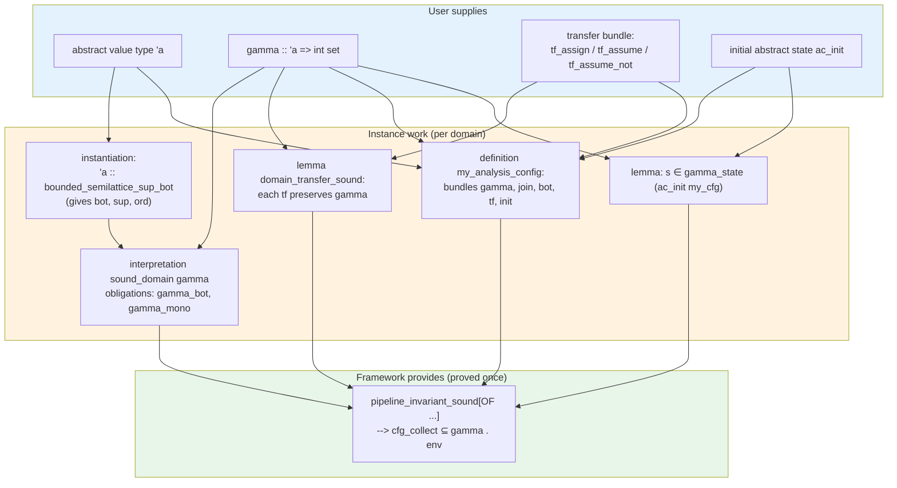

Voblint
=======

> **Voblint: Towards a Verified Voblint-style Analysis Pipeline in Isabelle/HOL**
> Master's thesis. Manuel Lerchner, TUM Informatics 2, supervised by Alexandra Graß.

Abstract
--------

We formalize the Voblint analysis pipeline from IMP through CFG compilation and
a constraint system to the verified top-down solver of
[stilscher/td-verification](https://github.com/stilscher/td-verification), and
prove that **any abstract domain** satisfying our locale and transfer obligations
yields a solver result that soundly over-approximates concrete collecting
semantics; sign analysis is the primary worked instance (`voblint_sign_sound`),
modulo TD termination hypothesis P1 (`⋀v. TD_plain.solve_dom`; see
`docs/OPEN_PROBLEMS.md`). Interval
instance: `voblint_interval_sound` (same hypotheses).

### Pipeline (overview)

Solid arrows: compilation and analysis steps. Dotted arrows: proved soundness
bridges. Dashed red arrows: bridges still missing (open problems; see
`docs/OPEN_PROBLEMS.md`).

```mermaid
flowchart LR
  SS["small_step / runs_to"]
  CC["cfg_collect"]
  PFP["env (post-fixpoint)"]
  TD["TD solver output"]
  TERM["TD terminates"]
  IVL["interval + widen"]

  SS -->|"operational link"| CC
  CC -->|B3| PFP
  PFP -->|"B4: td_analyse_collect_sound_at"| TD
  TD -.->|"B7: solve_dom (P1)"| TERM
  IVL -.->|"B8: widen + totality (P6/P7)"| TERM

  linkStyle 4,5 stroke:#c62828,stroke-dasharray: 4 3
```

| Bridge | Lemma / obligation                                            | Status              |
| ------ | ------------------------------------------------------------- | ------------------- |
| B3     | `post_fixpoint_sound` / `post_fixpoint_sound_at` — over-approximates `cfg_collect` | **done** |
| B4     | `td_analyse_collect_sound_at` — per-pp TD result sound at `v` | **done** (Fix B, #8) |
| ~~B5~~ | ~~`td_cfg_in_reach`~~ (P2)                                    | **removed** 2026-06-01 |
| ~~B6~~ | ~~`comp_fun_idem`~~ (P3)                                      | **done** (`join_state_comp_fun_idem`) |
| B7     | `⋀v. TD_plain.solve_dom` — per-pp solver termination          | **open** (P1)       |
| B8     | Interval widening + TD totality integration                   | **stretch** (P6/P7) |

Operational link: `runs_to_iff_small_step` connects small-step termination to
exit `cfg_collect`. End-to-end theorems: `pipeline_invariant_sound`,
`pipeline_sound_path`, `pipeline_sound_runs_to` (generic; carry P1 `solve_dom`); `voblint_sign_sound`
(sign instance). See `docs/OPEN_PROBLEMS.md`.

Where abstract interpretation is in the proof
-------------------------------------------

The equation system is not validated by a separate “code generator correctness”
theorem. We **define** `rhs` as the abstract analogue of CFG collecting, then
prove that **every post-fixpoint** over-approximates concrete reachability.

|                      | Concrete (collecting)                  | Abstract interpretation                                        |
| -------------------- | -------------------------------------- | -------------------------------------------------------------- |
| One edge             | `edge_collect a` on store sets         | `apply_tf tf a` on `abs_state`                                 |
| One program point    | `collect_pp` join of predecessor edges | `rhs` join of `apply_tf` images                                |
| Global               | `cfg_collect` (least fixpoint)         | `env` with `is_post_fixpoint`                                  |
| Link                 | (definition)                           | `edge_collect (γ σ) ⊆ γ (apply_tf … σ)` **transfer soundness** |
| Main soundness lemma |                                        | `post_fixpoint_sound`: `cfg_collect ⊆ γ ∘ env`                 |

So **abstract interpretation is the `rhs` / `γ` / `join` / `apply_tf` layer**.
`make_rhs` / `make_rhs_tree` spell out the equations; per-pp `td_analyse c … v`
runs the TD solver; `td_analyse_collect_sound_at` + `post_fixpoint_sound_at`
show the result is sound w.r.t. `cfg_collect` at `v`. IMP enters via small-step semantics and CFG
compilation; exit behaviour is `runs_to` / `runs_to_iff_small_step`.

Adding a new abstract domain
----------------------------

To plug a new analysis into the pipeline, a user supplies an abstract value
type and a transfer bundle, then discharges a handful of obligations. The
parametric `pipeline_invariant_sound` / `pipeline_sound_path` do the rest. Sign
(`src/Domains/Sign_Domain.thy`) is the worked reference.



Concretely, the user writes:

| Step | What                                                                                       | Reference (sign)                                              |
| ---- | ------------------------------------------------------------------------------------------ | ------------------------------------------------------------- |
| 1    | Declare abstract value type and its lattice instance                                       | `Sign_Domain.thy` — `datatype sign`, `instantiation` blocks   |
| 2    | Define `gamma_<dom>` and prove `gamma_bot`, `gamma_mono`                                   | `Sign_Domain.thy` (`gamma_sign_mono`)                         |
| 3    | `interpretation <dom>_domain: abstract_domain gamma_<dom> widen_<dom>`                    | `Sign_Domain.thy` (`interpretation sign_domain`)              |
| 4    | Define `tf_assign`, `tf_assume`, `tf_assume_not` and prove `domain_transfer_sound`          | `assign_sign_sound`, `assume_sign_sound`                      |
| 5    | Bundle as `analysis_config`                                                                | `Pipeline.thy` (`sign_analysis_config`)                       |
| 6    | Show `s \<in> gamma_state (ac_init my_cfg)` for the initial store                          | `Pipeline.thy` (`sign_init_in_gamma`)                         |
| 7    | Apply `pipeline_invariant_sound` / `sign_pipeline_sound`                                   | `Voblint_Formalization.thy` (`voblint_sign_sound`)            |

The pipeline carries one TD-side assumption the user must discharge:
`⋀v. TD_plain.solve_dom (make_rhs_tree …) v` (P1). P2 (`td_cfg_in_reach`) was
removed with per-pp solve (Fix B); P3 (`comp_fun_idem`) is proved in-repo. See
`docs/OPEN_PROBLEMS.md`.

Requirements
------------

- A running version of [Isabelle](https://isabelle.in.tum.de/) (Isabelle2025 or
  newer) with `isabelle` in your `$PATH`.
- The [Archive of Formal Proofs](https://www.isa-afp.org/) checked out locally;
  the build needs the `thys/` directory (transitive dependency
  `Root_Balanced_Tree`).
- GNU `make`, `git`, and standard POSIX tools.

Build instructions
------------------

Set `AFP` to your AFP `thys/` directory (default `~/afp/thys`) and use the
provided `Makefile` targets:

- `make vendor`: initializes the `vendor/td-verification` git submodule (pinned
  via the superproject gitlink), then applies `vendor/td-verification.patch`
  (Isabelle2025 compatibility uses `Set.remove_eq` in place of `remove_def`,
  see the patch for details).

- `make build` (default): runs the Isabelle formalization, depends on `vendor`.
  Equivalent to:

  ```
  isabelle build -d $(AFP) -d vendor/td-verification -D . Voblint_Formalization
  ```

- `make jedit`: launches Isabelle/jEdit with the correct session roots
  pre-loaded.

- `make html`: builds Isabelle browser info (`-o browser_info`) and copies it to
  `docs/html/` (gitignored; entry point `docs/html/isabelle/index.html`; same
  mechanism as the
  [Isabelle library HTML pages](https://stackoverflow.com/questions/17833567/how-to-generate-html-version-of-isabelle-theory)).
  CI deploys `docs/html/` to GitHub Pages on push to `main`. Handwritten layer
  walkthroughs live under `docs/walkthrough/` (repo only, not on the site).

- `make clean-vendor`: removes `vendor/td-verification/` (re-fetched on next
  `make vendor`).

- `make clean`: removes vendored sources and the built session heap.

Example:

```
make AFP=/path/to/afp/thys build
```

The `quick_and_dirty` option is set in `ROOT`, so `sorry` placeholders are
permitted during proof development.

Repository layout
-----------------

```
.
├── src/
│   ├── IMP2/             IMP syntax and small-step semantics
│   ├── CFG/              CFG definition, paths, IMP-to-CFG compiler
│   │   └── Collecting/   cfg_collect, runs_to, small-step bridge
│   ├── Equations/        constraint system + soundness layer
│   ├── Solver/           TD solver bridge (plain + widen/WN interfaces)
│   ├── Domains/          abstract domains (Sign, Interval, ...)
│   ├── Pipeline/         end-to-end pipeline theorems
│   ├── Examples/         concrete instantiations and worked examples
│   └── Voblint_Formalization.thy   top-level session entry
├── vendor/
│   ├── td-verification/             git submodule (init via `make vendor`)
│   ├── td-verification.patch        local Isabelle2025 compatibility patch
│   └── autocorrode/                 I/Q and I/R MCP (via `./scripts/setup.sh`)
├── docs/                 proof overview, phases; walkthroughs + generated HTML
├── Makefile              build entry points (vendor, build, jedit, clean)
└── ROOT                  Isabelle session definition
```

Verified dependencies
---------------------

| Dependency                       | Source                                                  | Role                                      |
| -------------------------------- | ------------------------------------------------------- | ----------------------------------------- |
| `HOL-IMP`                        | Isabelle distribution                                   | session parent; IMP syntax/semantics base |
| `TD` (`TD_plain`, `Basics`, ...) | vendored from `stilscher/td-verification` + local patch | verified top-down solver                  |
| `Dijkstra_Shortest_Path`         | AFP                                                     | CFG graph type (`CFG_Def.thy`)            |
| `Root_Balanced_Tree`             | AFP                                                     | transitive dep of TD session              |

Also built as separate `ROOT` theories: `TD_CFG_Core`, `TD_Widen_Interface`,
`TD_WN_Interface`, and the `Example_*` targets.

Vendoring the TD solver
-----------------------

The top-down solver lives upstream at
[stilscher/td-verification](https://github.com/stilscher/td-verification).
This repository vendors it via submodule
[`ManuelLerchner/td-verification`](https://github.com/ManuelLerchner/td-verification)
(a private fork of upstream, for CI and local access).
GitHub Actions cannot clone that fork with the default `GITHUB_TOKEN`; add a
**classic PAT** with `repo` scope as repository secret **`SUBMODULES_TOKEN`**
(Settings → Secrets and variables → Actions), or make the fork public.
A small local change is needed for Isabelle2025 compatibility, kept as a
plain `git`-format patch in `vendor/td-verification.patch`. Run `make vendor`
to initialize the submodule and apply the patch (idempotent). The patch diff is
reviewable in this repository; the submodule gitlink pins the upstream commit.

Documentation
-------------

| Document                       | Contents                                                |
| ------------------------------ | ------------------------------------------------------- |
| `docs/OPEN_PROBLEMS.md`        | Bridges B3–B8, problem catalogue, handoff notes         |
| `docs/HOL_IMP_COMPARISON.md`   | vs HOL-IMP `Abs_*`: workflow, domain theory tradeoffs   |
| `docs/PROOF_OVERVIEW.md`       | Theorem chain, key types and lemmas                     |
| `docs/PROOF_PHASES.md`         | Proof status, sorry inventory, remaining work           |
| `docs/walkthrough/`            | Per-layer HTML walkthroughs (`index.html` hub; not on GitHub Pages) |
| `docs/html/`                   | Isabelle browser info (`make html`; entry `isabelle/index.html`; gitignored; GitHub Pages on `main`) |

Agent / MCP workflow notes: `docs/ISABELLE_AGENT_NOTES.md`. Bootstrap: `./scripts/setup.sh`, `./scripts/start-ir.sh`.

Agent-assisted development (Isabelle/Q)
---------------------------------------

Proof development in this repository also experiments with
[Isabelle/Q](https://github.com/awslabs/AutoCorrode/tree/main/iq) (I/Q), an MCP
server for Isabelle/jEdit that lets coding agents edit theories, query proof
states, run Sledgehammer, and explore tactics interactively. The setup follows
the autoformalization workflow described by Kevin Kappelmann et al. in
[*Just Type It in Isabelle! AI Agents Drafting, Mechanizing, and Generalizing
from Human Hints*](https://arxiv.org/abs/2604.15713) (arXiv:2604.15713, 2026);
see their §6.1 for the Isabelle/Q technical setup and `AGENTS.md` here for
project-specific conventions.

| Script                                  | Role                                                                                                     |
| --------------------------------------- | -------------------------------------------------------------------------------------------------------- |
| `./scripts/setup.sh`                    | One-shot bootstrap: submodules, venv, I/Q jEdit plugin (skip with `--no-iq`)                             |
| `./scripts/start-iq.sh`                 | Launch Isabelle/jEdit with I/Q listening on port 8765                                                    |
| `./scripts/start-ir.sh`                 | Headless [Isabelle/R](https://github.com/awslabs/AutoCorrode/tree/main/ir) MCP on port 9148              |
| `./scripts/start-both.sh`               | Start I/R in background + I/Q in foreground; Ctrl+C tears down both                                      |
