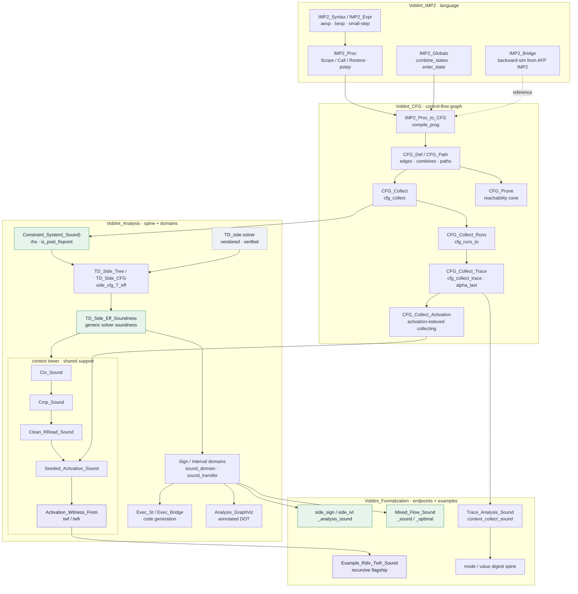
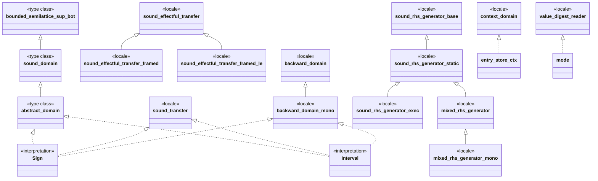

Voblint
=======

> **Towards a Verified Goblint-style Analysis Pipeline in Isabelle/HOL**
> Master's thesis. Manuel Lerchner, TUM Informatics 2, supervised by Alexandra Graß.

## Abstract

We formalize an end-to-end soundness proof for a Goblint-style abstract
interpreter. An IMP2 program (with procedures, scopes, calls) is compiled to a
control-flow graph; the graph induces a constraint system; the verified
side-effecting top-down solver of
[stilscher/td-verification](https://github.com/stilscher/td-verification)
computes a post-fixpoint; and **any abstract domain** satisfying our locale and
transfer obligations yields a result that soundly over-approximates the
interprocedural collecting semantics **at every program point**. Sign analysis
is the worked instance.

## The soundness statement

At **every** program point `v`, the analyzer's post-fixpoint `env`
over-approximates the CFG collecting semantics:

$$
\mathrm{cfg}_{\mathrm{collect}}\ g\ S\ v \subseteq \gamma(\mathrm{env}\ v)
$$

This is **proved and `sorry`-free** (`trace_analysis_sound`; Sign instance
`side_sign_analysis_sound`).

**Where does the trace semantics come in?** The theorem is proved one level finer,
on the *trace* collecting semantics `cfg_collect_trace` (the ordered runs, not just
the reachable states) — history-sensitive globals need to know *which* writes reach
a read. The state-level `cfg_collect` is its `alpha_last` projection:

$$
\mathrm{cfg}_{\mathrm{collect}}\ g\ S\ v =
\alpha_{\mathrm{last}}\bigl(\mathrm{cfg}_{\mathrm{collect\_trace}}\ g\ S\ v\bigr)
$$

so proving over-approximation at the trace level hands us the `cfg_collect ⊆ γ`
statement above for free. The trace form is only *needed* for the per-global
reaching-read theorem `reaching_global_read_sound`. For the headline
over-approximation, `cfg_collect ⊆ γ` is the whole story.

**Next step — compiler correctness.** `cfg_collect` is currently the specification.
Once `compile_prog` is verified against the IMP2 *source* semantics end-to-end,
the guarantee lifts to the program level:

$$
\mathrm{reach}_{\mathrm{IMP2}}(c)\ \text{at}\ v
\subseteq \gamma(\mathrm{env}\ v)
$$

The backward bridge (`IMP2_Bridge.thy`) already anchors terminating runs to AFP
IMP2 big-step; the full source-to-CFG collecting equivalence is the remaining
compiler-correctness step.

The shipped examples already expose concrete IMP2 witnesses for the flagship
showcase and the recursive `rdiv` program, so the source layer is now visible in
the example suite even though the main theorem still lands at `cfg_collect`.

## Pipeline

```
IMP2 (+ Proc + Globals) → CFG (+ IP Collecting) → Equations → Solver (TD side) → Pipeline → Examples
                    Domains ────────────────────────────────┘
```

Four Isabelle sessions, built in order:
`Voblint_IMP2` → `Voblint_CFG` → `Voblint_Analysis` → `Voblint_Formalization`.

## Architecture

Voblint is **one generic soundness core with several specializations**, not a set
of competing analyses. Every soundness endpoint descends from a single theorem —
a TD-side post-fixpoint over CFG collecting semantics over-approximates that
semantics at every program point — and the context-sensitive analyses form *one
layered tower* culminating in the recursive `twfr` witness flagship.

### Component & data flow



### Domain & locale inheritance

The genericity is carried by a **type-class + locale hierarchy**: a domain is an
`abstract_domain` (a `sound_domain` with widening, itself a bounded semilattice
with `gamma`); transfer soundness is the `sound_transfer` / `sound_effectful_transfer`
locale family; solver obligations live in the `*_rhs_generator` chain. Sign and
Interval are *interpretations* of these; nothing in the spine mentions a concrete
domain.



**Canonical end-to-end chain** — each step reuses the soundness of the one below:

`cfg_collect_trace` → `Constraint_System_Sound` → `TD_Side_Eff_Soundness` →
entry-context (`…_Ctx_Sound`) → keyed/combine (`…_Cmp_Sound`) → seeded-clean
(`Clean_RRead_Sound`) → activation collecting (`Seeded_Activation_Sound`) →
`twf`/`twfr` witness (`Activation_Witness_From`) → recursive soundness
(`Example_Rdiv_Twfr_Sound`).

Five theorems close the loop end-to-end (base flow-sensitive, entry-context,
keyed/combine, twfr-recursive, and the parallel mode/value digest spine
`context_collect_sound`). Every other theory is classified by role:

| Role | Meaning | Representative |
| --- | --- | --- |
| Canonical spine | proved end-to-end soundness | `side_sign_analysis_sound`, `rdiv_witness_G_over_approximated` |
| Required support | inside a flagship's dependency cone | context tower, return rehydration |
| Regression / counterexample | intentional negative or precision fact | `clean_transfer_unsound` |
| Precision comparison | `eval`-only sharper-than witness | bare `Exec_*_Ctx_Run` |
| Design evidence | motivates a design; proves no soundness | `Example_Interval_Recursion_Digest` |

## Semantic foundation

The concrete spec is an interprocedural **trace** collecting semantics
(`cfg_collect_trace`): the ordered run, not just the set of reachable states.
Traces are what history-sensitive globals need - *which* writes reach a given
read. Both the trace semantics and its flattening are CFG-edge based: dropping a
trace to its last state recovers the reachable-state collecting semantics
(`cfg_collect`) the analyzer over-approximates
(`alpha_last_cfg_collect_trace_le`). No small-step is involved in that step.

Big-step is **not** the spec - it is vacuous on diverging programs. It enters
only as a *reference* semantics: `backward_sim` (`src/IMP2/IMP2_Bridge.thy`)
shows every terminating AFP IMP2 big-step run is reproduced by our small-step
(`pstep`, `src/IMP2/IMP2_Proc.thy`), anchoring soundness to a recognised
AFP-blessed semantics. The two are
complementary - the analyzer certifies every program point (and diverging runs);
big-step / VCG pins the exact functional result at exit on terminating runs.

## Headline result

`TD_Side_Eff_Soundness.side_analyse_eff_collect_sound_exit_pruned`
(`src/Analysis/Generic/Solver/Core/TD_Side_Eff_Soundness.thy`): for a
post-fixpoint `env` of the interprocedural constraint system, the abstraction of
the trace collecting semantics is below `gamma_state (env v)` at every program
point `v`. Sign instance: `side_sign_analysis_sound`
(`src/Analysis/Instances/Sign/Sign_Side_Soundness.thy`).

Globals shared across the program are tracked flow-insensitively through the
solver's side-effect mechanism. In `Trace_Analysis_Sound.thy`:
`reaching_global_read_sound` - any global's value over any reaching trace lies in
`gamma`; `digest_read_sound` - digest-indexed reads are sound;
`flat_env_is_digest_sound` - the flat (flow-insensitive) env is the degenerate
sound digest. `Example_Trace_Digest_Precision.thy` then witnesses
(`digest_beats_flat`) that a digest-indexed read is strictly tighter than the
flat read on a concrete program.

Soundness is *not* validated by a separate code-generator theorem. We **define**
the equation system as the abstract analogue of CFG collecting, then prove every
post-fixpoint over-approximates concrete reachability:

| | Concrete (collecting) | Abstract |
| --- | --- | --- |
| One edge | `edges_collect` on store sets | `apply_tf tf` on `abs_state` |
| One point | join of predecessor edges | constraint `rhs` join |
| Global | `cfg_collect_trace` | `env` with `is_post_fixpoint` |
| Link | (definition) | transfer soundness: `gamma` commutes with each `tf` |

## Adding a domain

Supply an abstract value type, a `gamma`, and a transfer bundle
(`tf_assign` / `tf_assume` / `tf_assume_not`); discharge a handful of
obligations; the parametric pipeline does the rest. Sign
(`src/Analysis/Instances/Sign/Sign_Domain.thy`) is the reference.

| Step | What | Reference (sign) |
| --- | --- | --- |
| 1 | value type + lattice instance (`bot`, `sup`, `ord`) | `datatype sign`, `instantiation` |
| 2 | define `gamma`, prove `gamma_bot` / `gamma_mono` | `gamma_sign_mono` |
| 3 | `interpretation` of the `abstract_domain` locale | `sign_domain` |
| 4 | define transfer fns, prove they preserve `gamma` | `assign_sign_sound`, `assume_sign_sound` |
| 5 | apply the IP pipeline soundness theorem | `side_sign_analysis_sound` |

## Requirements

- [Isabelle](https://isabelle.in.tum.de/) 2025 or newer, with `isabelle` in `$PATH`.
- A local [AFP](https://www.isa-afp.org/) checkout (`thys/`): transitive deps
  `Root_Balanced_Tree`, `Dijkstra_Shortest_Path`.
- GNU `make`, `git`, POSIX tools.

## Build

Set `AFP` to your AFP `thys/` directory (default `~/afp/thys`):

```
make AFP=/path/to/afp/thys build
```

| Target | Role |
| --- | --- |
| `make vendor` | init `vendor/td-verification` submodule + apply Isabelle2025 patch |
| `make build` (default) | build session `Voblint_Formalization` (depends on `vendor`) |
| `make jedit` | launch Isabelle/jEdit with session roots pre-loaded |
| `make html` | browser info → `docs/html/` (CI deploys to GitHub Pages on `main`) |
| `make clean` / `clean-vendor` | remove built heaps / vendored sources |

The checked source tree is sorry-free; `ROOT` files do not enable
`quick_and_dirty`. See `src/README.md` for the per-layer map.

## Layout

```
src/
  IMP2/          syntax, procedures, globals/locals, small-step
  CFG/           CFG, IP compilation, paths; Collecting/ - IP collecting semantics
  Analysis/      Generic/ (Domain/ Equations/ Solver/) Instances/ (Voblint_Analysis session)
  Formalization/ Pipeline/ Examples/ (Voblint_Formalization session)
vendor/
  td-verification/         verified TD solver (submodule, AFP session TD)
  td-verification.patch    local Isabelle2025 compatibility patch
  autocorrode/             I/Q + I/R MCP servers (via ./scripts/setup.sh)
docs/          proof overview, phases, roadmap, walkthroughs, generated HTML
```

The analysis rides on the **side-effecting** solver (`TD.TD_side`) only; the
plain top-down solver was retired. The intra-procedural (classical) spine moved
to the sibling repo `voblint-formalization-classical`.

## Verified dependencies

| Dependency | Source | Role |
| --- | --- | --- |
| `HOL-IMP` | Isabelle distribution | session parent; IMP base |
| `TD` (`TD_side`, `Basics`, …) | vendored `stilscher/td-verification` + patch | verified top-down solver |
| `Dijkstra_Shortest_Path` | AFP | CFG graph type |
| `Root_Balanced_Tree` | AFP | transitive dep of TD |

## Vendoring the TD solver

Upstream: [stilscher/td-verification](https://github.com/stilscher/td-verification).
Vendored as a submodule via the private fork
[`ManuelLerchner/td-verification`](https://github.com/ManuelLerchner/td-verification)
(CI + local access). GitHub Actions cannot clone the fork with the default
`GITHUB_TOKEN`; add a classic PAT with `repo` scope as repository secret
`SUBMODULES_TOKEN`, or make the fork public. A small Isabelle2025 compatibility
change lives in `vendor/td-verification.patch`; `make vendor` applies it
(idempotent).

## Agent-assisted development

Proof development experiments with
[Isabelle/Q](https://github.com/awslabs/AutoCorrode/tree/main/iq) (I/Q), an MCP
server for Isabelle/jEdit that lets coding agents edit theories, query proof
states, run Sledgehammer, and explore tactics. Following the autoformalization
workflow of Kappelmann et al.,
[*Just Type It in Isabelle!*](https://arxiv.org/abs/2604.15713) (arXiv:2604.15713,
2026), §6.1. See `AGENTS.md` and `docs/ISABELLE_AGENT_NOTES.md`.

| Script | Role |
| --- | --- |
| `./scripts/setup.sh` | one-shot bootstrap: submodules, venv, I/Q plugin (`--no-iq` to skip) |
| `./scripts/start-iq.sh` | Isabelle/jEdit + I/Q on port 8765 |
| `./scripts/start-ir.sh` | headless Isabelle/R MCP on port 9148 |
| `./scripts/start-both.sh` | I/R background + I/Q foreground; Ctrl+C tears down both |

`start-ir.sh` registers `vendor/td-verification` as an Isabelle component via
`isabelle components -u`. This persistent, idempotent registration lets the
I/R `ML_process` resolve the parent session `TD`; the I/R launcher accepts only
one explicit session directory. Remove the registration, if needed, with:

```bash
isabelle components -x "$(pwd)/vendor/td-verification"
```
