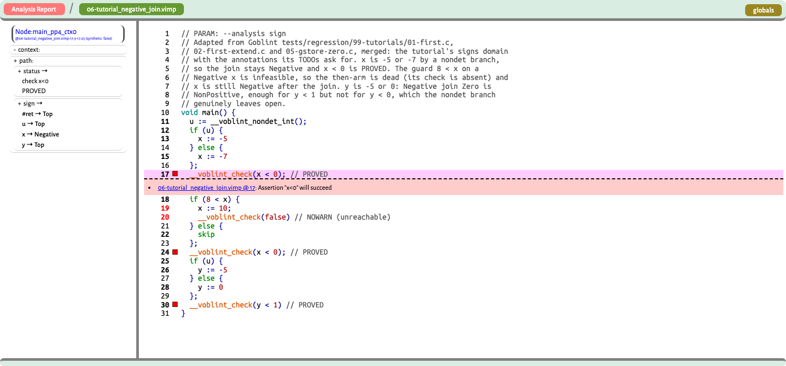

# Voblint

> **A Generic, Executable, and Machine-Checked Framework for Interprocedural Abstract Interpretation in Isabelle/HOL**

> Master's thesis. Manuel Lerchner, supervised by [@AlexandraGrass](https://github.com/AlexandraGrass)

[](https://github.com/ManuelLerchner/Voblint-Verification-Master-Thesis/actions/workflows/ci.yml)
[](https://deepwiki.com/ManuelLerchner/Voblint-Verification-Master-Thesis)


Voblint is a machine-checked Isabelle/HOL framework for building, running and
verifying interprocedural abstract interpreters, modelled on Goblint's D/G
architecture. It chains verified CFG compilation, activation-local operational
semantics, executable equation generation, and a vendored verified top-down
solver into one soundness statement about the analyzer's own output.

The solver runs inside Isabelle/HOL and computes an abstract **post-solution**.
With widening and narrowing in play that is not necessarily a least fixpoint.
The end-to-end analyzer corollaries apply to that computed solution rather than to
an externally supplied one; the generic framework theorems below them are
stated for an arbitrary abstract bound.

## A first run

Voblint programs are written in VIMP, a small IMP-style language with
`__voblint_check(cond)` assertions:

```c
void main() {
    x := 0;
    while (x < 10) {
        x := x + 1
    };
    __voblint_check(0 < x)
}
```

```bash
$ pixi run voblint --analysis interval tests/regression/02-control-flow/precision/02-while_loop.vimp
8:3  pp3        0<x                  PROVED   x=[10,10]
```

`--dot` renders the same solved CFG as GraphViz instead: the source sits beside
the graph, each check node carries its verdict and the state it was decided on,
and dead nodes are shaded. `--dot-full` puts every node's own state on the graph
rather than only the check nodes; under a context policy each context gets its
own cluster (see the gallery below).

```bash
pixi run voblint --analysis interval --dot tests/regression/02-control-flow/precision/02-while_loop.vimp \
  | dot -Tpng -o cfg.png
```

<p align="center">
  <a href="docs/images/while_loop_cfg.png">
    
  </a>
  <br><sub>The source travels with the graph; the check node carries its verdict and the state it was decided on.</sub>
</p>

A product domain does not fit on a graph. One variable of the `int` domain
prints as `sign=Positive, ivl=[1,1], parity=Odd, congruence==1`, and a whole
program of those is unreadable. `--html` writes a browsable report instead: the
graph stays sparse, each node's full state lives in its own document, and
clicking a node or a source line shows it. `pixi run report` emits, serves and
opens one.

<p align="center">
  <a href="docs/images/report-source-sign.png">
    
  </a>
  <br><sub>Source view: click a line, get the verdict and the abstract state that decided it.</sub>
</p>

More views in [the gallery below](#reading-a-result); details and the
browser-XSLT caveat in [`docs/HTML_REPORT.md`](docs/HTML_REPORT.md).

## The certified pipeline

```text
Execution:  VIMP AST -> CFG -> equation system -> verified TD solver
                     -> computed post-solution -> check report

Proof:      source execution -> activation-local traces (valid_ltr)
                             -> per-point collection (ltr_collect)
                             included in the concretization of that result
```

The reference meaning the computed result is proved sound against is a
collecting semantics built on a *local trace* semantics, not a stage the solver
produces. [`valid_ltr`](src/Program_Model/CFG/Collecting/LTR_Def.thy) is the trace
layer: a trace is one procedure activation's own view of the run, so a call is entered and returned from without threading a
global control stack through the semantics. Goblint's thread-modular local
traces make the same move for threads; this takes it for activations.
[`ltr_collect`](src/Program_Model/CFG/Collecting/LTR_Collect.thy) `gs g S v` is
the collection on top of it: every store some valid trace holds when it sits at node `v`. `ltr_collect` is not indexed by analysis
contexts; `activation_collect` is the context-keyed variant the
context-sensitive results are stated over.

The chain ends at a configuration-generic statement over the CLI's HOL entry
point
([`run_voblint_certified_source_sound`](src/Executable_Surface/CLI/Analysis_Certified.thy)):
run the source program, stop wherever you like, and the analyzer's answer for the
program point you are standing at describes the store in your hands -- the
abstract state contains it, and every definite verdict printed beside it is
correct for that store. The domain, the solver discipline and the context policy are
arguments, not parameters of the statement.

```isabelle
theorem run_voblint_certified_source_sound:
  fixes p :: imp_prog and s0 s :: store
  assumes s0: "s0 ∈ cinit_stores (declared_global p)"
      and run: "star (pstep (declared_global p) (prog_table p))
                  (main_body (prog_table p), s0, []) (residual, s, frs)"
      and cert: "certified_preconditions D solver ctx p"
      and ans: "run_voblint D solver ctx view p = Analysed out"
  shows "∃v stk. csim (prog_table p) (prog_cfg p) (residual, s, frs) (v, s, stk)
               ∧ s ∈ ltr_collect (declared_global p) (prog_cfg p)
                         (cinit_stores (declared_global p)) v
               ∧ analysis_result_covers D solver ctx p v s
               ∧ checks_sound_at out v s"
```

`run_voblint` is the single operation `export_code` exports and `cli/main.ml`
calls, so this constrains the analyzer's own output rather than an internal
solved system. Neither configuration legality nor well-formedness is a premise:
an unsupported pairing answers `Unsupported_Configuration` and a malformed
program answers `Malformed_Program`, so `Analysed out` already says the resolver
accepted the configuration and the program passed its check. What a caller owes
is `certified_preconditions D solver ctx p` -- that configuration's solver run
completed, and it solved enough keys -- and nothing else.

The two case splits the statement avoids live in the definitions instead:
`certified_preconditions` names the obligations per configuration and
`analysis_result_covers` names what that configuration's own table claims, both
by recursion over the domain, the solver and the policy. They have to be
definitions rather than parameters because an abstract state's type is the
domain's own carrier, so nothing polymorphic holds all five.

[`Example_End_To_End_Certificate`](src/Examples/CLI/Example_End_To_End_Certificate.thy)
instantiates this theorem for an actual run -- the `Int` product domain, a
call-string context of length one, and `Solver_Join` named explicitly rather than
defaulted -- with well-formedness, solver termination, context coverage and the
`Analysed` answer all discharged by evaluation. The source run is not assumed
either: it is built step by step, both calls and the check, so the theorem's
conclusion holds outright for a store the program really computes.

It also closes the last gap the endpoint leaves open. `csim` is not functional,
so the generic endpoint produces *some* sound witness node, and that existential
witness need not be the check node whose printed row a reader wants to inspect.
The example therefore establishes a second, explicit collecting-semantics witness
at that node -- the semantics there really does contain the store the program
computes, calls and all -- and reads
[`ctx_rows_sound_at`](src/Executable_Surface/CLI/Analysis_Run_Ctx_Sound.thy)
at that node: every store the semantics admits there satisfies the condition the
report called `PROVED`. Printed verdict, named node, real execution.
`certificate_demo_full_certificate` collects the whole thing with no existentials
left -- the answer, its single row, the completed run, the membership at that node,
`analysis_result_covers` and `checks_sound_at` there, and the check's own truth.

The per-configuration endpoints stay underneath as the implementation level:
[`Analysis_Run_Sound`](src/Executable_Surface/CLI/Analysis_Run_Sound.thy) for the
context-free ones,
[`Analysis_Run_Ctx_Sound`](src/Executable_Surface/CLI/Analysis_Run_Ctx_Sound.thy)
for the contextual ones at each policy's default discipline, and
[`Analysis_Run_Solver_Sound`](src/Executable_Surface/CLI/Analysis_Run_Solver_Sound.thy)
for the contextual ones at an explicitly named discipline.

`csim` gives a *structural* CFG correspondence for the current source control
state, and that correspondence need not be unique. A procedure that is never
called still has its body compiled into the graph, so

```text
main()   { x := 1; }
unused() { x := 1; }
```

leaves the residual `x := 1` structurally matching two nodes -- one in `main`,
which is running, and one in `unused`, which nothing reaches.

The `ltr_collect` membership is what picks out a witness that is genuinely
reachable carrying this store, and it is
load-bearing rather than decorative -- at the dead witness the analysis
computed bottom, so the coverage conjunct would be false there. At that
reachable node the computed abstract state contains the store, and every
definite check verdict printed for it is correct.

One asymmetry is deliberate. The check guarantee is stated over `out_checks
out`, the analyzer's own returned rows, while the state guarantee is stated as
`analysis_result_covers D solver ctx p v s` rather than over `out`. That is
because `analysis_output` keeps no abstract state: its snapshot, globals and
per-row states are all `String.literal`, already rendered. An output-level state
predicate could only be defined by inverting the renderer, so the honest split
is a semantic guarantee about the computed result and an observable guarantee
about the printed report.
`analysis_result_covers` is the over-approximation itself: the concrete store
lies in the concretization of the abstract state that configuration's own solve
filed for that node -- under at least one context its call history is admitted at,
when the policy keeps contexts. A call string is a function of that history, so
there the context is unique; entry-state routing is relational and may admit more
than one. `checks_sound_at` reads the printed check
rows -- PROVED rows hold, REFUTED rows are violated, and no row at a node the
run actually reaches is marked dead, so an unreachability claim can never be
printed over a store that reached it.

[`analyse_source_sound`](src/Executable_Surface/CLI/Analyse_Dispatch.thy) is the
same statement one layer down, over the `analyse` verdict list rather than the
rendered rows, and without the coverage conjunct.

### What is certified

For the HOL call

```isabelle
run_voblint D solver ctx view p = Analysed out
```

with the per-program premises established, a source-level soundness theorem
covers every configuration the dispatcher answers with check rows:

```text
D      in {Sign, Interval, Parity, Congruence, Int}
ctx    in {Ctx_None, Ctx_EntryState, Ctx_CallString k}
solver = None, or any discipline that domain and policy accepts
```

Every modeled source execution is over-approximated at a genuinely reachable
CFG node -- and, at the context-sensitive policies, under the analysis context
its own call history produced. At that node every definite check verdict is
correct for that execution, and no check row there is reported dead.

What a `DEAD` row claims is a separate theorem, deliberately.
[`dead_row_unreached`](src/Executable_Surface/CLI/Analysis_Run_Sound.thy) says
that if a row at a point is dead then the collecting semantics there is empty --
nothing reaches it at all:

```isabelle
theorem dead_row_unreached:
  ... and dead: "row_verdict row = Bot"
  shows "ltr_collect (declared_global p) (prog_cfg p)
           (cinit_stores (declared_global p)) (row_point row) = {}"
```

That does not follow from reading the endpoint backwards. The endpoint is
existential in its witness, so it constrains the rows at the one node it
produced, not at an arbitrary node someone names; `csim` being non-unique is
exactly what breaks the contraposition. It is proved forwards instead -- a
store collected at the point would have to be covered there, and a dead row
says nothing is.

[`ctx_dead_row_unreached`](src/Executable_Surface/CLI/Analysis_Run_Ctx_Sound.thy)
is the contextual counterpart, and it lands in the same shape rather than a
context-indexed one: a dead aggregate means no context published a live entry
at the point, so every bucket there is empty and the union equation collapses
them back. A dead marker means nothing reaches the point, under any context.

The same statement holds at the context-sensitive configurations, where the
table has one entry per point *and* context
([`Analysis_Run_Ctx_Sound`](src/Executable_Surface/CLI/Analysis_Run_Ctx_Sound.thy)).
The store then sits in the entry filed under *at least one* context its own call
history is admitted at -- unique for a call string, possibly several for
entry-state routing -- and quantifying over every context the node was solved at
instead would be false, since another activation's entry need not describe this
store at all.

```isabelle
theorem run_voblint_sign_entry_state_source_sound:
  ...
      and solves: "sign_entry_state_terminates_for (declared_global p) p"
      and cover: "ctx_vars_cover (prog_cfg p) (sign_es.ctx_succ (declared_global p) p) []
                    (sign_entry_state_vars (declared_global p) p)"
      and ans: "run_voblint Sign_Analysis None Ctx_EntryState view p = Analysed out"
  shows "∃v stk ctx st.
           csim (prog_table p) (prog_cfg p) (residual, s, frs) (v, s, stk)
         ∧ s ∈ activation_collect (declared_global p)
                   (sign_entry_state_context_rel (declared_global p) p) [] (prog_cfg p)
                   (cinit_stores (declared_global p)) v ctx
         ∧ lookup_context (analyse_sign_entry_state_result p) v ctx = Lifted st ∧ s ∈ ⟦st⟧
         ∧ (∀row ∈ set (out_checks out). row_point row = v ⟶
              row_verdict row ≠ Dead
            ∧ (row_verdict row = Decided Check_Proved ⟶ truthy (aval (row_exp row) s))
            ∧ (row_verdict row = Decided Check_Refuted ⟶ ¬ truthy (aval (row_exp row) s)))"
```

All five domains have this at the entry-state configuration. Its conclusion
carries an `activation_collect` membership for the same reason the
context-insensitive one carries `ltr_collect`: `csim` is structural and
non-unique, so the witness needs a semantic conjunct to pin it to a node this
store genuinely reaches under some context. The two premises are the
contextual counterpart of what
[`analyse_certified`](src/Executable_Surface/CLI/Analyse_Dispatch.thy) bundles:
a termination fact and one coverage fact. The coverage is
[`ctx_vars_cover`](src/Abstract_Interpreter/Framework/Constraints/CFG_Enumeration.thy)
rather than `vars_cover`, whose key type is `unit`, and it is *closure* rather
than blanket coverage -- if a node-context pair was solved, the pairs its edges
lead to were solved too. A context-sensitive system cannot demand the
unconditional form, because which contexts a node was solved at is decided by
the run.

Call-string carries a *smaller* certificate than entry state, not a larger one.
A call string is a total function of the call history, so every activation has
exactly one context by construction and there is no context-totality obligation
at all: `fun_route_ltr_collect_eq_Union` is premise-free. What remains is the
termination fact and the one closure premise.

`None` selects each domain's default discipline, and naming a solver instead
changes nothing about what is proved: every configuration the dispatcher answers
with rows carries the same source-level theorem, all 32 of them, whichever of
always-join, per-origin, Apinis warrowing or warrowing-per-origin ran the system.
The 32 are plans, not spellings: `None` and the discipline it defaults to resolve
to one plan and share one theorem, so they count once.
[`docs/THEOREM_MAP.md`](docs/THEOREM_MAP.md) is the cell-by-cell matrix, and
[`Analysis_Run_Solver_Sound`](src/Executable_Surface/CLI/Analysis_Run_Solver_Sound.thy)
holds the contextual cells at a named discipline. What the endpoint reads is the
solved table, not the search that produced it, so a discipline costs one
registration and one instantiation, never a new argument.

One limit is worth naming: the guarantee is about `out_checks` -- the graph,
snapshot and globals in the answer are rendered strings, with no theorem about
them.

[`analyse_certified D p`](src/Executable_Surface/CLI/Analyse_Dispatch.thy)
bundles the two per-program facts nothing here proves in general. It is a
logical precondition of the theorem, not a certificate the CLI produces or
checks: a caller establishes it for a specific program, by evaluation, before
the theorem says anything about that program's report.

Each domain also states the result over its own result table rather than over
verdicts: [`analyse_sign_source_sound`](src/Analyses/Sign/generated/Sign_Entry.thy) says
the store lies in the concretization of the entry
`analyse_sign_result p` returned for that node, with a weaker completed-run
reading (`analyse_<domain>_completed_run_sound`: final store at `cfg_exit`, no
`csim` witness needed) beside it. Those live in each domain's entry theory:
[Sign](src/Analyses/Sign/generated/Sign_Entry.thy),
[Interval](src/Analyses/Interval/generated/Interval_Entry.thy),
[Parity](src/Analyses/Parity/generated/Parity_Entry.thy),
[Congruence](src/Analyses/Congruence/generated/Congruence_Entry.thy),
[Int](src/Analyses/Int/Int_Entry.thy).

Underneath, the source bridge is domain-free. It consumes only a
collecting-semantics bound.
[`source_sound_from_ltr_collecting_cap`](src/Soundness/Source_Activation_Sound.thy)
takes any `G :: pp ⇒ store set` with `ltr_collect ... v ⊆ G v` and places the
store of a source run inside `G` at the node it reached. Composing that
inclusion with each domain's check soundness is what produces the verdict
theorem above. Generic framework theorems establish the bound itself from an
analysis's own soundness, solver-success and coverage obligations, so a new
domain writes no source-level reasoning. See
[`docs/PROOF_OVERVIEW.md`](docs/PROOF_OVERVIEW.md).

### What the guarantee covers, and what it does not

The theorem above is stated for the configuration as an argument, so domain,
solver discipline and context policy are all covered by one statement, and
`certified_preconditions D solver ctx p` is what a caller owes per program. The
per-configuration endpoints underneath it are what that predicate is assembled
from, one per plan; `analyse_certified D p` is the unit-context specialization of
the same pair of obligations, and the per-domain corollaries read their tables at
`lookup_context ... v ()`. See
[`docs/THEOREM_MAP.md`](docs/THEOREM_MAP.md) for each endpoint's exact shape.

Read the two verdicts precisely. `PROVED` at a node says every execution that
reaches that node satisfies the condition; `REFUTED` says every execution that
reaches it falsifies the condition. Neither says an execution reaches the node
at all, so a `REFUTED` line is not a verified counterexample: a check on a dead
branch is reported dead, and `REFUTED` on a reachable one still comes with no
witness run.

`certified_preconditions` -- and `analyse_certified`, its unit-context
specialization -- is exactly the two side conditions that survive, and neither is
discharged in general. Both can be established for an individual program by
executable evaluation:

* `solve`: the solver run completed. Per program: evaluate the solver-success
  condition, then apply that domain's `..._via_solve_c` theorem. The evaluation
  may itself fail to terminate, and no theorem here guarantees success for every
  program; partial correctness is the scope.
* `cover`: the solve visited enough keys. `vars_cover` bundles the entry,
  intra-edge, call-entry and combine-target obligations into one predicate,
  decided by `vars_cover_exec` and bridged by each domain's
  `<x>_vars_cover_prog_of_exec`.

Stated exactly: *successful analyses whose required coverage is established
over-approximate all modeled source executions.* A `PROVED` verdict carries the
formal guarantee once the solver-success and coverage premises are established
for that invocation. The CLI does not validate coverage or emit a proof
certificate: it returns a report.

Two further steps separate the theorem from the binary, and no theorem covers
either: the generated OCaml (`export_code` translates the same HOL functions,
but the translation, the OCaml compiler and its runtime are trusted), and
everything upstream of the AST (lexing and parsing sit outside the proved
chain).

`Example_Side_Execute.thy` (`src/Examples/CLI`) carries one complete instance
with both conditions discharged and no assumption left open. See
[`docs/VERIFICATION_CHAIN_AND_TRUST_BOUNDARY.md`](docs/VERIFICATION_CHAIN_AND_TRUST_BOUNDARY.md)
for the full trust boundary.

## Reading a result

The report separates the graph from the state, and each view answers a different
question.

<table>
  <tr>
    <td width="50%" valign="top" align="center">
      <a href="docs/images/report-graph-sign.png">
        
      </a>
      <br><b>Graph view, Sign</b>
      <br><sub>Green nodes are proved checks, orange nodes are dead: <code>8 &lt; x</code> is infeasible on a <code>Negative</code> <code>x</code>, so the whole arm, its check included, drops out. The selected node's state is on the left.</sub>
      <br><sub><a href="tests/regression/07-sign-precision/precision/06-tutorial_negative_join.vimp"><code>06-tutorial_negative_join.vimp</code></a> &middot; <code>--analysis sign --html</code></sub>
    </td>
    <td width="50%" valign="top" align="center">
      <a href="docs/images/report-context-interval.png">
        
      </a>
      <br><b>Context-sensitive Interval</b>
      <br><sub><code>--context entry-state</code> keeps a separate abstract state per distinct <em>abstract</em> argument context. Several concrete arguments can share one, and the solver may revisit a context. <code>--context-graph expanded</code> draws each as its own cluster: <code>[5,5]</code>, <code>[4,4]</code> and <code>[19,19]</code>, the last read from a global at the call site, instead of one cluster holding their join.</sub>
      <br><sub><a href="tests/regression/11-graph-snapshot/04-expanded_three_contexts.vimp"><code>04-expanded_three_contexts.vimp</code></a> &middot; <code>--context entry-state --context-graph expanded --html</code></sub>
    </td>
  </tr>
  <tr>
    <td colspan="2" align="center">
      <a href="docs/images/report-int-refinement.png">
        
      </a>
      <br><b>The refining <code>int</code> domain: four analyses in one report</b>
      <br><sub><code>int: PROVED</code> beside <code>interval</code>, <code>sign</code> and <code>parity</code>, each UNKNOWN on the same program and the same node.</sub>
      <br><sub><a href="tests/regression/16-composite-domain/precision/01-refinement_beats_components.vimp"><code>01-refinement_beats_components.vimp</code></a> &middot; <code>--analysis int,interval,sign,parity --context none --html</code></sub>
    </td>
  </tr>
</table>

Where that last gain comes from is worth stating precisely, because stronger
precision alone does not identify its cause. Interval's own backward step for
`+` is the conservative identity, so the guard `y + 1 == 3` tells it nothing;
Sign and Parity likewise. Congruence carries the only real arithmetic
inversion, and it is the fourth component, not selectable on its own. The
composite's
reduction step then re-derives the other three views from that tightened
operand, giving `y = [2,2]`, `Positive`, `Even`, `==2`. The gain is the extra
component *plus* cross-component reduction, not a better interval transfer
([`Int_Backward.thy`](src/Analyses/Int/Int_Backward.thy),
[`Int_Refinement.thy`](src/Analyses/Int/Int_Refinement.thy)).

## Domains and configurations

| Domain | `--analysis` | Result table | Default solver | Context policies |
| --- | --- | --- | --- | --- |
| Sign | `sign` | `analyse_sign_result` | join | `none`, `entry-state`, `call-string` |
| Interval | `interval` | `analyse_interval_td_result` | warrowing | `none`, `entry-state`, `call-string` |
| Parity | `parity` | `analyse_parity_result` | join | `none`, `entry-state`, `call-string` |
| Congruence | `congruence` | `analyse_congruence_result` | join | `none`, `entry-state`, `call-string` |
| Int (Sign × Interval × Parity × Congruence) | `int` | `analyse_int_result` | warrowing | `none`, `entry-state`, `call-string` |

Every domain supplies a `widen` operator; Sign and Parity are finite lattices
with `widen = sup`. What only Interval and the `int` product have is a solved
table and a soundness corollary behind the widening rules, so the other
`Solver_Warrow` pairings stay unsupported rather than being exposed on the
strength of the instance alone. Unsupported `(domain, solver)` and
`(domain, context)` pairings are rejected explicitly, answering `None` at
[`resolve_analysis_config`](src/Executable_Surface/CLI/Analysis_Config.thy) rather
than falling back silently.

## The generic D/G framework

Analyses are factored the way Goblint factors them:

* **D**: abstract facts attached to program points;
* **G**: globally shared information published and consumed across points.

The central abstraction is the Isabelle counterpart of Goblint's
[`Spec`](https://github.com/goblint/analyzer/blob/1ab59c9c4d9859e9135885d3c9a9aa1a8f3b677e/src/framework/analyses.ml#L168-L263)
interface: an analysis provides domain-specific transfer, combine and
communication operations, and inherits equation generation, solver integration,
and the collecting- and source-level soundness theorems. The interface separates core
transfer/combine soundness from the routed entry and coverage obligations:
[`sound_dg_spec_core`](src/Abstract_Interpreter/Framework/Spec/DG_Spec_Sound.thy)
signs the edge-transfer and return-combine obligations, which are independent of
how a call is compiled, and
[`dg_ctx_activation_base`](src/Abstract_Interpreter/Framework/Activation/DG_Ctx_Activation.thy)
extends it with the entry obligation for the routed equation shape. The complete
statement is the latter; interpreting the core alone leaves a call's entry
unconstrained.

| Responsibility | Owner |
| --- | --- |
| Generic unit-context equations | `Routed_Unit_Generator` |
| Generic reader transport | `DG_Reader_Transport` |
| Executable finite states | `Exec_St_*` |
| Executable local specification | `DG_Local_State_Exec` |
| Executable local refinement | `DG_Local_State_Exec_Refinement` |

Adding a domain still costs more than one locale instantiation: the lattice and
its concretization, transfer soundness, an executable representation and its
refinement, entry/context coverage, and solver integration each carry
obligations. What is *not* re-proved is any source-level reasoning; see
[`docs/DG_ANALYSIS_AUTHORING.md`](docs/DG_ANALYSIS_AUTHORING.md).

## Repository structure

| Directory | Responsibility |
| --- | --- |
| `src/Program_Model/VIMP` | Source syntax and small-step semantics |
| `src/Program_Model/CFG` | Graph model and activation-local collecting semantics; never mentions the compiler |
| `src/Program_Model/Compile` | VIMP-to-CFG compiler, its invariants and forward simulation |
| `src/Abstract_Interpreter/Domain` | Abstract values and states, concretization, dead-code lift |
| `src/Abstract_Interpreter/Solver` | Strategy-tree equation language and the bridge to the vendored TD solver |
| `src/Abstract_Interpreter/Framework` | Generic D/G specifications, routing, constraints, results |
| `src/Abstract_Interpreter/Exec` | Executable finite states and their refinement |
| `src/Soundness` | Domain-independent end-to-end endpoints (`run_source_sound`, `collect_sound`, `source_reaches_ltr_collect`) |
| `src/Analyses` | Concrete domains over a shared `Base`; each selectable domain owns its `<Domain>_Entry.thy` |
| `src/Executable_Surface/CLI` | The `analyse` dispatcher and the render surface; the one layer that sees every domain |
| `src/Executable_Surface/Codegen` | `export_code` declarations (generated OCaml lands in `codegen/generated/`) |
| `src/Examples` | Executable runs, flagship demos, regression proofs, one session per folder |
| `vendor/` | TD solver, g2html and AutoCorrode submodules |

Session dependencies run, in outline,
`VIMP → CFG → Compile`, `Domain`/`Solver` → `Framework` → `Exec` → `Soundness` →
`Analyses/*` → `CLI` → `Codegen`, with `Examples/*` hanging off the analysis
sessions. That is a simplified overview. It omits cross-dependencies and the
CLI-dependent example sessions; `ROOTS` lists one directory per session, and each
`ROOT` states the real closure.

## Build and verification

Requirements: **Isabelle2025-2** (the version CI runs and `scripts/setup.sh`
expects), an **[AFP](https://www.isa-afp.org/)** checkout, **[pixi](https://pixi.sh/)**,
and, for the code-generation and CLI tasks, OCaml (`ocamlfind`, `menhir`,
`ocamllex`, `zarith`) via opam.

```bash
pixi run vendor                        # init the TD solver submodule + Isabelle2025 patch
AFP=/path/to/afp/thys pixi run build   # batch-build every session (the integration gate)
AFP=/path/to/afp/thys pixi run jedit   # interactive development
```

`pixi.toml` is the single command surface; `pixi task list` shows all tasks.
The ones that matter most often:

| Task | Description |
| --- | --- |
| `build` | Batch-build every required session; the project's integration verification gate |
| `codegen` / `codegen-check` | Regenerate `codegen/generated/`, or fail on drift |
| `codegen-regression` | Compile and run the OCaml driver against Isabelle-proved expected output |
| `cli-build` / `cli-test` | Build the `voblint` binary; run `tests/run.py` against it |
| `grammar-check` | Regenerate both parser frontends and fail on any diff |
| `property` | Hypothesis property tests (parser fuzzing, AST round-trip) |
| `ci` | Everything CI runs |

The generated OCaml is compile-checked by actually compiling it: both
`codegen-regression` and `cli-build` run `ocamlfind ocamlopt` over
`codegen/generated/ml/Voblint_CLI.ml`. `export_code` emits one `Generated`
module for the whole reachable program (plus HOL's `Bit_Shifts` and
`Str_Literal` preludes); do not hand-edit anything under `codegen/generated/`.

> The vendored solver is pinned to a private fork of
> [stilscher/td-verification](https://github.com/stilscher/td-verification); CI
> needs a `SUBMODULES_TOKEN` secret to clone it. Making that fork public is the
> outstanding step for a fully reproducible artifact.

## Running the analyzer

`voblint` (`cli/main.ml`) is a thin, unverified adapter over the exact generated
`analyse` entry point.

```bash
# one line per __voblint_check, in source order
pixi run voblint --analysis interval FILE.vimp

# GraphViz of the solved CFG (--dot-full: every node, not only check nodes)
pixi run voblint --analysis interval --dot FILE.vimp > cfg.dot && dot -Tsvg cfg.dot -o cfg.svg

# deterministic textual CFG snapshot, no GraphViz dependency
pixi run voblint --analysis interval --graph-snapshot FILE.vimp

# parse-only syntax check (exit 0 on success, 2 on a parse error)
pixi run voblint --parse-only FILE.vimp
```

`--context none|entry-state|call-string` selects the analysis;
`--context-graph collapsed|expanded` only changes how a context-sensitive result
is *drawn*, never what is computed. `pixi run voblint --help` has the full flag
list, [`docs/CLI_DESIGN.md`](docs/CLI_DESIGN.md) the design and trust-boundary
notes, and [`docs/CHECK_ARCHITECTURE.md`](docs/CHECK_ARCHITECTURE.md) the
contextual result and rendering architecture.

## VIMP grammar pipeline

`grammar/vimp.yaml` is the sole source of truth for VIMP syntax. Two generators
realize it for two unrelated parser targets:

```text
grammar/vimp.yaml
       |
       +-- scripts/gen_vimp_menhir.py   -> cli/vimp_parser.mly, cli/vimp_lexer.mll
       +-- scripts/gen_vimp_isabelle.py -> src/Program_Model/VIMP/VIMP_Grammar_Generated.thy
```

Never hand-edit the three generated files. **This pipeline sits outside the
proved pipeline and is untrusted code**: no soundness theorem covers lexing or
parsing, and the proved chain starts at an already-constructed `imp_prog`.
Confidence comes from process instead: one canonical grammar, drift-checked
generation (`pixi run grammar-check`, also a pre-commit hook), the `.vimp`
regression corpus, AST round-trip and print-stability checks, and Hypothesis
fuzzing under `tests/property/`.

## Foundations

* **Goblint** ([GitHub](https://github.com/goblint/analyzer)): modular interprocedural abstract interpretation and the D/G architecture.
* **Abstract Interpretation of Annotated Commands** ([ITP 2012](https://doi.org/10.1007/978-3-642-32347-8_9)): reusable abstract interpretation in Isabelle/HOL.
* **The Top-Down Solver Verified** ([CAV 2024](https://doi.org/10.1007/978-3-031-65627-9_15)): the vendored executable verified solver.
* **Mixed Flow-Sensitive Static Analysis: Engineering Modularity** ([FM 2026](https://doi.org/10.1007/978-3-032-26220-2_22)).
* **Data Race Detection by Digest-Driven Abstract Interpretation** ([arXiv:2511.11055](https://arxiv.org/abs/2511.11055)): thread-modular local-trace semantics, which Voblint's activation-local traces (`src/Program_Model/CFG/Collecting/`) adapt to procedure activations.

## Documentation

| Document | Contents |
| --- | --- |
| [`AGENTS.md`](AGENTS.md) | Project contract, style rules, working agreements |
| [`docs/PROOF_OVERVIEW.md`](docs/PROOF_OVERVIEW.md) | Proof architecture and intended claims |
| [`docs/THEOREM_MAP.md`](docs/THEOREM_MAP.md) | Thesis claims mapped to checked Isabelle theorems |
| [`docs/GLOSSARY.md`](docs/GLOSSARY.md) | Terminology and defining layers |
| [`docs/VERIFICATION_CHAIN_AND_TRUST_BOUNDARY.md`](docs/VERIFICATION_CHAIN_AND_TRUST_BOUNDARY.md) | What is proved, what is trusted |
| [`docs/GOBLINT_ALIGNMENT_REGISTER.md`](docs/GOBLINT_ALIGNMENT_REGISTER.md) | Where this formalization differs from upstream Goblint, and why |
| [`docs/ISABELLE_AGENT_NOTES.md`](docs/ISABELLE_AGENT_NOTES.md) | Build commands, agent-assisted development (I/Q, I/R), `./scripts/setup.sh` |
| [`docs/ROADMAP.md`](docs/ROADMAP.md), [`docs/NON_GOALS.md`](docs/NON_GOALS.md) | Scope and priorities |
