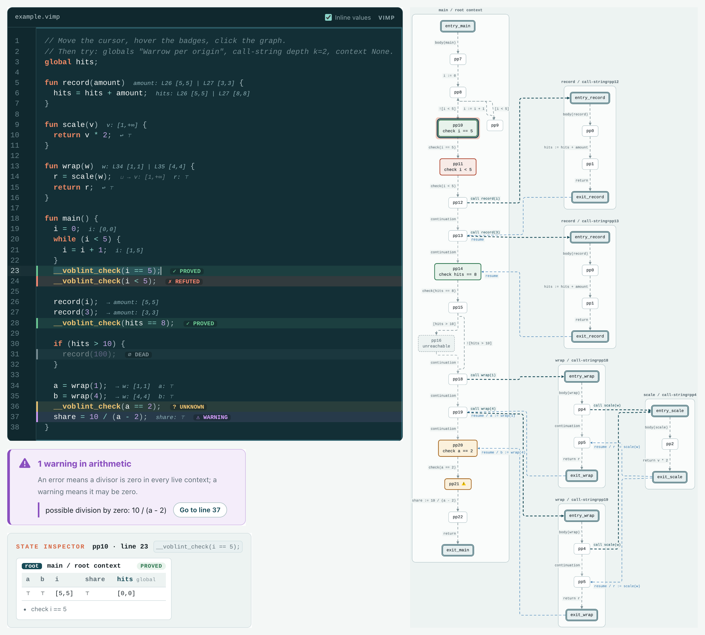
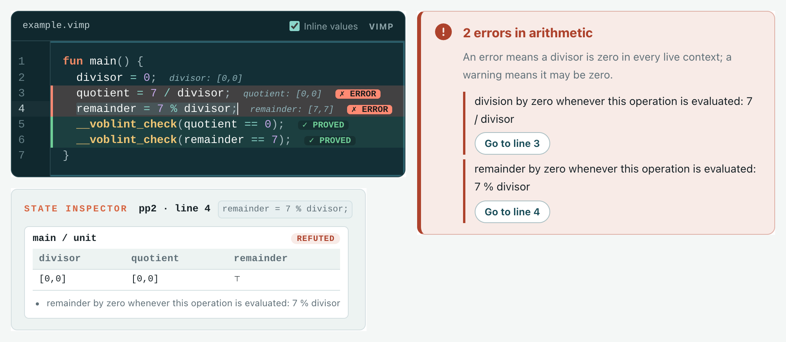
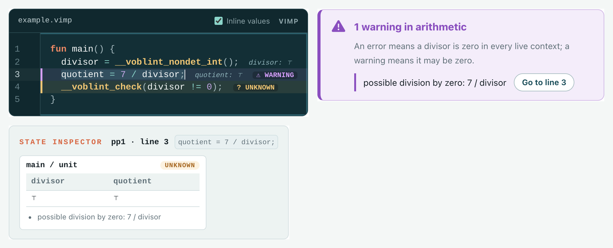
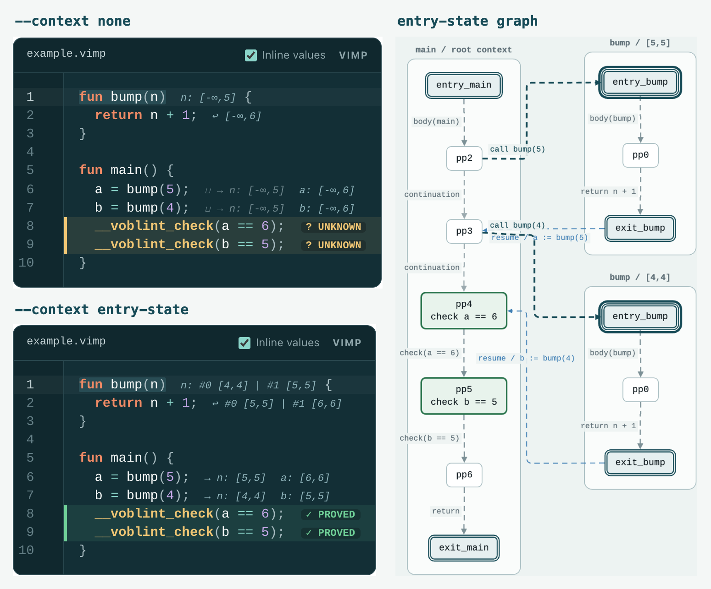
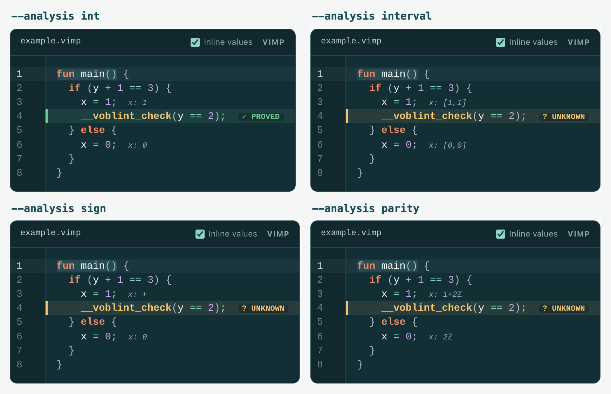

# Voblint

> **A Verified Goblint-Style Static Analysis Pipeline in Isabelle/HOL**
>
> Master's thesis. Manuel Lerchner, supervised by [@AlexandraGrass](https://github.com/AlexandraGrass)

[](https://github.com/ManuelLerchner/Voblint-Verification-Master-Thesis/actions/workflows/ci.yml)
[](https://deepwiki.com/ManuelLerchner/Voblint-Verification-Master-Thesis)


Voblint is a machine-checked Isabelle/HOL framework for building, running and
verifying interprocedural abstract interpreters, modelled on Goblint's D/G
architecture. It chains verified CFG compilation, activation-local operational
semantics, executable equation generation, and a vendored verified top-down
solver into one soundness statement about the analyzer's own output.

The solver runs inside Isabelle/HOL and computes an abstract **post-solution**.
With widening and narrowing in play that is not necessarily a least fixpoint.
The end-to-end analyzer corollaries apply to that computed solution rather than to
an externally supplied one; the generic framework theorems below them are
stated for an arbitrary abstract bound.

## Running Voblint

Voblint programs are written in VIMP, a small IMP-style language with
`__voblint_check(cond)` assertions:

```c
fun main() {
    x = 0;
    while (x < 10) {
        x = x + 1;
    }
    __voblint_check(0 < x);
}
```

```text
$ pixi run voblint --analysis interval tests/regression/02-control-flow/precision/02-while_loop.vimp
tests/regression/02-control-flow/precision/02-while_loop.vimp [interval]

Arithmetic diagnostics
None

Assertion checks
Location  Point  Condition  Verdict  State
--------  -----  ---------  -------  ---------
8:3       pp3    0 < x      PROVED   x=[10,10]
```

The [browser playground](https://manuellerchner.github.io/Voblint-Verification-Master-Thesis/playground.html) runs the same generated analyzer on a program
you edit, with no server involved. Verdicts and value hints appear in the source,
the cursor's statement shows its state in every context, and the solved graph
draws one box per procedure and context.

<p align="center">
  <a href="docs/images/while_loop_cfg.png">
    
  </a>
  <br><sub>The program above in the playground. <a href="https://manuellerchner.github.io/Voblint-Verification-Master-Thesis/playground.html?example=while-loop&amp;analysis=interval&amp;context=none">Open this run</a>.</sub>
</p>

<p align="center">
  <a href="docs/images/playground-overview.png">
    
  </a>
  <br><sub>Calls, contexts, every verdict and an arithmetic warning in one run. <a href="https://manuellerchner.github.io/Voblint-Verification-Master-Thesis/playground.html?analysis=interval&amp;globals=warrow&amp;context=call-string&amp;k=1">Open this run</a>.</sub>
</p>

`--context none|entry-state|call-string` selects the analysis context and
`--globals` the update rule for side-effected globals; `pixi run voblint --help`
lists every flag. `--graph-snapshot` prints the solved graph as deterministic
text and `--parse-only` checks syntax.
[`docs/CLI_DESIGN.md`](docs/CLI_DESIGN.md) describes the CLI trust boundary and
[`docs/CHECK_ARCHITECTURE.md`](docs/CHECK_ARCHITECTURE.md) how a result becomes
a report.

### Arithmetic diagnostics

Every analysis also checks the divisors of `/` and `%` against the solved state
before the statement. A divisor that may be zero is a `warning`; one that is
zero in every live context is an `error`. Safe operations and unreachable points
report nothing, and diagnostics never change the exit code.

<table>
  <tr>
    <td align="center">
      <a href="docs/images/playground-division-definite.png">
        
      </a>
      <br><sub>Definite: errors, while both checks still prove. <a href="https://manuellerchner.github.io/Voblint-Verification-Master-Thesis/playground.html?example=division-definite&amp;analysis=interval&amp;context=none">Open</a>.</sub>
    </td>
    <td align="center">
      <a href="docs/images/playground-division-possible.png">
        
      </a>
      <br><sub>Possible: the state cannot exclude zero. <a href="https://manuellerchner.github.io/Voblint-Verification-Master-Thesis/playground.html?example=division-possible&amp;analysis=interval&amp;context=none">Open</a>.</sub>
    </td>
  </tr>
</table>

The traversal covers assignments, guards, call arguments, returns, `min`/`max`
and checks, nested arithmetic included, and both operands of `&&` and `||`. It is
a diagnostic policy over VIMP's total expressions: execution still uses
`a / 0 = 0` and `a % 0 = a`. “Possible” means the abstraction cannot exclude
zero, not that a zero-divisor execution exists; an `error` does not prove its
point reachable. Executable witnesses live in
[`Example_Arithmetic_Diagnostics_Regression.thy`](src/Examples/CLI/Example_Arithmetic_Diagnostics_Regression.thy),
and the [arithmetic fixtures](tests/regression/23-arithmetic-diagnostics/README.md)
describe the expectation syntax.

## What Voblint proves

For every domain, globals rule and context policy, the report `run_voblint`
returns is sound for every execution of the program: whenever an execution
reaches a program point, the state filed for that point contains its store, and
every `PROVED` or `REFUTED` verdict there is correct for it. The theorem is stated
about the same `run_voblint` that is exported to OCaml and runs in the CLI and the
playground.

"Every execution" is made precise by an activation-local collecting semantics.
A [`valid_ltr`](src/Program_Model/CFG/Collecting/LTR_Def.thy) trace records one
procedure activation's view of a run, and
[`ltr_collect`](src/Program_Model/CFG/Collecting/LTR_Collect.thy) gathers every
store such traces hold at each CFG node, adapting Goblint's thread-modular local
traces from threads to procedure activations.

### The headline theorem

[`run_voblint_certified_source_sound`](src/Executable_Surface/CLI/Analysis_Certified.thy) relates any finite source execution
to the analysis result:

```isabelle
theorem run_voblint_certified_source_sound:
  fixes p :: imp_prog and s0 s :: store
  assumes s0: "s0 ∈ cinit_stores (declared_global p)"
      and run: "star (pstep (declared_global p) (prog_table p))
                  (main_body (prog_table p), s0, []) (residual, s, frs)"
      and terminates: "config_terminates D rule ctx p"
      and ans: "run_voblint D rule ctx p = Analysed res"
  shows "∃v stk. csim (prog_table p) (prog_cfg p) (residual, s, frs) (v, s, stk)
               ∧ s ∈ ltr_collect (declared_global p) (prog_cfg p)
                         (cinit_stores (declared_global p)) v
               ∧ analysis_result_covers D rule ctx p v s
               ∧ checks_sound_at res v s"
```

| Premise | Meaning |
| --- | --- |
| `s0` | Initial store. Declared globals start at `0`; locals are unconstrained. |
| `run` | Any finite execution prefix from `main`; the program need not terminate. |
| `terminates` | The selected solver run terminates on this program, the only analyzer-side obligation. |
| `ans` | `run_voblint` accepted the program and returned `Analysed res`, which supplies well-formedness. |

| Conclusion | Guarantee |
| --- | --- |
| `csim ... (v, s, stk)` | The compiler's forward simulation relates the source state to CFG node `v`. |
| `s ∈ ltr_collect ... v` | A valid trace reaches `v` with store `s`. |
| `analysis_result_covers ... v s` | The abstract state filed for `v`, in an admitted context, contains `s`. |
| `checks_sound_at res v s` | No check at `v` is `DEAD`, and every `PROVED` or `REFUTED` verdict there holds for `s`. |

`D` ranges over Sign, Interval, Parity, Congruence and Int; `rule` over the four
globals rules; `ctx` over no contexts, entry states, and call strings of any
length.

<details>
<summary>Why the node is existential</summary>

A source state need not determine one CFG node: in `main() { x := 1; }` and
`unused() { x := 1; }` the command `x := 1` structurally matches a node in each
procedure, but only `main`'s is reached with the running store. `csim` records
the structural match and `ltr_collect` picks the reachable witness. Contexts are
existential for the same reason: a call string is a function of the call history,
but entry-state routing may admit several contexts.

</details>

### Checks, dead code and arithmetic

Three results in the same theory specialise the guarantee to what the report
shows:

- [`run_voblint_check_sound`](src/Executable_Surface/CLI/Analysis_Certified.thy): when an execution is about to run a check,
  the report lists it at a node reached with the current store, the check is not
  `DEAD`, and a definite verdict is correct.
- [`run_voblint_dead_check_unreached`](src/Executable_Surface/CLI/Analysis_Certified.thy): no execution reaches a `DEAD`
  check's point.
- [`run_voblint_arithmetic_safe`](src/Executable_Surface/CLI/Analysis_Certified.thy): at a reachable point with no arithmetic
  diagnostic, every divisor in the point's expressions is nonzero in every store
  that reaches it.

<details>
<summary>Exact statements</summary>

```isabelle
theorem run_voblint_check_sound:
  fixes p :: imp_prog and s0 s :: store
  assumes s0: "s0 ∈ cinit_stores (declared_global p)"
      and run: "star (pstep (declared_global p) (prog_table p))
                  (main_body (prog_table p), s0, []) (residual, s, frs)"
      and chk: "next_check residual = Some e"
      and terminates: "config_terminates D rule ctx p"
      and ans: "run_voblint D rule ctx p = Analysed res"
  shows "∃c ∈ set (res_checks res). check_exp c = e
           ∧ s ∈ ltr_collect (declared_global p) (prog_cfg p)
                   (cinit_stores (declared_global p)) (check_point c)
           ∧ check_verdict c ≠ Dead
           ∧ (check_verdict c = Decided Check_Proved ⟶ truthy (aval e s))
           ∧ (check_verdict c = Decided Check_Refuted ⟶ ¬ truthy (aval e s))"
```

```isabelle
corollary run_voblint_dead_check_unreached:
  assumes terminates: "config_terminates D rule ctx p"
      and ans: "run_voblint D rule ctx p = Analysed res"
      and listed: "chk ∈ set (res_checks res)"
      and dead: "check_verdict chk = Dead"
  shows "ltr_collect (declared_global p) (prog_cfg p)
           (cinit_stores (declared_global p)) (check_point chk) = {}"
```

```isabelle
theorem run_voblint_arithmetic_safe:
  assumes terminates: "config_terminates D rule ctx p"
      and ans: "run_voblint D rule ctx p = Analysed res"
      and reachable: "s ∈ ltr_collect (declared_global p) (prog_cfg p)
                            (cinit_stores (declared_global p)) v"
      and quiet: "∀d ∈ set (res_diagnostics res). diagnostic_point d ≠ v"
  shows "arithmetic_safe_at (prog_cfg p) v s"
```

</details>

### Limits

The result is partial correctness: termination is a premise per program, which a
single solve can discharge by evaluation, and nothing proves it for every
program. Neither verdict establishes reachability, so `REFUTED` is not a verified
counterexample.

| Covered by the proof | Outside the proof |
| --- | --- |
| VIMP execution from an already-constructed AST | Solver termination for arbitrary programs |
| Compilation to the procedure-aware CFG | Lexing and parsing |
| Equation generation and the computed post-solution | Isabelle code generation, the OCaml compiler and runtime |
| Abstract states, check rows, arithmetic safety at quiet points | Source positions, rendered graphs and state strings, the playground |
| | Completeness and precision |

[`Example_End_To_End_Certificate`](src/Examples/Capstone/Example_End_To_End_Certificate.thy)
discharges every premise for one `Int` program with call-string contexts, so the
headline theorem is not vacuous. [`docs/THEOREM_MAP.md`](docs/THEOREM_MAP.md)
lists the lower-level statements.

## Reading a result

Each figure is a playground run; the link under it opens the same program and
settings.

<table>
  <tr>
    <td align="center">
      <a href="docs/images/playground-contexts.png">
        
      </a>
      <br><b>Context sensitivity, Interval</b>
      <br><sub>Without contexts, <code>bump(5)</code> and <code>bump(4)</code> share one state for <code>n</code>, so neither result is exact and both checks are UNKNOWN. <code>--context entry-state</code> keeps a separate abstract state per distinct <em>abstract</em> argument, so both checks prove, and the graph draws each context as its own box: <code>[5,5]</code> and <code>[4,4]</code>, instead of one box holding their join.</sub>
      <br><sub><a href="https://manuellerchner.github.io/Voblint-Verification-Master-Thesis/playground.html?example=contexts&amp;analysis=interval&amp;context=none">Open without contexts</a> &middot; <a href="https://manuellerchner.github.io/Voblint-Verification-Master-Thesis/playground.html?example=contexts&amp;analysis=interval&amp;context=entry-state">open with entry-state contexts</a></sub>
    </td>
  </tr>
  <tr>
    <td align="center">
      <a href="docs/images/playground-int-refinement.png">
        
      </a>
      <br><b>The refining <code>int</code> domain against three of its components</b>
      <br><sub><code>int: PROVED</code> beside <code>interval</code>, <code>sign</code> and <code>parity</code>, each UNKNOWN on the same program and the same check.</sub>
      <br><sub><a href="https://manuellerchner.github.io/Voblint-Verification-Master-Thesis/playground.html?example=int-refinement&amp;analysis=int&amp;context=none">Open with <code>int</code></a> &middot; <a href="tests/regression/16-composite-domain/precision/01-refinement_beats_components.vimp"><code>01-refinement_beats_components.vimp</code></a></sub>
    </td>
  </tr>
</table>

The gain does not come from a better interval transfer. Interval's backward step
for `+` is the conservative identity, so the guard `y + 1 == 3` tells it nothing,
and Sign and Parity likewise. Congruence, the fourth component, carries the only
real arithmetic inversion; the composite's reduction then re-derives the other
three views from that tightened operand, giving `y = [2,2]`, `+`, `2ℤ`, `2`
([`Int_Backward.thy`](src/Analyses/Int/Int_Backward.thy),
[`Int_Refinement.thy`](src/Analyses/Int/Int_Refinement.thy)).

## The generic D/G framework

Analyses are factored the way Goblint factors them: **D** holds the abstract facts
attached to program points, **G** the information published and consumed across
points. An analysis supplies the Isabelle counterpart of Goblint's
[`Spec`](https://github.com/goblint/analyzer/blob/1ab59c9c4d9859e9135885d3c9a9aa1a8f3b677e/src/framework/analyses.ml#L168-L263)
interface (transfer, entry, combine and communication), and the framework supplies
routed equation generation, solver integration, and the lifting to source-level
soundness. A new domain carries its own obligations (lattice, concretization,
transfer soundness, an executable refinement, context coverage) but no
source-level reasoning; see
[`src/Abstract_Interpreter/Framework/README.md`](src/Abstract_Interpreter/Framework/README.md).

## Building

Requirements: **Isabelle2025-2**, an **[AFP](https://www.isa-afp.org/)** checkout,
**[pixi](https://pixi.sh/)**, and OCaml via opam for the CLI.

```bash
./scripts/setup.sh                             # pixi and OCaml environments
pixi run vendor-init                           # fetch the TD solver submodule
AFP=/path/to/afp/thys pixi run isabelle-build  # check the formalization
```

`pixi task list` lists everything else.

> The vendored solver is pinned to a private fork of
> [stilscher/td-verification](https://github.com/stilscher/td-verification); CI
> needs a `SUBMODULES_TOKEN` secret to clone it. Making that fork public is the
> outstanding step for a fully reproducible artifact.

## Foundations

- **Goblint** ([GitHub](https://github.com/goblint/analyzer)): modular interprocedural abstract interpretation and the D/G architecture.
- **Abstract Interpretation of Annotated Commands** ([ITP 2012](https://doi.org/10.1007/978-3-642-32347-8_9)): reusable abstract interpretation in Isabelle/HOL.
- **The Top-Down Solver Verified** ([CAV 2024](https://doi.org/10.1007/978-3-031-65627-9_15)): the vendored executable verified solver.
- **Mixed Flow-Sensitive Static Analysis: Engineering Modularity** ([FM 2026](https://doi.org/10.1007/978-3-032-26220-2_22)).
- **Data Race Detection by Digest-Driven Abstract Interpretation** ([arXiv:2511.11055](https://arxiv.org/abs/2511.11055)): thread-modular local-trace semantics, which Voblint's activation-local traces (`src/Program_Model/CFG/Collecting/`) adapt to procedure activations.

## Documentation

| Document | Contents |
| --- | --- |
| [`AGENTS.md`](AGENTS.md) | Project contract, style rules, working agreements |
| [`docs/PROOF_OVERVIEW.md`](docs/PROOF_OVERVIEW.md) | Proof architecture and intended claims |
| [`docs/THEOREM_MAP.md`](docs/THEOREM_MAP.md) | Thesis claims mapped to checked Isabelle theorems |
| [`docs/GLOSSARY.md`](docs/GLOSSARY.md) | Terminology and defining layers |
| [`docs/VERIFICATION_CHAIN_AND_TRUST_BOUNDARY.md`](docs/VERIFICATION_CHAIN_AND_TRUST_BOUNDARY.md) | What is proved, what is trusted |
| [`docs/GOBLINT_ALIGNMENT_REGISTER.md`](docs/GOBLINT_ALIGNMENT_REGISTER.md) | Where this formalization differs from upstream Goblint, and why |
| [`docs/ISABELLE_AGENT_NOTES.md`](docs/ISABELLE_AGENT_NOTES.md) | Build commands, agent-assisted development (I/Q, I/R), `./scripts/setup.sh` |
| [`docs/ROADMAP.md`](docs/ROADMAP.md), [`docs/NON_GOALS.md`](docs/NON_GOALS.md) | Scope and priorities |

## License

Voblint is available under the [`BSD-3-Clause`](LICENSE) license. Vendored
dependencies retain their own licenses.
