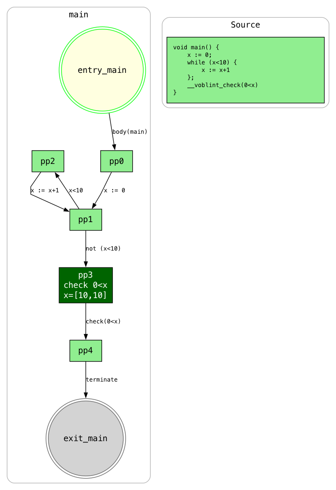
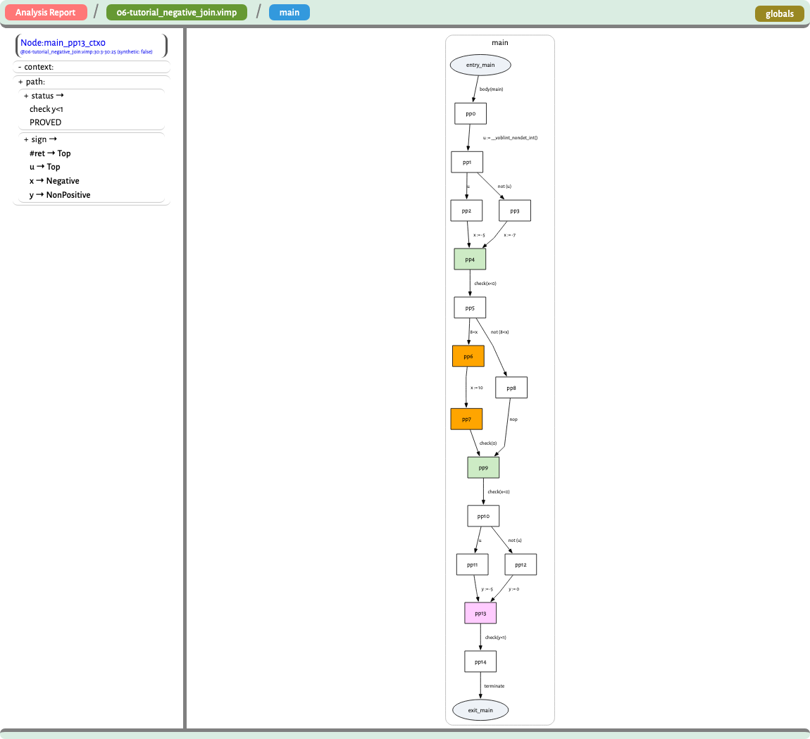
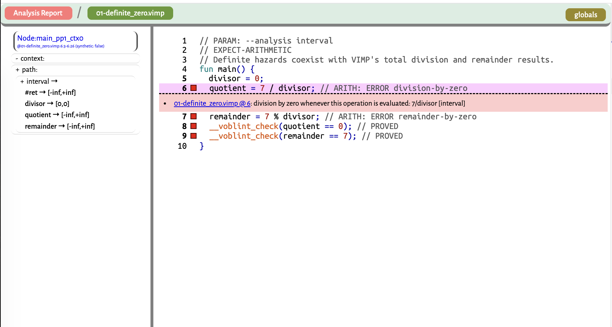
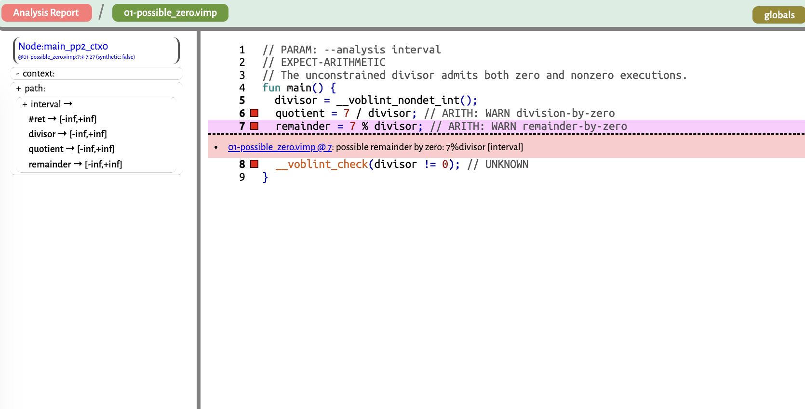
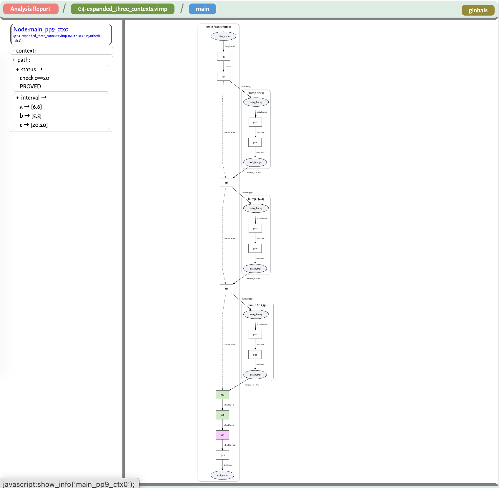
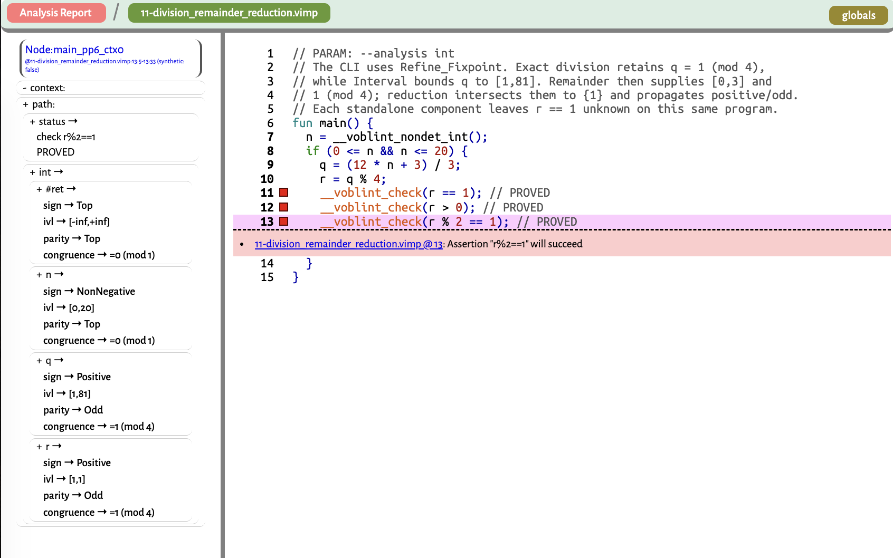

# Voblint

> **A Verified Goblint-Style Static Analysis Pipeline in Isabelle/HOL**

> Master's thesis. Manuel Lerchner, supervised by [@AlexandraGrass](https://github.com/AlexandraGrass)

[](https://github.com/ManuelLerchner/Voblint-Verification-Master-Thesis/actions/workflows/ci.yml)
[](https://deepwiki.com/ManuelLerchner/Voblint-Verification-Master-Thesis)


Voblint is a machine-checked Isabelle/HOL framework for building, running and
verifying interprocedural abstract interpreters, modelled on Goblint's D/G
architecture. It chains verified CFG compilation, activation-local operational
semantics, executable equation generation, and a vendored verified top-down
solver into one soundness statement about the analyzer's own output.

The solver runs inside Isabelle/HOL and computes an abstract **post-solution**.
With widening and narrowing in play that is not necessarily a least fixpoint.
The end-to-end analyzer corollaries apply to that computed solution rather than to
an externally supplied one; the generic framework theorems below them are
stated for an arbitrary abstract bound.

## Running Voblint

Voblint programs are written in VIMP, a small IMP-style language with
`__voblint_check(cond)` assertions:

```c
fun main() {
    x = 0;
    while (x < 10) {
        x = x + 1;
    }
    __voblint_check(0 < x);
}
```

```bash
$ pixi run voblint --analysis interval tests/regression/02-control-flow/precision/02-while_loop.vimp
8:3  pp3        0<x                  PROVED   x=[10,10]
```

`--dot` renders the same solved CFG as GraphViz instead: the source sits beside
the graph, each check node carries its verdict and the state it was decided on,
and dead nodes are shaded. `--dot-full` puts every node's own state on the graph
rather than only the check nodes; under a context policy each context gets its
own cluster (see the gallery below).

```bash
pixi run voblint --analysis interval --dot tests/regression/02-control-flow/precision/02-while_loop.vimp \
  | dot -Tpng -o cfg.png
```

<p align="center">
  <a href="docs/images/while_loop_cfg.png">
    
  </a>
  <br><sub>The source travels with the graph; the check node carries its verdict and the state it was decided on.</sub>
</p>

A product domain does not fit on a graph. One variable of the `int` domain
prints as `sign=Positive, ivl=[1,1], parity=Odd, congruence==1`, and a whole
program of those is unreadable. `--html` writes a browsable report instead: the
graph stays sparse, each node's full state lives in its own document, and
clicking a node or a source line shows it. `pixi run html-report-serve` serves and
opens the report generated by `--html`.

<p align="center">
  <a href="docs/images/report-graph-sign.png">
    
  </a>
  <br><sub>Source view: click a line, get the verdict and the abstract state that decided it.</sub>
</p>

More views in [the gallery below](#reading-a-result); details and the
browser-XSLT caveat in [`docs/HTML_REPORT.md`](docs/HTML_REPORT.md).

Other useful modes:

```bash
# deterministic textual CFG snapshot, no GraphViz dependency
pixi run voblint --analysis interval --graph-snapshot FILE.vimp

# parse-only syntax check (exit 0 on success, 2 on a parse error)
pixi run voblint --parse-only FILE.vimp
```

`--context none|entry-state|call-string` selects the analysis context.
`--context-graph collapsed|expanded` changes only how a context-sensitive
result is drawn. `pixi run voblint --help` lists every flag;
[`docs/CLI_DESIGN.md`](docs/CLI_DESIGN.md) describes the CLI trust boundary,
and [`docs/CHECK_ARCHITECTURE.md`](docs/CHECK_ARCHITECTURE.md) the contextual
result and rendering architecture.

### Arithmetic diagnostics

Executable Isabelle witnesses live in
[Example_Arithmetic_Diagnostics_Regression.thy](src/Examples/CLI/Example_Arithmetic_Diagnostics_Regression.thy),
also imported by the `Voblint.thy` capstone. They cover guard deduplication,
dead-branch silence, contextual aggregation, and both Boolean operands.

Every analysis also checks divisors in `/` and `%` expressions using the solved
state before the containing statement. A divisor that may be zero produces a
`warning`; a divisor that is zero in every represented live context produces an
`error`. Safe operations and unreachable points produce no message. These
plain text report groups arithmetic diagnostics and assertion checks into two
aligned tables, with source positions and an analysis heading. Graph and HTML
commands also print compiler-style diagnostics to stderr. Analysis continues, and diagnostics do not change the exit code.
HTML reports include source-linked findings for each selected domain.

<p align="center">
  <a href="docs/images/report-arithmetic-definite.png">
    
  </a>
  <br><sub>Definite zero divisors remain visible in the report while VIMP keeps division and remainder total.</sub>
</p>

<p align="center">
  <a href="docs/images/report-arithmetic-possible.png">
    
  </a>
  <br><sub>A possible zero divisor is a warning: the abstract state cannot exclude zero, even when nonzero executions also exist.</sub>
</p>

The traversal covers assignments, guards, call arguments, returns, `min`/`max`,
and checks, including nested arithmetic. It inspects both operands of `&&` and
`||`: `0 && 1 / 0` therefore reports the zero divisor too. This is a diagnostic
policy over VIMP's total expressions. Execution still uses `a / 0 = 0` and
`a % 0 = a`; warnings do not introduce faults or C undefined behavior.

“Possible” means the abstraction cannot exclude zero, not that a concrete
execution with a zero divisor has been found. An `error` likewise describes the
divisor whenever the point is reached; it does not prove the point reachable.

Regression fixtures opt into exact diagnostic checking with
`// EXPECT-ARITHMETIC`. Inline expectations use `// ARITH: WARN division-by-zero`,
`// ARITH: ERROR remainder-by-zero`, or `// ARITH: NONE`. Multiple expectations
on one statement are separated by semicolons. The harness rejects missing and
unexpected diagnostics; see the
[arithmetic fixtures](tests/regression/23-arithmetic-diagnostics/README.md).

## What Voblint proves

```text
Execution:  VIMP AST -> CFG -> equation system -> verified TD solver
                     -> computed post-solution -> check report

Proof:      source execution -> activation-local traces (valid_ltr)
                             -> per-point collection (ltr_collect)
                             included in the concretization of that result
```

The computed result is compared with an activation-local collecting semantics.
A [`valid_ltr`](src/Program_Model/CFG/Collecting/LTR_Def.thy) records one
procedure activation's view of an execution; calls enter and return without
threading a global control stack through the semantics.
[`ltr_collect`](src/Program_Model/CFG/Collecting/LTR_Collect.thy) collects
every store held by a valid trace at each CFG node. Context-sensitive analyses
use `activation_collect`, which groups those stores by admitted activation
context. This adapts Goblint's thread-modular local-trace construction from
threads to procedure activations.

### End-to-end soundness

The headline theorem is
[`run_voblint_certified_source_sound`](src/Executable_Surface/CLI/Analysis_Certified.thy).
It ranges over the same `run_voblint` entry point exported to OCaml and over
every accepted domain, solver discipline, and context policy:

```isabelle
theorem run_voblint_certified_source_sound:
  fixes p :: imp_prog and s0 s :: store
  assumes s0: "s0 ∈ cinit_stores (declared_global p)"
      and run: "star (pstep (declared_global p) (prog_table p))
                  (main_body (prog_table p), s0, []) (residual, s, frs)"
      and terminates: "config_terminates D solver ctx p"
      and ans: "run_voblint D solver ctx view p = Analysed out"
  shows "∃v stk. csim (prog_table p) (prog_cfg p) (residual, s, frs) (v, s, stk)
               ∧ s ∈ ltr_collect (declared_global p) (prog_cfg p)
                         (cinit_stores (declared_global p)) v
               ∧ analysis_result_covers D solver ctx p v s
               ∧ checks_sound_at out v s"
```

| Premise | Meaning |
| --- | --- |
| `s0` | Initial store. Declared globals start at `0`; locals are unconstrained. |
| `run` | An arbitrary finite VIMP execution prefix from `main`, with the residual command, current store, and pending caller frames made explicit. Source termination is not required. |
| `terminates` | The selected verified-solver run terminates for this program. This is the sole analyzer-side proof obligation. |
| `ans` | `run_voblint` accepted the program and configuration and returned `Analysed out`. It therefore supplies configuration legality and well-formedness. The requested rendering `view` is arbitrary. |

The conclusion supplies a CFG node `v` and matching call stack `stk`:

| Conjunct | Guarantee |
| --- | --- |
| `csim ... (v, s, stk)` | The compiler's forward simulation relates the source state to `v`. |
| `s ∈ ltr_collect ... v` | A valid trace genuinely reaches `v` with store `s`. |
| `analysis_result_covers ... v s` | The abstract state filed for `v`, under an admitted context when contexts are used, contains `s`. |
| `checks_sound_at out v s` | No row at `v` is `DEAD`; every `PROVED` or `REFUTED` verdict there is correct for `s`. |

`config_terminates` and `analysis_result_covers` dispatch over the selected
plan. They cannot store every domain behind one polymorphic abstract-state
value because each domain has its own carrier type. “Certified” names the
theorem; the CLI returns a report, not a proof certificate.

The theorem covers every row-producing configuration:

```text
D      in {Sign, Interval, Parity, Congruence, Int}
ctx    in {Ctx_None, Ctx_EntryState, Ctx_CallString k}
solver = None, or any discipline accepted for that domain and policy
```

There are 32 accepted plans. `None` selects a domain's default discipline;
naming another accepted discipline changes how the equations are solved, not
the guarantee. Unsupported combinations return `Unsupported_Configuration`;
ill-formed programs return `Malformed_Program`.

All 32 plans discharge the same [`sound_table`](src/Executable_Surface/CLI/Analysis_Run_Sound.thy)
interface. `Analysis_Run_Sound` establishes the generic endpoint,
`Analysis_Run_Ctx_Sound` lifts contextual results through
[`sound_table_of_activation`](src/Executable_Surface/CLI/Analysis_Run_Sound.thy),
and `Analysis_Run_Solver_Sound` registers explicitly selected disciplines. A
new supported discipline therefore needs an analysis registration and
instantiation, not new source-level reasoning.

### Checks and dead code

[`run_voblint_check_sound`](src/Executable_Surface/CLI/Analysis_Certified.thy)
specializes the headline to the next source check. If an execution is about to
run `Check e`, the report contains a row for `e` at a node reached with the
current store. That row is live, and every definite verdict is correct.

<details>
<summary>Exact check theorem</summary>

```isabelle
theorem run_voblint_check_sound:
  fixes p :: imp_prog and s0 s :: store
  assumes s0: "s0 ∈ cinit_stores (declared_global p)"
      and run: "star (pstep (declared_global p) (prog_table p))
                  (main_body (prog_table p), s0, []) (residual, s, frs)"
      and chk: "next_check residual = Some e"
      and terminates: "config_terminates D solver ctx p"
      and ans: "run_voblint D solver ctx view p = Analysed out"
  shows "∃row ∈ set (out_checks out). row_exp row = e
           ∧ s ∈ ltr_collect (declared_global p) (prog_cfg p)
                   (cinit_stores (declared_global p)) (row_point row)
           ∧ row_verdict row ≠ Dead
           ∧ (row_verdict row = Decided Check_Proved ⟶ truthy (aval e s))
           ∧ (row_verdict row = Decided Check_Refuted ⟶ ¬ truthy (aval e s))"
```

</details>

[`run_voblint_dead_row_unreached`](src/Executable_Surface/CLI/Analysis_Certified.thy)
states the guarantee needed for dead code: a `DEAD` row's point has an empty
collecting semantics.

<details>
<summary>Exact dead-row theorem</summary>

```isabelle
corollary run_voblint_dead_row_unreached:
  assumes terminates: "config_terminates D solver ctx p"
      and ans: "run_voblint D solver ctx view p = Analysed out"
      and row: "row ∈ set (out_checks out)"
      and dead: "row_verdict row = Dead"
  shows "ltr_collect (declared_global p) (prog_cfg p)
           (cinit_stores (declared_global p)) (row_point row) = {}"
```

</details>

This result is proved directly at the named point. It does not follow by
contraposing the existential end-to-end theorem. Under a context policy, the
printed row aggregates the contexts solved at that point, so `DEAD` means no
admitted context reaches it.

[`run_voblint_check_sites`](src/Executable_Surface/CLI/Analysis_Certified.thy)
proves that returned rows correspond exactly, in graph order, to the compiled
`EA_Check` edges. The handwritten CLI pairs them with parser source positions
by order; that pairing is outside the proof.

### Arithmetic safety from an empty diagnostic list

[`run_voblint_arithmetic_safe`](src/Executable_Surface/CLI/Analysis_Certified.thy)
connects the returned diagnostics to concrete divisors. For a terminating,
accepted analysis, absence of a diagnostic at a reachable point guarantees
that every divisor in that point's expressions is nonzero in every store
collected there. It covers the same domain, solver, and context configurations
as the other CLI soundness endpoints.

<details>
<summary>Exact arithmetic-safety theorem</summary>

```isabelle
theorem run_voblint_arithmetic_safe:
  assumes terminates: "config_terminates D solver ctx p"
      and ans: "run_voblint D solver ctx view p = Analysed out"
      and reachable: "s ∈ ltr_collect (declared_global p) (prog_cfg p)
                            (cinit_stores (declared_global p)) v"
      and quiet: "∀d ∈ set (out_diagnostics out). diagnostic_point d ≠ v"
  shows "arithmetic_safe_at (prog_cfg p) v s"
```

</details>

`arithmetic_safe_at` quantifies over every `/` and `%` occurrence in expressions
attached to the point, including both operands of Boolean expressions. The
extraction-completeness lemmas in
[`Arithmetic_Diagnostics.thy`](src/Executable_Surface/CLI/Arithmetic_Diagnostics.thy)
connect those occurrences to the generated obligations. Each obligation asks
whether its divisor differs from zero; the classifier uses the same solved
result as the check report and aggregates verdicts across contexts. A safe
context cannot suppress a warning from another context.

The theorem concerns `out_diagnostics` and compiled program points. Source
locations and diagnostic text come from the handwritten CLI and remain outside
the proof, as they do for check rows.

### Why the node and context are existential

A source control state need not determine one CFG node. The compiler can create
structurally matching nodes for identical commands in different procedures.
The `csim` conjunct records structural correspondence; the
`ltr_collect` conjunct selects a witness that is actually reachable with the
current store.

<details>
<summary>Example: structural correspondence is not unique</summary>

```text
main()   { x := 1; }
unused() { x := 1; }
```

The residual command `x := 1` structurally matches a node in each procedure.
Only the node in `main` has a valid trace carrying the running store. The
unused procedure's corresponding state is bottom.

</details>

Context-sensitive coverage is existential for the same semantic reason. The
store lies in at least one context admitted by its call history. A call string
is a function of that history, so its context is unique. Entry-state routing is
relational and may admit several contexts; another activation's entry need not
describe this store. Functional call-string routing therefore needs no separate
context-totality premise; relational entry-state routing proves the required
coverage of admitted contexts.

The state and check claims live at different representations.
`analysis_output` retains check rows, but renders snapshots, globals, and
per-row states as `String.literal`. Check soundness can therefore refer to
`out_checks out` directly. State soundness refers to the semantic result via
`analysis_result_covers`; recovering an abstract state from rendered text
would require inverting the renderer.

### Coverage, termination, and trust

Demand-driven solving does not add a coverage premise to the headline theorem.
For an accepted answer, well-formedness comes from `ans`; together with
`terminates`, the supporting `live_keys_cover` theorem proves closure along
the dependencies a reachable execution can follow: live intra-edge targets,
call continuations, and callee entries reached with live states. Structurally
dead procedures and calls on dead branches need not be solved. Keys after a
`return` may be solved but unread, so the closure is deliberately over live
keys rather than every solved key.

Termination remains a per-program logical premise. A caller can establish a
specific solve's termination by evaluation and then apply the corresponding
solver-success theorem; logically, this is membership in the solver's
termination domain. Nothing proves termination for every program, and the
evaluation may itself diverge. The result is partial correctness:

> Every report returned for a terminating accepted solve over-approximates all
> modeled source executions.

Read verdicts accordingly. `PROVED` says every execution reaching the row's
node satisfies the condition; `REFUTED` says every execution reaching it
falsifies the condition. Neither establishes reachability, so `REFUTED` is
not a verified counterexample.

The proof covers:

- VIMP execution from an already-constructed AST;
- compilation to the procedure-aware CFG;
- equation generation and the computed verified-solver post-solution;
- semantic abstract states, returned check rows, and arithmetic safety at points
  without diagnostics.

The executable `cli/main.ml` is a thin, unverified adapter around the generated
`run_voblint` entry point.

It does not cover:

- solver termination for arbitrary programs;
- lexing or parsing;
- Isabelle code generation, the OCaml compiler, or its runtime;
- the handwritten CLI's source-position pairing;
- rendered graph, snapshot, globals, or state strings;
- completeness or precision.

Lower-level collector, D/G, solver-transport, per-domain, and
per-configuration statements remain in
[`docs/THEOREM_MAP.md`](docs/THEOREM_MAP.md). The README keeps the three
configuration-generic, reader-facing results above.

Those lower layers retain the same content in more specialized forms: the
context-free dispatcher states verdict soundness over its verdict list; each
domain states source and completed-run soundness over its own result table; and
the domain-free source bridge turns any `ltr_collect` bound into a source-run
claim. New domains reuse that source reasoning.

<details>
<summary>Lower-level API ladder</summary>

`analyse_certified` packages the context-free analysis obligations. Domains
expose `analyse_<domain>_source_sound` and
`analyse_<domain>_completed_run_sound`; the domain-independent
`source_sound_from_ltr_collecting_cap` turns any `ltr_collect` bound into a
source-execution claim.

</details>

[`Example_End_To_End_Certificate`](src/Examples/Capstone/Example_End_To_End_Certificate.thy)
shows the headline is non-vacuous. It evaluates well-formedness, solver
termination, and the answer for one program using the `Int` product, a
length-one call string, and an explicit always-join solver. It also constructs
the source run through both calls and its check. Its full certificate names the
returned answer, the `PROVED` row, the completed run, collection at `Statement
4`, result coverage, row soundness, and the checked condition's truth.
The example names those witnesses `certificate_demo_check_row_sound` and
`certificate_demo_full_certificate`.
[`Example_Side_Execute`](src/Examples/Sign/Example_Side_Execute.thy) provides a
smaller Sign instance with every premise discharged.

## Reading a result

The report separates the graph from the state, and each view answers a different
question.

<table>
  <tr>
    <td width="50%" valign="top" align="center">
      <a href="docs/images/report-graph-sign.png">
        
      </a>
      <br><b>Graph view, Sign</b>
      <br><sub>Green nodes are proved checks, orange nodes are dead: <code>8 &lt; x</code> is infeasible on a <code>Negative</code> <code>x</code>, so the whole arm, its check included, drops out. The selected node's state is on the left.</sub>
      <br><sub><a href="tests/regression/07-sign-precision/precision/06-tutorial_negative_join.vimp"><code>06-tutorial_negative_join.vimp</code></a> &middot; <code>--analysis sign --html</code></sub>
    </td>
    <td width="50%" valign="top" align="center">
      <a href="docs/images/report-context-interval.png">
        
      </a>
      <br><b>Context-sensitive Interval</b>
      <br><sub><code>--context entry-state</code> keeps a separate abstract state per distinct <em>abstract</em> argument context. Several concrete arguments can share one, and the solver may revisit a context. <code>--context-graph expanded</code> draws each as its own cluster: <code>[5,5]</code>, <code>[4,4]</code> and <code>[19,19]</code>, the last read from a global at the call site, instead of one cluster holding their join.</sub>
      <br><sub><a href="tests/regression/11-graph-snapshot/04-expanded_three_contexts.vimp"><code>04-expanded_three_contexts.vimp</code></a> &middot; <code>--context entry-state --context-graph expanded --html</code></sub>
    </td>
  </tr>
  <tr>
    <td colspan="2" align="center">
      <a href="docs/images/report-int-refinement.png">
        
      </a>
      <br><b>The refining <code>int</code> domain: four analyses in one report</b>
      <br><sub><code>int: PROVED</code> beside <code>interval</code>, <code>sign</code> and <code>parity</code>, each UNKNOWN on the same program and the same node.</sub>
      <br><sub><a href="tests/regression/16-composite-domain/precision/01-refinement_beats_components.vimp"><code>01-refinement_beats_components.vimp</code></a> &middot; <code>--analysis int,interval,sign,parity --context none --html</code></sub>
    </td>
  </tr>
</table>

Where that last gain comes from is worth stating precisely, because stronger
precision alone does not identify its cause. Interval's own backward step for
`+` is the conservative identity, so the guard `y + 1 == 3` tells it nothing;
Sign and Parity likewise. Congruence carries the only real arithmetic
inversion, and it is the fourth component. The
composite's
reduction step then re-derives the other three views from that tightened
operand, giving `y = [2,2]`, `Positive`, `Even`, `==2`. The gain is the extra
component *plus* cross-component reduction, not a better interval transfer
([`Int_Backward.thy`](src/Analyses/Int/Int_Backward.thy),
[`Int_Refinement.thy`](src/Analyses/Int/Int_Refinement.thy)).

## Domains and configurations

| Domain | `--analysis` | Result table | Default solver | Context policies |
| --- | --- | --- | --- | --- |
| Sign | `sign` | `analyse_sign_result` | join | `none`, `entry-state`, `call-string` |
| Interval | `interval` | `analyse_interval_result` | warrowing | `none`, `entry-state`, `call-string` |
| Parity | `parity` | `analyse_parity_result` | join | `none`, `entry-state`, `call-string` |
| Congruence | `congruence` | `analyse_congruence_result` | join | `none`, `entry-state`, `call-string` |
| Int (Sign × Interval × Parity × Congruence) | `int` | `analyse_int_result` | warrowing | `none`, `entry-state`, `call-string` |

Every domain supplies a `widen` operator; Sign and Parity are finite lattices
with `widen = sup`. What only Interval and the `int` product have is a solved
table and a soundness corollary behind the widening rules, so the other
`Solver_Warrow` pairings stay unsupported rather than being exposed on the
strength of the instance alone. Unsupported `(domain, solver)` and
`(domain, context)` pairings are rejected explicitly, answering `None` at
[`resolve_analysis_config`](src/Executable_Surface/CLI/Analysis_Config.thy) rather
than falling back silently.

## The generic D/G framework

Analyses are factored the way Goblint factors them:

* **D**: abstract facts attached to program points;
* **G**: globally shared information published and consumed across points.

The central abstraction is the Isabelle counterpart of Goblint's
[`Spec`](https://github.com/goblint/analyzer/blob/1ab59c9c4d9859e9135885d3c9a9aa1a8f3b677e/src/framework/analyses.ml#L168-L263)
interface. An analysis provides transfer, entry, combine, and communication
operations. The framework supplies routed equation generation, solver
integration, and the collecting- and source-level soundness lifting.

| Layer | Responsibility |
| --- | --- |
| `DG_Spec` / `DG_Spec_Sound` | Transfer, entry, combine, and communication contracts |
| `DG_Ctx_Activation` | Routed activation and context obligations |
| `Compiled_Routed_Equations` | One equation generator for every context policy |
| `Unit_DG_Analysis` | Context-insensitive instance and source endpoints |
| `DG_Reader_Transport` | Generic solved-state transport |
| `Exec_St_*` / `DG_Local_State_Exec*` | Executable finite states and refinement |

[`sound_dg_spec_core`](src/Abstract_Interpreter/Framework/Spec/DG_Spec_Sound.thy)
covers transfer and return-combine independently of routing;
[`dg_ctx_activation_base`](src/Abstract_Interpreter/Framework/Activation/DG_Ctx_Activation.thy)
adds the routed call-entry obligation. Interpreting the core alone therefore
does not constrain interprocedural entry.

Adding a domain still costs more than one locale instantiation: the lattice and
its concretization, transfer soundness, an executable representation and its
refinement, entry/context coverage, and solver integration each carry
obligations. What is *not* re-proved is any source-level reasoning; see "One
generator, six layers" in
[`src/Abstract_Interpreter/Framework/README.md`](src/Abstract_Interpreter/Framework/README.md)
and [`docs/ANALYSIS_ASSEMBLY_GENERATION.md`](docs/ANALYSIS_ASSEMBLY_GENERATION.md).

## Repository structure

| Directory | Responsibility |
| --- | --- |
| `src/Program_Model/VIMP` | Source syntax and small-step semantics |
| `src/Program_Model/CFG` | Graph model and activation-local collecting semantics; never mentions the compiler |
| `src/Program_Model/Compile` | VIMP-to-CFG compiler, its invariants and forward simulation |
| `src/Abstract_Interpreter/Domain` | Abstract values and states, concretization, dead-code lift |
| `src/Abstract_Interpreter/Solver` | Strategy-tree equation language and the bridge to the vendored TD solver |
| `src/Abstract_Interpreter/Framework` | Generic D/G specifications, routing, constraints, results |
| `src/Abstract_Interpreter/Exec` | Executable finite states and their refinement |
| `src/Analyses` | Concrete domains over the shared sessions in `Analyses/Shared`, which also hold the domain-independent end-to-end endpoints (`source_reaches_ltr_collect`, `unit_dg_analysis`); each selectable domain owns its `<Domain>_Entry.thy` |
| `src/Executable_Surface/CLI` | The `analyse` dispatcher and the render surface; the one layer that sees every domain |
| `src/Executable_Surface/Codegen` | `export_code` declarations (generated OCaml lands in `codegen/generated/`) |
| `src/Examples` | Executable runs, flagship demos, regression proofs, one session per folder |
| `manifests/` | Canonical YAML inputs for analysis registration and VIMP grammar generation |
| `vendor/` | TD solver and g2html submodules |

`Abstract_Interpreter/Framework` is the generic D/G framework, stated for an
arbitrary CFG. `Analyses/Shared` instantiates it over compiled programs for the
concrete analyses: routing policies, the published result with its source-level
endpoints, and the reuse locales of non-relational domains. The same split
separates `Framework/Result` (what a solved table is) from `Analyses/Shared/Result`
(what a compiled program's solved table proves about its source runs).

Session dependencies run, in outline,
`VIMP → CFG → Compile`, `Domain`/`Solver` → `Framework` → `Exec` → `Routing` →
`Result` → `Nonrelational` → `Analyses/*` → `CLI` → `Codegen`, with `Examples/*` hanging off the analysis
sessions. That is a simplified overview. It omits cross-dependencies and the
CLI-dependent example sessions; `ROOTS` lists one directory per session, and each
`ROOT` states the real closure.

## Build and verification

Requirements: **Isabelle2025-2** (the version CI runs and `scripts/setup.sh`
expects), an **[AFP](https://www.isa-afp.org/)** checkout, **[pixi](https://pixi.sh/)**,
and, for the code-generation and CLI tasks, OCaml (Dune, Menhir, `ocamllex`,
and Zarith) via opam.

```bash
pixi run ocaml-deps-install  # install the dependencies declared in voblint.opam
```

`scripts/setup.sh` installs the optional I/Q and I/R developer tooling from a
pinned AutoCorrode revision under the ignored `vendor/autocorrode/` directory
and registers I/Q in Isabelle's user component configuration. It also installs
the Pixi and OCaml environments, so a fresh development checkout needs only
that one setup command. Normal builds do not fetch AutoCorrode.

```bash
pixi run vendor-init                         # init the TD solver submodule
AFP=/path/to/afp/thys pixi run isabelle-build # batch-build the Isabelle integration target
AFP=/path/to/afp/thys pixi run isabelle-jedit # interactive development
```

`pixi.toml` is the single command surface; `pixi task list` shows all tasks.
The ones that matter most often:

| Task | Description |
| --- | --- |
| `isabelle-build` | Batch-build `Voblint_Examples`, which reaches every session except `Voblint_Codegen` |
| `isabelle-pdf-build` | Render the formalization and certificate appendix into `output/document.pdf` |
| `isabelle-pdf-full-build` | Include all example sessions in `output/document-full.pdf` |
| `codegen` / `codegen-check` | Regenerate `codegen/generated/`, or fail on drift |
| `codegen-regression` | Compile and run the OCaml driver against Isabelle-proved expected output |
| `cli-build` / `cli-test` | Build the `voblint` binary; run `tests/run.py` against it |
| `grammar-check` | Regenerate both parser frontends and fail on any diff |
| `property-test` | Hypothesis property tests (parser fuzzing, AST round-trip) |
| `verify` | Run the supported local verification gate; GitHub CI runs the same leaf checks separately |

To export the formalization as a PDF, run `pixi run isabelle-pdf-build`
(or `AFP=/path/to/afp/thys pixi run isabelle-pdf-build`). This requires Isabelle's
LaTeX toolchain and Pandoc. Open `output/document.pdf` after the build succeeds.
The current `README.md` is converted automatically and included starting on
page 2, followed by the abstract and theory contents. Its local figures, tables,
code blocks, and expanded detail sections are retained. Remote images, including
the local banner and figures are embedded; remote badges are represented by
text. The PDF build is offline and deterministic. CI installs Pandoc alongside
LaTeX.
The document groups the core theories by session, including generated theories
and code export. Example sessions are omitted from presentation, except for
`Example_End_To_End_Certificate`, which appears in an appendix. To include every
example session, run `pixi run isabelle-pdf-full-build`; its output is
`output/document-full.pdf`. Both PDFs stay in the ignored `output/` directory.
CI builds the default PDF and uploads it as the `formalization-pdf` workflow
artifact, retained for seven days, alongside the separate `thesis-pdf` artifact.
Isabelle/HOL, AFP, and vendored dependencies are checked but are not printed.

The task generates a separate `Voblint_Document` session under `build/pdf-session/`
and an `inventory.json` listing every included source file. It checks that every
theory under `src/` belongs to the full inventory before selecting what to print.
Both variants retain all theory imports and proof dependencies. This session
starts from HOL so project theories can be presented; the first PDF build checks them again and can
take substantially longer than an incremental proof build. Subsequent builds
are incremental; switching variants changes the presentation configuration.
The session stays outside `ROOTS` so regular builds do not require LaTeX.
Do not run `isabelle mkroot` in the repository: that creates an empty session
template rather than a document of the existing sessions.

The generated OCaml is compile-checked by actually compiling it: both
`codegen-regression` and `cli-build` run Dune over
`codegen/generated/ml/Voblint_CLI.ml`. `export_code` emits one `Generated`
module for the whole reachable program (plus HOL's `Bit_Shifts` and
`Str_Literal` preludes); do not hand-edit anything under `codegen/generated/`.

> The vendored solver is pinned to a private fork of
> [stilscher/td-verification](https://github.com/stilscher/td-verification); CI
> needs a `SUBMODULES_TOKEN` secret to clone it. Making that fork public is the
> outstanding step for a fully reproducible artifact.

## VIMP grammar pipeline

`manifests/vimp-grammar.yaml` is the sole source of truth for VIMP syntax. Two generators
realize it for two unrelated parser targets:

```text
manifests/vimp-grammar.yaml
       |
       +-- scripts/gen_vimp_menhir.py   -> cli/vimp_parser.mly, cli/vimp_lexer.mll
       +-- scripts/gen_vimp_isabelle.py -> src/Program_Model/VIMP/VIMP_Grammar_Generated.thy
```

Never hand-edit the three generated files. **This pipeline sits outside the
proved pipeline and is untrusted code**: no soundness theorem covers lexing or
parsing, and the proved chain starts at an already-constructed `imp_prog`.
Confidence comes from process instead: one canonical grammar, drift-checked
generation (`pixi run grammar-check`, also a pre-commit hook), the `.vimp`
regression corpus, AST round-trip and print-stability checks, and Hypothesis
fuzzing under `tests/property/`.

## Foundations

* **Goblint** ([GitHub](https://github.com/goblint/analyzer)): modular interprocedural abstract interpretation and the D/G architecture.
* **Abstract Interpretation of Annotated Commands** ([ITP 2012](https://doi.org/10.1007/978-3-642-32347-8_9)): reusable abstract interpretation in Isabelle/HOL.
* **The Top-Down Solver Verified** ([CAV 2024](https://doi.org/10.1007/978-3-031-65627-9_15)): the vendored executable verified solver.
* **Mixed Flow-Sensitive Static Analysis: Engineering Modularity** ([FM 2026](https://doi.org/10.1007/978-3-032-26220-2_22)).
* **Data Race Detection by Digest-Driven Abstract Interpretation** ([arXiv:2511.11055](https://arxiv.org/abs/2511.11055)): thread-modular local-trace semantics, which Voblint's activation-local traces (`src/Program_Model/CFG/Collecting/`) adapt to procedure activations.

## Documentation

| Document | Contents |
| --- | --- |
| [`AGENTS.md`](AGENTS.md) | Project contract, style rules, working agreements |
| [`docs/PROOF_OVERVIEW.md`](docs/PROOF_OVERVIEW.md) | Proof architecture and intended claims |
| [`docs/THEOREM_MAP.md`](docs/THEOREM_MAP.md) | Thesis claims mapped to checked Isabelle theorems |
| [`docs/GLOSSARY.md`](docs/GLOSSARY.md) | Terminology and defining layers |
| [`docs/VERIFICATION_CHAIN_AND_TRUST_BOUNDARY.md`](docs/VERIFICATION_CHAIN_AND_TRUST_BOUNDARY.md) | What is proved, what is trusted |
| [`docs/GOBLINT_ALIGNMENT_REGISTER.md`](docs/GOBLINT_ALIGNMENT_REGISTER.md) | Where this formalization differs from upstream Goblint, and why |
| [`docs/ISABELLE_AGENT_NOTES.md`](docs/ISABELLE_AGENT_NOTES.md) | Build commands, agent-assisted development (I/Q, I/R), `./scripts/setup.sh` |
| [`docs/ROADMAP.md`](docs/ROADMAP.md), [`docs/NON_GOALS.md`](docs/NON_GOALS.md) | Scope and priorities |

## License

Voblint is available under the [`BSD-3-Clause`](LICENSE) license. Vendored
dependencies retain their own licenses.
