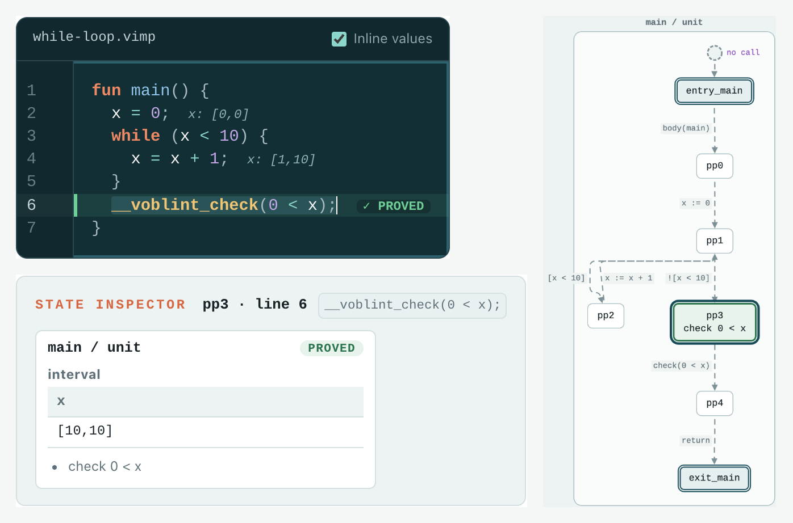
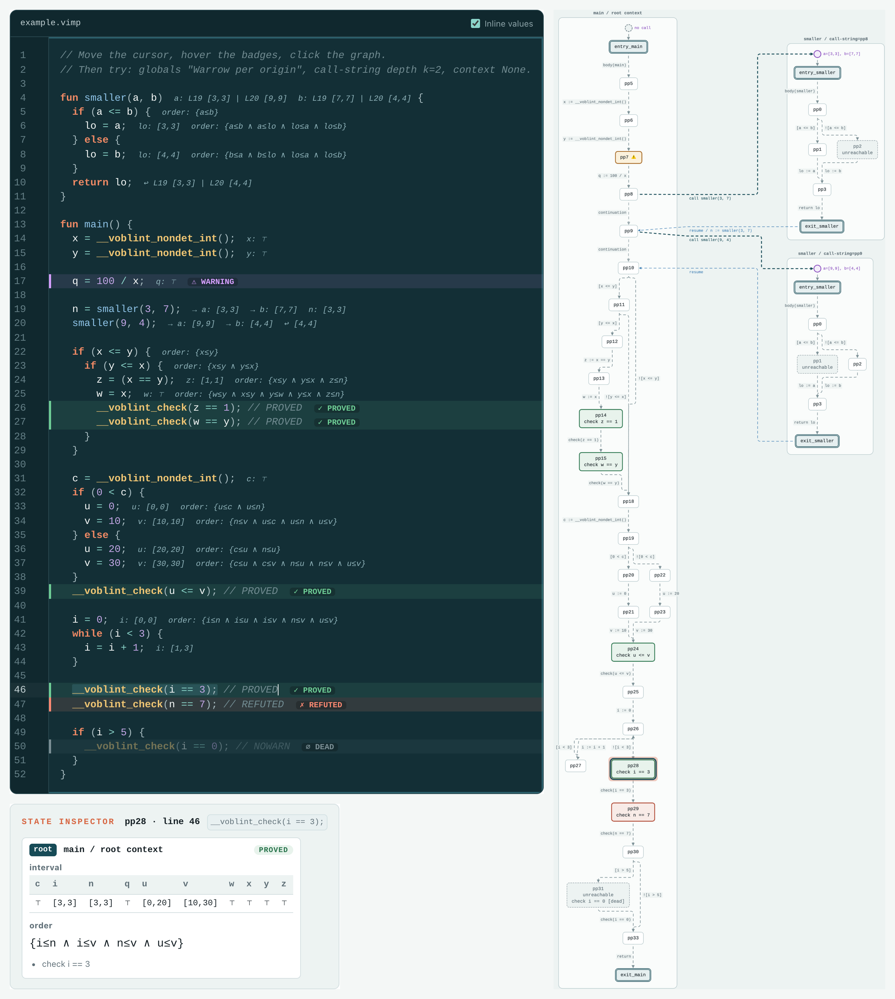
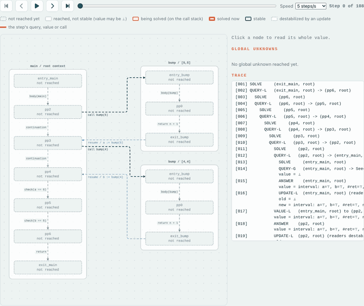
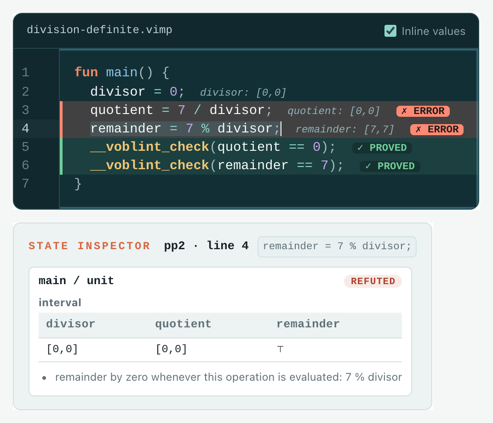
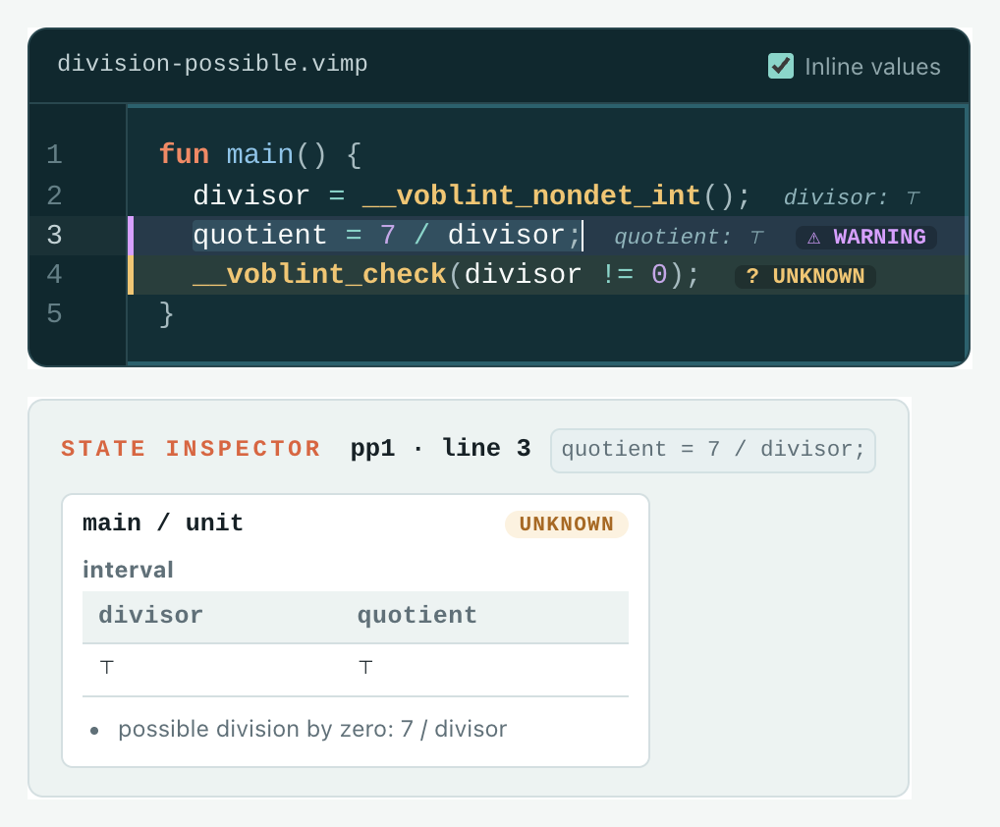
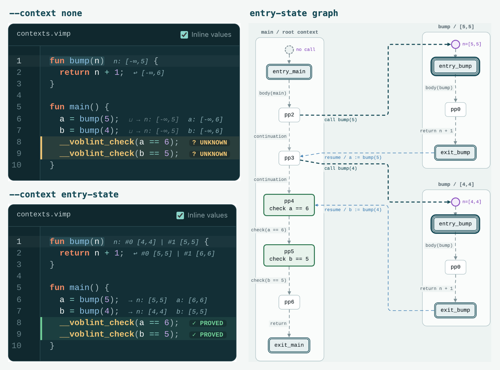
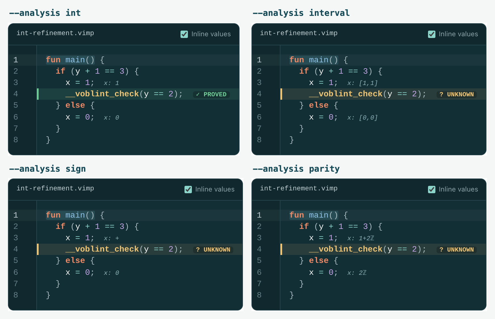

# Voblint

> **A Verified Goblint-Style Static Analysis Pipeline in Isabelle/HOL**
>
> Master's thesis. Manuel Lerchner, supervised by [@AlexandraGrass](https://github.com/AlexandraGrass)

[](https://github.com/ManuelLerchner/Voblint-Verification-Master-Thesis/actions/workflows/ci.yml)
[](https://deepwiki.com/ManuelLerchner/Voblint-Verification-Master-Thesis)


## What is verified?

Voblint proves an end-to-end soundness result:
whenever `run_voblint` returns a report, every reachable source state is covered by that report, and every definite verdict it gives holds concretely.

```math
\underbrace{(\mathit{main}, s_0, [\,]) \to_p^{*} (r, s, \mathit{fs})}_{\text{source run}}
\;\Longrightarrow\;
\exists v.\;\;
(r, s, \mathit{fs}) \approx v
\;\;\wedge\;\;
s \in
\underbrace{\mathcal{C}(v) \;=\; \bigcup_{c} \mathcal{A}(v, c)}_{\text{collecting semantics}}
\;\subseteq\;
\underbrace{[\![\, \mathit{res} \,]\!]_{v}}_{\text{analyzer report}}
\;\subseteq\;
\underbrace{\mathcal{V}_{\mathit{res}}(v)}_{\text{verdicts}}
```

Every store $s$ a source run from an initial store $s_0$ reaches is collected at
a CFG node $v$ that
simulates the run's configuration ($\approx$), is represented by the analyzer's
report at $v$, and satisfies every definite verdict reported there.

The node is existential because the simulation relation is structural rather
than functional: the same residual source command may match several compiled
nodes, for instance in an uncalled procedure with the same body. Membership in
$\mathcal{C}(v)$ selects a node the execution actually reaches. The equality
is lossless: the context-indexed sets $\mathcal{A}(v, c)$ cover the collecting
semantics, and their union recovers $\mathcal{C}(v)$ exactly. The two inclusions
are one-way guarantees: the report may describe stores no run reaches, and the
verdict semantics keeps only what the definite verdicts assert.

Each step is an Isabelle theorem:
[`source_reaches_node_collect`](src/Analyses/Shared/Result/Source_Activation_Sound.thy),
[`node_collect_eq_Union_activation_collect`](src/Program_Model/CFG/Collecting/Activation_Trace_Abstract.thy),
[`run_voblint_covers`](src/Executable_Surface/CLI/Analysis_Certified.thy) and
[`analysis_report_verdicts_sound`](src/Executable_Surface/CLI/Analysis_Report.thy).

[`run_voblint_source_sound`](src/Executable_Surface/CLI/Analysis_Certified.thy)
states the whole chain for every run that returns a report.

The report's states at $v$ can also be joined over their contexts. Every store
the report describes at $v$ lies in the concretization of that join,
$`[\![\, \mathit{res} \,]\!]_{v}
\subseteq \gamma\big(\bigsqcup_{c} \mathit{res}(v,c)\big)`$
([`report_sem_point_join`](src/Executable_Surface/CLI/Analysis_Report.thy)),
so [`run_voblint_source_sound_joined`](src/Executable_Surface/CLI/Analysis_Certified.thy)
gives the same guarantee for the one state per point that the playground's
control-flow view shows. The join can lose precision but not reached stores.

## What is Voblint?

Voblint is a machine-checked Isabelle/HOL framework for building, running and
verifying interprocedural abstract interpreters, modelled on Goblint's D/G
architecture. It chains verified CFG compilation, activation-trace operational
semantics, executable equation generation, and a vendored verified top-down
solver into one soundness statement about the analyzer's own output.

The solver runs inside Isabelle/HOL and computes an abstract **post-solution**.
With widening and narrowing in play that is not necessarily a least fixpoint.
The end-to-end analyzer corollaries apply to that computed solution rather than to
an externally supplied one; the generic framework theorems below them are
stated for an arbitrary abstract bound.

## Running Voblint

Voblint programs are written in VIMP, a small IMP-style language with
`__voblint_check(cond)` assertions:

```c
fun main() {
    x = 0;
    while (x < 10) {
        x = x + 1;
    }
    __voblint_check(0 < x);
}
```

```text
$ pixi run voblint --analysis interval tests/regression/02-control-flow/precision/02-while_loop.vimp
tests/regression/02-control-flow/precision/02-while_loop.vimp [interval]

Arithmetic diagnostics
None

Assertion checks
Location  Point  Condition  Verdict  State
--------  -----  ---------  -------  -------------------
8:3       pp3    0 < x      PROVED   interval: x=[10,10]
```

The [browser playground](https://manuellerchner.github.io/Voblint-Verification-Master-Thesis/playground.html) runs the same generated analyzer on a program
you edit, with no server involved. Verdicts and value hints appear in the source,
the cursor's statement shows its state in every context, and the solved graph
draws one box per procedure and context. To explore a local program there, add
`--playground`: it opens the playground with the file and the given settings, or
those of its `// PARAM:` header, instead of analyzing it locally.

```bash
pixi run voblint --analysis interval --context entry-state my_program.vimp --playground
```

<p align="center">
  <a href="docs/images/while_loop_cfg.png">
    
  </a>
  <br><sub>The program above in the playground. <a href="https://manuellerchner.github.io/Voblint-Verification-Master-Thesis/playground.html?analysis=interval&amp;globals=warrow&amp;context=none#code=SyvNU8hNzMzT0FSo5lJQqFCwVTCwBjLKMzJzUhU0KhRsFAwNIHIQ2QoFbQVDkIpaII6PL8tPysnMK4lPzkhNztYwACqv0LTmqgUA">Open this run</a>.</sub>
</p>

<p align="center">
  <a href="docs/images/playground-overview.png">
    
  </a>
  <br><sub>Calls, contexts, a relational domain, verdicts and an arithmetic warning in one run. <a href="https://manuellerchner.github.io/Voblint-Verification-Master-Thesis/playground.html?analysis=interval%2Corder&amp;globals=warrow&amp;context=call-string&amp;k=1">Open this run</a>.</sub>
</p>

`--context none|entry-state|call-string` selects the analysis context,
`--globals` the update rule for side-effected globals, and
`--program-globals flow-sensitive|flow-insensitive` whether a program's globals
travel with each point's state or each live at its own global unknown, read only by
the points that mention it;
both placements carry the same soundness theorem. `pixi run voblint --help`
lists every flag. `--graph-snapshot` prints the solved graph as deterministic
text and `--parse-only` checks syntax.
[`docs/CLI_DESIGN.md`](docs/CLI_DESIGN.md) describes the CLI trust boundary and
[`docs/CHECK_ARCHITECTURE.md`](docs/CHECK_ARCHITECTURE.md) how a result becomes
a report.

`--trace` also writes the solver's steps to stderr: per call, the context it is
routed to, what the callee's entry reads from its seed, and which publications
restart the caller. `--verbose` lists every step in a Goblint-aligned tracing
vocabulary (`%%% iter: begin iterate ...`; the mapping table in
`docs/CLI_DESIGN.md` records every difference), `--trace-sys iter,side` selects
subsystems, `--format jsonl` emits JSON Lines and `--output FILE` writes to a
file; standard output stays the same. The playground's **run_voblint: call and answer** panel
shows the full (`--verbose`) trace under the call and its answer, colored by step and folded
by query, with downloads of the whole text and of its JSON Lines form. Three layers: the solver
result is the exported computation of proved equations, and the trace calls
inside it come from code equations proved equal to the untraced ones; the trace
is an unverified observation of that computation, through a `code_printing`
mapping of `trace_event` to an OCaml hook that returns unit, swallows
exceptions and never touches solver state, so it cannot feed back; the replay
and animation are an unverified visualization of the trace
([`docs/CLI_DESIGN.md`](docs/CLI_DESIGN.md#solver-trace---trace)).

```bash
pixi run voblint --analysis interval --context entry-state --trace docs/readme-figures/contexts.vimp
```

The playground's **Solve replay** section steps through the same solve on the
graph, with the verbose trace beside it: the value each unknown holds, the seed
each call publishes its entry state into, the stack of open queries and the
edge each query follows backward from the exit, with the stable set,
destabilization cascades, widening points and influence edges drawn on the
graph and the routes and counters below it. One reducer folds the run's JSON
Lines trace into every state it shows.
`node scripts/capture_readme_figures.mjs solve-replay` regenerates the
animation below from the playground.

<p align="center">
  <a href="docs/images/solve-replay.gif">
    
  </a>
  <br><sub>The context example solved step by step. <a href="https://manuellerchner.github.io/Voblint-Verification-Master-Thesis/playground.html?analysis=interval&amp;globals=warrow&amp;context=entry-state#code=SyvNU0gqzS3QyNNUqOZSUChKLSktylPIU9BWMLTmquXiSgMqyE3MzNOAyCcq2ELUm2paA7lJMK4JmBsfX5aflJOZVxKfnJGanK0BVG2rYIZVKgkkBTKkFgA">Open this run</a>.</sub>
</p>

### Arithmetic diagnostics

Every analysis also checks the divisors of `/` and `%` against the solved state
before the statement. A divisor that may be zero is a `warning`; one that is
zero in every live context is an `error`. Safe operations and unreachable points
report nothing, and diagnostics never change the exit code.

<table>
  <tr>
    <td align="center">
      <a href="docs/images/playground-division-definite.png">
        
      </a>
      <br><sub>Definite: errors, while both checks still prove. <a href="https://manuellerchner.github.io/Voblint-Verification-Master-Thesis/playground.html?analysis=interval&amp;globals=warrow&amp;context=none#code=SyvNU8hNzMzT0FSo5lJQSMksyyzOL1KwVTCwBnILS_NLMlPzSoB8cwV9mCxIpigVpCsltQgspYosFR9flp-Uk5lXEp-ckZqcrYEwBGiqJjYVSIYBTQMqqQUA">Open</a>.</sub>
    </td>
    <td align="center">
      <a href="docs/images/playground-division-possible.png">
        
      </a>
      <br><sub>Possible: the state cannot exclude zero. <a href="https://manuellerchner.github.io/Voblint-Verification-Master-Thesis/playground.html?analysis=interval&amp;globals=warrow&amp;context=none#code=SyvNU8hNzMzT0FSo5lJQSMksyyzOL1KwVYiPL8tPysnMK4nPy89LSS2JBzI1NK2BagpL80syU_NKgIrMFfRhWkAyCD3JGanJ2Row0xRtFQyAWmsB">Open</a>.</sub>
    </td>
  </tr>
</table>

The traversal covers assignments, guards, call arguments, returns, `min`/`max`
and checks, nested arithmetic included, and both operands of `&&` and `||`. It is
a diagnostic policy over VIMP's total expressions: execution still uses
`a / 0 = 0` and `a % 0 = a`. “Possible” means the abstraction cannot exclude
zero, not that a zero-divisor execution exists; an `error` does not prove its
point reachable. The [arithmetic fixtures](tests/regression/23-arithmetic-diagnostics/README.md)
pin the findings and describe the expectation syntax.

## What Voblint proves

For every selection of analyses, globals rule and context policy, the report
`run_voblint` returns is sound for every execution of the program: whenever an
execution reaches a program point, some state the report holds there describes
its store, and every `PROVED` or `REFUTED` verdict there is correct for it. The
theorems are stated about the same `run_voblint` that is exported to OCaml and
runs in the CLI and the playground.

"Every execution" is made precise by an activation-trace collecting semantics.
A [`valid_activation_trace`](src/Program_Model/CFG/Collecting/Activation_Trace_Def.thy) trace records one
procedure activation's view of a run, and
[`node_collect`](src/Program_Model/CFG/Collecting/Activation_Trace_Collect.thy) gathers every
store such traces hold at each CFG node, adapting thread-modular local traces
(see [Foundations](#foundations)) from threads to procedure activations.

### The headline theorem

[`run_voblint_source_sound`](src/Executable_Surface/CLI/Analysis_Certified.thy) relates any finite source execution
to the report:

```isabelle
theorem run_voblint_source_sound:
  fixes p :: imp_prog and s0 s :: store
  defines "𝒢 ≡ declared_global p" and "Π ≡ prog_table p" and "g ≡ prog_cfg p"
  assumes s0: "s0 ∈ cinit_stores 𝒢"
      and run: "𝒢, Π ⊢ (main_body Π, s0, []) →⇩p⇧* (residual, s, frs)"
      and ans: "run_voblint config p = Analysed res"
  shows "∃v stk. Π, g ⊢ (residual, s, frs) ≈ (v, s, stk)
                 ∧ s ∈ 𝒞⇘𝒢,g,cinit_stores 𝒢⇙ v
                 ∧ s ∈ ⟦res⟧⇘v⇙
                 ∧ s ∈ 𝒱⇘res⇙ v"
```

| Premise | Meaning |
| --- | --- |
| `s0` | Initial store. Declared globals start at `0`; locals are unconstrained. |
| `run` | Any finite execution prefix from `main`; the program need not terminate. |
| `ans` | `run_voblint` accepted the configuration and the program, and its solve finished. |

`→⇩p⇧*` is `psteps`, `≈` is `csim`, and `𝒞`, `⟦res⟧` and `𝒱` are `node_collect`,
`report_sem` and `verdict_stores`; the [notation table](#notation) lists each symbol.

| Conclusion | Guarantee |
| --- | --- |
| `Π, g ⊢ … ≈ (v, s, stk)` | The compiler's forward simulation relates the source state to CFG node `v`. |
| `s ∈ 𝒞⇘𝒢,g,cinit_stores 𝒢⇙ v` | A valid activation trace reaches `v` with store `s`. |
| `s ∈ ⟦res⟧⇘v⇙` | Some state the report holds at `v`, under one of its contexts, describes `s`. |
| `s ∈ 𝒱⇘res⇙ v` | Every `PROVED` or `REFUTED` verdict at `v` holds for `s`. |

`config` names a nonempty list of distinct analyses among Sign, Interval, Parity,
Congruence, Int and Order, run together, one of the globals rules, and one
context policy: no contexts, entry states, or call strings of any length.

The last two conclusions are two inclusions: `𝒞 v ⊆ ⟦res⟧⇘v⇙`
needs the run that built the report
([`run_voblint_covers`](src/Executable_Surface/CLI/Analysis_Certified.thy)), and
`⟦res⟧⇘v⇙ ⊆ 𝒱⇘res⇙ v` holds for the report alone
([`analysis_report_verdicts_sound`](src/Executable_Surface/CLI/Analysis_Report.thy)).

<details>
<summary>Why the node is existential</summary>

A source state need not determine one CFG node: in `main() { x := 1; }` and
`unused() { x := 1; }` the command `x := 1` structurally matches a node in each
procedure, but only `main`'s is reached with the running store. `csim` records
the structural match and `node_collect` picks the reachable witness. Contexts are
existential for the same reason: a call string is a function of the call history,
but entry-state routing may admit several contexts.

</details>

### Checks, dead code and arithmetic

Results in the same theory specialise the guarantee to what the report shows:

- [`run_voblint_check_sound`](src/Executable_Surface/CLI/Analysis_Certified.thy): when an execution is about to run a check,
  the report lists a row under that check's label at a node reached with the
  current store, the row is not `DEAD`, and a definite verdict is correct.
  `run_voblint_labelled_check_sound` adds that, when no two rows share a label,
  every row carrying the label is that row.
- [`run_voblint_dead_unreached`](src/Executable_Surface/CLI/Analysis_Certified.thy): no execution reaches a `DEAD`
  point; `run_voblint_dead_check_unreached` states it for a `DEAD` check row.
- [`run_voblint_arithmetic_safe`](src/Executable_Surface/CLI/Analysis_Certified.thy): at a reachable point with no arithmetic
  diagnostic, every divisor in the point's expressions is nonzero in every store
  that reaches it.

<details>
<summary>Exact statements</summary>

```isabelle
theorem run_voblint_report_contract:
  assumes "run_voblint config p = Analysed res"
  shows "valid_config config" "wf_program_compile_input_exec p"
    and "report_config res = config" "report_cfg res = prog_cfg p"
    and "well_formed_report res" "sound_report p res"
```

```isabelle
theorem run_voblint_check_sound:
  fixes p :: imp_prog and s0 s :: store
  defines "𝒢 ≡ declared_global p" and "Π ≡ prog_table p" and "g ≡ prog_cfg p"
  assumes s0: "s0 ∈ cinit_stores 𝒢"
      and run: "𝒢, Π ⊢ (main_body Π, s0, []) →⇩p⇧* (residual, s, frs)"
      and chk: "next_check residual = Some (l, e)"
      and ans: "run_voblint config p = Analysed res"
  shows "∃c ∈ set (report_checks res). check_label c = l ∧ check_exp c = e
           ∧ s ∈ 𝒞⇘𝒢,g,cinit_stores 𝒢⇙ (check_point c)
           ∧ check_verdict c ≠ Dead
           ∧ (check_verdict c = Decided Check_Proved ⟶ truthy (⟦e⟧⇩e s))
           ∧ (check_verdict c = Decided Check_Refuted ⟶ ¬ truthy (⟦e⟧⇩e s))"
```

```isabelle
corollary run_voblint_dead_unreached:
  assumes "run_voblint config p = Analysed res" and "DEAD res v"
  shows "𝒞⇘declared_global p,prog_cfg p,cinit_stores (declared_global p)⇙ v = {}"
```

```isabelle
theorem run_voblint_arithmetic_safe:
  assumes "run_voblint config p = Analysed res"
      and "s ∈ 𝒞⇘declared_global p,prog_cfg p,cinit_stores (declared_global p)⇙ v"
      and "∀d ∈ set (report_diagnostics res). diagnostic_point d ≠ v"
  shows "arithmetic_safe_at (prog_cfg p) v s"
```

</details>

### Limits

The result is partial correctness. `run_voblint` runs the executable solver,
which answers only where the solve terminates, so the theorems need no
termination premise; nothing proves that the solve terminates for every program,
and where it does not, the analyzer gives no answer. Neither `PROVED` nor
`REFUTED` establishes that its point is reachable, so `REFUTED` is not a verified
counterexample. `DEAD` is the only reachability claim: no covered execution
reaches the point. The converse does not hold: a point no execution reaches need
not be `DEAD`.

| Covered by the proof | Outside the proof |
| --- | --- |
| VIMP execution from an already-constructed AST | Solver termination for arbitrary programs |
| Compilation to the procedure-aware CFG | Lexing and parsing |
| Equation generation and the computed post-solution | Isabelle code generation, the OCaml compiler and runtime |
| The report's states, check rows under their labels, arithmetic safety at quiet points | That a check's label is its source position; diagnostic positions; rendered graphs and state strings; the playground |
| | Completeness and precision |

[`Example_End_To_End_Certificate`](src/Examples/Capstone/Example_End_To_End_Certificate.thy)
evaluates the headline theorem's answer for one `Int` program with call-string
contexts, so the theorem is not vacuous. [`docs/THEOREM_MAP.md`](docs/THEOREM_MAP.md)
lists the lower-level statements.

## Notation

<!-- notation:begin -->
<!-- Generated by thesis/tools/notation.py from thesis/shared/notation.toml. -->

Theorem statements use a few symbols the theories declare. Each name links to its declaration.

| Symbol | Reads as | Isabelle | Meaning |
| --- | --- | --- | --- |
| γ a | gamma of _a_ | [`gamma`](https://manuellerchner.github.io/Voblint-Verification-Master-Thesis/Voblint/Voblint_Domain/Abstract_Domain.html#Abstract_Domain.numeric_domain_class.gamma%7Cconst) | the integers the abstract value _a_ represents |
| 𝒢,Π ⊢ c →<sub>p</sub> c' / 𝒢,Π ⊢ c →<sub>p</sub><sup>&#42;</sup> c' | _c_ steps to _c′_ | [`pstep`](https://manuellerchner.github.io/Voblint-Verification-Master-Thesis/Voblint/Voblint_VIMP/VIMP_Proc.html#VIMP_Proc.pstep%7Cconst) / [`psteps`](https://manuellerchner.github.io/Voblint-Verification-Master-Thesis/Voblint/Voblint_VIMP/VIMP_Proc.html#VIMP_Proc.psteps%7Cconst) | one small step of a source configuration (command, store, frame stack) under procedure table _Π_; the starred arrow is its reflexive-transitive closure |
| Π,g ⊢ c ≈ c' | _c_ is matched with _c′_ | [`csim`](https://manuellerchner.github.io/Voblint-Verification-Master-Thesis/Voblint/Voblint_Compile/Simulation_Relation.html#Simulation_Relation.csim%7Cconst) | the compiler's simulation relation between a source configuration _c_ and a configuration _c′_ of the compiled graph _g_ |
| 𝒢 | the globals classifier | [`declared_global`](https://manuellerchner.github.io/Voblint-Verification-Master-Thesis/Voblint/Voblint_VIMP/VIMP_Program.html#VIMP_Program.declared_global%7Cconst) | the predicate on variable names that marks the globals; a program supplies it from its global declarations, and the theorems take it as a parameter |
| 𝒯<sub>𝒢,g,S</sub><br>Within `activation_coverage`, the fixed parameters are omitted: 𝒯 | the valid activation traces of _g_ from _S_ | [`valid_activation_trace`](https://manuellerchner.github.io/Voblint-Verification-Master-Thesis/Voblint/Voblint_CFG/Activation_Trace_Def.html#Activation_Trace_Def.valid_activation_trace%7Cconst) | the activation traces of graph _g_ from initial stores _S_ |
| 𝒞<sub>𝒢,g,S</sub> v<br>Within `activation_coverage`, the fixed parameters are omitted: 𝒞 v | the stores collected at _v_ | [`node_collect`](https://manuellerchner.github.io/Voblint-Verification-Master-Thesis/Voblint/Voblint_CFG/Activation_Trace_Collect.html#Activation_Trace_Collect.node_collect%7Cconst) | the stores valid activation traces reach at node _v_ |
| ⟦res⟧<sub>v</sub> | the stores report _res_ describes at _v_ | [`report_sem`](https://manuellerchner.github.io/Voblint-Verification-Master-Thesis/Voblint/Voblint_CLI/Analysis_Report.html#Analysis_Report.report_sem%7Cconst) | the stores some state the analysis report holds at point _v_, under any of its contexts, describes |
| 𝒱<sub>res</sub> v | the stores the verdicts of _res_ at _v_ hold in | [`verdict_stores`](https://manuellerchner.github.io/Voblint-Verification-Master-Thesis/Voblint/Voblint_CLI/Analysis_Report.html#Analysis_Report.verdict_stores%7Cconst) | the stores in which every definite verdict the analysis report gives at point _v_ holds: a proved condition is true, a refuted one false |
| carries t c<br>In `activation_coverage`, short for activation&#95;context&#95;rel 𝒢 R c<sub>0</sub> g | _t_ carries context _c_ | [`carries`](https://manuellerchner.github.io/Voblint-Verification-Master-Thesis/Voblint/Voblint_CFG/Activation_Trace_Abstract.html#Activation_Trace_Abstract.activation_coverage.carries%7Cconst) | the context relation of the locale's policy, between a valid activation trace and the contexts it may run in |
| cover v ctx<br>In `routed_context`, input only, short for γ<sub>M</sub> (sg (Inl (v, ctx))) | the stores claimed at _v_ in _ctx_ | [`cover`](https://manuellerchner.github.io/Voblint-Verification-Master-Thesis/Voblint/Voblint_Framework/Routed_Context.html#Routed_Context.routed_context.cover%7Cconst) | proof-local shorthand for applying γ<sub>M</sub> to the value the published reader holds at (_v_, _ctx_), the claim handed to the coverage locale; it is not a separate semantic operation |

<!-- notation:end -->

## Reading a result

Each figure is a playground run; the link under it opens the same program and
settings.

<table>
  <tr>
    <td align="center">
      <a href="docs/images/playground-contexts.png">
        
      </a>
      <br><b>Context sensitivity, Interval</b>
      <br><sub>Without contexts, <code>bump(5)</code> and <code>bump(4)</code> share one state for <code>n</code>, so neither result is exact and both checks are UNKNOWN. <code>--context entry-state</code> keeps a separate abstract state per distinct <em>abstract</em> argument, so both checks prove, and the graph draws each context as its own box: <code>[5,5]</code> and <code>[4,4]</code>, instead of one box holding their join.</sub>
      <br><sub><a href="https://manuellerchner.github.io/Voblint-Verification-Master-Thesis/playground.html?analysis=interval&amp;globals=warrow&amp;context=none#code=SyvNU0gqzS3QyNNUqOZSUChKLSktylPIU9BWMLTmquXiSgMqyE3MzNOAyCcq2ELUm2paA7lJMK4JmBsfX5aflJOZVxKfnJGanK0BVG2rYIZVKgkkBTKkFgA">Open without contexts</a> &middot; <a href="https://manuellerchner.github.io/Voblint-Verification-Master-Thesis/playground.html?analysis=interval&amp;globals=warrow&amp;context=entry-state#code=SyvNU0gqzS3QyNNUqOZSUChKLSktylPIU9BWMLTmquXiSgMqyE3MzNOAyCcq2ELUm2paA7lJMK4JmBsfX5aflJOZVxKfnJGanK0BVG2rYIZVKgkkBTKkFgA">open with entry-state contexts</a></sub>
    </td>
  </tr>
  <tr>
    <td align="center">
      <a href="docs/images/playground-int-refinement.png">
        
      </a>
      <br><b>The refining <code>int</code> domain against three of its components</b>
      <br><sub><code>int: PROVED</code> beside <code>interval</code>, <code>sign</code> and <code>parity</code>, each UNKNOWN on the same program and the same check.</sub>
      <br><sub><a href="https://manuellerchner.github.io/Voblint-Verification-Master-Thesis/playground.html?analysis=int&amp;globals=warrow&amp;context=none#code=SyvNU8hNzMzT0FSo5lJQyExT0KhU0FYwVLC1VTCGiCkoVCjYKhhag5nx8WX5STmZeSXxyRmpydlAxUCFRpogyVqF1JziVCQtBmBRrloA">Open with <code>int</code></a> &middot; <a href="tests/regression/16-composite-domain/precision/01-refinement_beats_components.vimp"><code>01-refinement_beats_components.vimp</code></a></sub>
    </td>
  </tr>
</table>

The gain does not come from a better interval transfer. Sign and Interval invert
`+` conservatively, so the guard `y + 1 == 3` tells them nothing about `y`.
Parity inverts it and learns only that `y` is even. Congruence, the fourth
component, inverts `+` precisely enough to prove the check on its own. Inside `int`,
the reduction re-derives the Sign, Interval and Parity views from the operand
Congruence tightened
([`Int_Backward.thy`](src/Analyses/Int/Int_Backward.thy),
[`Int_Refinement.thy`](src/Analyses/Int/Int_Refinement.thy)).

## The generic D/G framework

Analyses are factored the way Goblint factors them: **D** holds the abstract facts
attached to program points, **G** the information published and consumed across
points. The framework's interface is
[`dg_spec`](src/Abstract_Interpreter/Framework/Spec/DG_Spec.thy), the Isabelle
counterpart of Goblint's
[`Spec`](https://github.com/goblint/analyzer/blob/1ab59c9c4d9859e9135885d3c9a9aa1a8f3b677e/src/framework/analyses.ml#L168-L263)
(transfer, entry, combine and communication). Equation generation with context
routing, solver integration and the lifting to source-level soundness are proved
once, for any `dg_spec` with an
[`analysis_contract`](src/Abstract_Interpreter/Framework/Spec/DG_Spec_Sound.thy)
relating it to concrete stores; see
[`src/Abstract_Interpreter/Framework/README.md`](src/Abstract_Interpreter/Framework/README.md).
Specifications that read or publish globals of their own, such as the relational
`rel_order_spec`, instantiate `dg_spec` directly.

Every analysis selectable through `run_voblint` enters through a smaller
interface, a [`local_spec`](src/Abstract_Interpreter/Framework/Cooperation/MCP_Spec.thy):
one transfer per edge kind plus entry and combine, over local state only, with
the soundness condition `sound_local_spec`. `dg_spec_of` lifts it to a `dg_spec`,
and `dg_spec_of_contract` supplies the contract. With flow-insensitive program
globals, [`keyed_split_spec`](src/Abstract_Interpreter/Framework/Spec/DG_Keyed_Split_Spec.thy)
wraps that specification so each edge reads only the globals its expressions
mention and publishes only the globals it may assign, each at its own unknown,
and `keyed_split_contract` carries the contract over.

A numeric domain supplies one record of value operations,
[`nonrelational_ops`](src/Analyses/Shared/Nonrelational/Nonrelational_Ops.thy):
an abstract evaluator, the comparison queries `<` and `==`, backward refinement
operators, `min`/`max` and top. It proves one certificate,
[`sound_nonrelational_ops`](src/Analyses/Shared/Nonrelational/Nonrelational_Transfer.thy);
Sign, Interval, Parity and Congruence also prove their operations monotone.
Everything else is derived from that record: the guard filter and branch
transfer, the check classifier, the assignment and entry transfers, and their
executable versions. Abstract and executable versions come from the same
operations and agree on live stores, so there is no second implementation to
prove equal. One rule, `dg_analysis_execI`, discharges the registration's
transfer and classifier obligations from the certificate. The
relational Order analysis writes its `local_spec` by hand
([`order_spec`](src/Analyses/Relational/Rel_Order_Local.thy)). Deriving
transfer functions from certified value operations follows Nipkow's Isabelle
abstract interpreter (see [Foundations](#foundations)).

The registrations and the combined analyzer state are generated from
[`manifests/analyses.yaml`](manifests/analyses.yaml) by
`pixi run assembly-generate`. A new numeric domain needs its lattice with
widening and narrowing, its concretization, the certified operation record, a
lemma that the initial state covers the initial stores, and a manifest entry.
The CLI's analysis names are still added by hand. No step needs source-level
reasoning.

## Building

Requirements: **Isabelle2025-2**, an **[AFP](https://www.isa-afp.org/)** checkout,
**[pixi](https://pixi.sh/)**, and OCaml via opam for the CLI.

```bash
./scripts/setup.sh                             # pixi, OCaml and developer tooling
pixi run vendor-init                           # fetch the TD solver submodule
AFP=/path/to/afp/thys pixi run isabelle-build  # check the formalization
```

On a fresh clone without parent heaps, run `pixi run isabelle-bootstrap` first,
with the same `AFP` setting.
`pixi run isar-check` checks ROOT entries, unfinished proofs, theory syntax and
formatting with isar-tools, without Isabelle or the AFP. `pixi task list` lists
everything else.

> The vendored solver is pinned to a private fork of
> [stilscher/td-verification](https://github.com/stilscher/td-verification); CI
> needs a `SUBMODULES_TOKEN` secret to clone it. Making that fork public is the
> outstanding step for a fully reproducible artifact.

## Foundations

- **Goblint** ([GitHub](https://github.com/goblint/analyzer)): modular interprocedural abstract interpretation and the D/G architecture.
- **Abstract Interpretation of Annotated Commands** ([ITP 2012](https://doi.org/10.1007/978-3-642-32347-8_9)): reusable abstract interpretation in Isabelle/HOL.
- **The Top-Down Solver Verified** ([CAV 2024](https://doi.org/10.1007/978-3-031-65627-9_15)): the vendored executable verified solver.
- **Mixed Flow-Sensitive Static Analysis: Engineering Modularity** ([FM 2026](https://doi.org/10.1007/978-3-032-26220-2_22)).
- **Data Race Detection by Digest-Driven Abstract Interpretation** ([arXiv:2511.11055](https://arxiv.org/abs/2511.11055)): thread-modular local-trace semantics of a multithreaded program. Voblint's activation traces (`src/Program_Model/CFG/Collecting/`) adapt its shape to procedure activations of a sequential run.

## Documentation

| Document | Contents |
| --- | --- |
| [`AGENTS.md`](AGENTS.md) | Project contract, style rules, working agreements |
| [`docs/PROOF_OVERVIEW.md`](docs/PROOF_OVERVIEW.md) | Proof architecture and intended claims |
| [`docs/THEOREM_MAP.md`](docs/THEOREM_MAP.md) | Thesis claims mapped to checked Isabelle theorems |
| [`docs/GLOSSARY.md`](docs/GLOSSARY.md) | Terminology and defining layers |
| [`docs/VERIFICATION_CHAIN_AND_TRUST_BOUNDARY.md`](docs/VERIFICATION_CHAIN_AND_TRUST_BOUNDARY.md) | What is proved, what is trusted |
| [`docs/GOBLINT_ALIGNMENT_REGISTER.md`](docs/GOBLINT_ALIGNMENT_REGISTER.md) | Where this formalization differs from upstream Goblint, and why |
| [`docs/ISABELLE_AGENT_NOTES.md`](docs/ISABELLE_AGENT_NOTES.md) | Build commands, agent-assisted development (I/Q, I/R), `./scripts/setup.sh` |
| [`docs/ROADMAP.md`](docs/ROADMAP.md), [`docs/NON_GOALS.md`](docs/NON_GOALS.md) | Scope and priorities |

## License

Voblint is available under the [`BSD-3-Clause`](LICENSE) license. Vendored
dependencies retain their own licenses.
