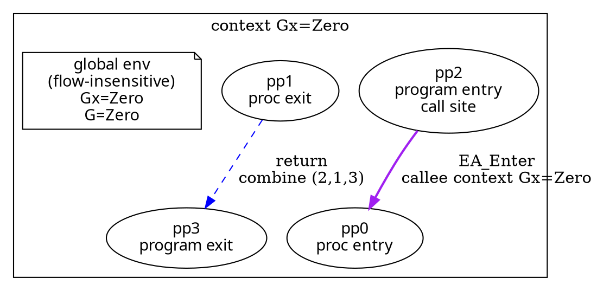

# Context GraphViz Debug Renderer

Status: **implemented**.

The context debug renderer lives in
`src/Analysis/Instances/Tooling/Analysis_GraphViz.thy`.  It renders a CFG under a
finite list of materialized contexts by duplicating every program point per
context.  This makes context splitting visible without requiring example
theories to define their own debug node and edge lists.

## Goal

Show when a function body is analyzed under more than one entry-store context.
For the entry-store precision witness, the same procedure body appears once for
`context Gx=Zero` and once for `context Gx=Positive`.

The renderer keeps raw proof/debug information visible:

- node ids encode `(pp, ctx)`;
- node labels keep raw program points;
- call edges show `EA_Enter` and the callee context;
- return edges show `return` plus the raw `combine (call, exit, ret)` triple;
- each context cluster has its own globals box.

## Generic API

The main convenience entry point for same-context CFG witnesses is:

```isabelle
ctx_debug_graphviz_same_ctx_cfg_show_globals_default ::
  ('ctx::show_val => string list) =>
  ('ctx::show_val => string list) =>
  'ctx list =>
  cfg =>
  string
```

The two function arguments are:

- context-label lines, used as the cluster title;
- globals-label lines, rendered once inside that context cluster.

Example use:

```isabelle
definition entry_ctx_debug_dot :: string where
  "entry_ctx_debug_dot =
     ctx_debug_graphviz_same_ctx_cfg_show_globals_default
       (\<lambda>s. [''context Gx='' @ show_val s])
       (\<lambda>s. [''Gx='' @ show_val s, ''G='' @ show_val s])
       [SZero, SPos] entry_ctx_g"
```

The example does not manually define context datatypes, duplicated node lists,
call-edge lists, return-edge lists, node label functions, or node style
functions.

## Output Shape

For the entry-store precision witness, the generated DOT has this structure:



The actual output includes one such cluster for each supplied context.

## Contexts And Globals

Cluster labels describe the entry context.  They should stay short, for example:

```text
context Gx=Zero
context Gx=Positive
```

Globals are rendered separately in a note node:

```text
global env
(flow-insensitive)
Gx=Zero
G=Zero
```

This distinction matters: the analysis is flow-insensitive for globals within
one context, but the debug graph is not globally monovariant.  Each context gets
its own global environment box.

## Default Labels

The default node-role helper derives roles from the CFG:

- `program entry`;
- `program exit`;
- `proc entry`;
- `proc exit`;
- `call site`, when the program point is the source of an `EA_Enter` edge.

If a program-entry node is also a call site, the label includes both lines.

## Printable Domains

Context labels and globals use the `show_val` class.  Sign values print abstract
domain names such as `Zero`, `Positive`, and `Top`, rather than concrete-looking
values such as `0`.

This keeps the visualization honest: labels denote abstract values, not concrete
stores.

## Renderer Boundary

`ctx_debug_graphviz_same_ctx_cfg_show_globals_default` is for witnesses where
context is unchanged along the CFG edges and combine edges.  More precise
analyses can use the lower-level entry points that accept explicit
context-specific node, call-edge, and return-edge lists:

```isabelle
ctx_debug_graphviz
ctx_debug_graphviz_with_globals
```

Keep context reconstruction in the analysis layer.  The renderer consumes
materialized contexts and executable CFG data; it does not prove that a context
split is semantically valid.

## Done Criteria

The current slice is done when:

- `Example_Entry_Store_Context_Precision.thy` prints a DOT graph with two
  context-specialized copies of the same function body;
- cluster titles show entry contexts;
- each cluster contains a separate flow-insensitive globals box;
- `pp2` is visibly the program entry and call site;
- `EA_Enter` edges name the callee context;
- dashed return edges are labeled `return` and include the raw combine triple;
- Isabelle builds the touched sessions.
