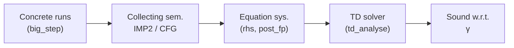
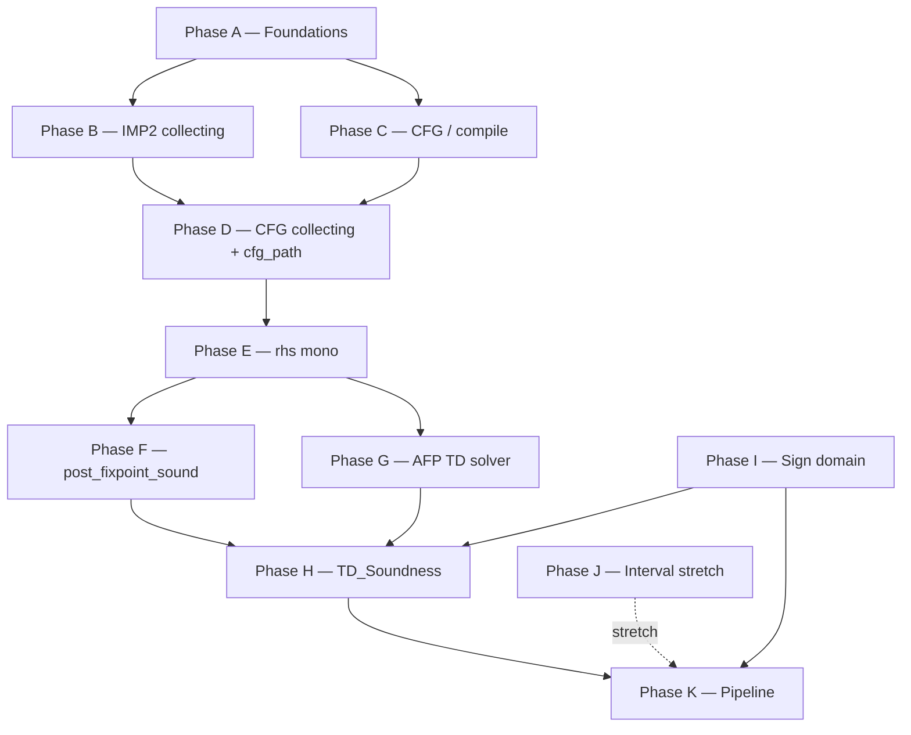

# Implementation guide — Goblint formalization

Step-by-step proof development order, dependencies, and **rough effort** estimates. Treat durations as **order-of-magnitude** for one thesis student working **part-time** (~12–20 h/week). Full-time compresses proportionally.

**Convention:** Finish earlier phases before leaning on lemmas from later ones. Replace `sorry` bottom-up unless noted.

---

## Assumptions

| Item | Note |
|------|------|
| Isabelle/AFP | Isabelle **2025-2** aligned with CI; AFP **Top_Down_Solver** installed when proving solver connection |
| Scope | Tier 1: **Sign** end-to-end. Tier 2: **Interval** + widening as stretch |
| Language | Either stay on **IMP2** or temporarily narrow to **HOL-IMP** / minimal fragment to shorten proofs (supervisor sign-off) |

Effort tags: **S** ≈ days–1 week · **M** ≈ 1–3 weeks · **L** ≈ 1–3 months · **XL** ≥ 3 months (can overlap with other reading/writing).

### Conceptual theorem chain (what you are wiring up)



### Proof-phase dependencies (order of work)



---

## Phase A — Foundations (language + deterministic semantics)

**Goal:** Concrete semantics is a trustworthy basis for everything else.

| Step | Tasks | Typical artifacts | Effort |
|------|--------|-------------------|--------|
| A1 | Prove **`big_step_determ`** (`IMP2_Semantics`) | induction on `big_step` | **S** |
| A2 | Auxiliary lemmas (`big_step` inversion, sequencing) | small lemmas used by collecting | **S–M** |
| A3 | Decide **IMP vs IMP2**: if simplifying, refactor syntax/imports and fix session `ROOT` | thinner language layer | **M** *if pivoting* |

**Rough calendar:** **2–4 weeks** part-time.

---

## Phase B — IMP2 collecting semantics (`IMP2_Collecting`)

**Goal:** Characterize reachable states **without** the CFG — matches “collecting semantics” in *Concrete Semantics* Ch. 13.

| Step | Tasks | Effort |
|------|--------|--------|
| B1 | `collect_SKIP`, `collect_Assign`, `collect_Seq`, `collect_If` | unfold `collect` + case analysis on `big_step` | **M** |
| B2 | Monotonicity `collect_mono` | sets/order | **S** |
| B3 | **`collect_While`** | lfp characterization vs `big_step` for `WHILE` — **central and delicate** | **L** |

**Rough calendar:** **4–10 weeks** part-time (WHILE dominates).

---

## Phase C — CFG correctness (`CFG_Def`, `IMP2_to_CFG`)

**Goal:** **`to_cfg` / compile** builds a well-formed CFG and matches intended control structure.

| Step | Tasks | Effort |
|------|--------|--------|
| C1 | **`compile_finite`** | induction on compile | **S–M** |
| C2 | Freshness / injectivity **`compile_fresh`** (PP allocation) | induction; may need invariant | **M–L** |
| C3 | **`compile_entry_ne_exit`** and structural invariants | medium | **M** |
| C4 | Semantic link (optional staged): **single-step simulation** IMP2 vs edge actions | bridges syntax to `edge_collect` | **L** |

**Rough calendar:** **6–12 weeks** part-time *without* full semantic equivalence.

---

## Phase D — CFG collecting semantics (`CFG_Collecting`)

**Goal:** **`cfg_collect` / reach** formalizes sets of states at PP; aligns with **`Constraint_System`** later.

| Step | Tasks | Effort |
|------|--------|--------|
| D1 | Define **`cfg_path`** (inductive path relation over edges + actions) — prerequisite for proofs | **`XL` prep** · implement **S–M** |
| D2 | **`cfg_collect_exit_eq_collect`** (bridge IMP2 collecting ↔ CFG collecting at exit) | hardest thesis lemma | **XL** |
| D3 | Supporting lemmas on `cfg_entry`/`cfg_exit`, finite reachability where needed | **M–L** |

**Rough calendar:** **3–9 months** part-time *for the full bridge*, often **parallel** with Phase E design.

---

## Phase E — Constraint system (`Constraint_System`)

**Goal:** **`rhs`** monotone and well-defined on finite CFGs.

| Step | Tasks | Effort |
|------|--------|--------|
| E1 | **`rhs_mono`** | fold/join monotonicity; locale assumptions | **M–L** |
| E2 | Sanity lemmas (finite preds, `abs_join_set` neutrality) | **S–M** |

**Rough calendar:** **4–10 weeks** part-time.

---

## Phase F — Post-fixpoint soundness (`Constraint_System_Sound`)

**Goal:** **`post_fixpoint_sound`** — post-fixpoint **⊇** CFG collecting (in **`gamma`** form via `gamma_state`).

**Depends on:** Phase D bridge + Phase E + abstract-domain locale assumptions.

| Step | Tasks | Effort |
|------|--------|--------|
| F1 | Prove **`post_fixpoint_sound`** (main induction / coinduction / lfp argument) | **XL** |
| F2 | Derive **`exit_sound`** corollary | packaging | **S** |

**Rough calendar:** **overlap with Phase D**; pure proof time often **4–12+ weeks** once `cfg_path` story is clear.

---

## Phase G — Solver connection (`Solver/TD_Interface`)

**Goal:** Replace axiom stub with AFP **`TD_plain`**; prove **`make_rhs_mono`** ⇒ **`td_analyse_post_fixpoint`**.

| Step | Tasks | Effort |
|------|--------|--------|
| G1 | AFP install + session path in `ROOT` / components | infra | **S** |
| G2 | **`td_analyse_post_fixpoint`** real proof (automation may need iteration) | **M** |
| G3 | Keep **`td_solve`** axiom only until AFP available; document fallback | **S** |

**Rough calendar:** **2–8 weeks** (blocked on AFP + Phase E).

---

## Phase H — Combined solver soundness (`TD_Soundness`)

**Goal:** **`td_solver_sound`** — glue **`td_analyse_post_fixpoint`** + **`exit_sound`** + TF assumptions.

| Step | Tasks | Effort |
|------|--------|--------|
| H1 | Restore **`post_fp`** proof (remove `sorry`) once G2 done | **S–M** |
| H2 | Finish **`show ?thesis`** via **`exit_sound`** | **S–M** |

**Rough calendar:** **2–6 weeks** once F + G exist.

---

## Phase I — Domains

**Goal:** discharge **`domain_transfer_sound`** for concrete domains.

### Sign (tier 1 — thesis spine)

| Step | Tasks | Effort |
|------|--------|--------|
| I1 | Lattice laws `join_sign_*`, order on `sign` | **S–M** |
| I2 | **`gamma_sign`** monotonicity / soundness lemmas | **M** |
| I3 | **`aval_sign_sound`**, **`assign_sign_sound`**, assume/assume_not | induction on expressions | **M–L** |

**Rough calendar:** **6–14 weeks** part-time.

### Interval (tier 2 — stretch)

| Step | Tasks | Effort |
|------|--------|--------|
| J1 | **`join_ivl_*`**, **`widen_ivl_*`**, termination | **L** |
| J2 | **`interpretation ivl_domain`** | **M–L** |

**Rough calendar:** **8–20+ weeks** if done to full lattice standards.

---

## Phase K — Pipeline & packaging (`Pipeline`, `Result_Mapping`)

**Goal:** **`pipeline_sound`**, **`sign_pipeline_sound`**, optional **`goblint_sign_sound`** clean proof.

| Step | Tasks | Effort |
|------|--------|--------|
| K1 | Instantiate generic pipeline | **S–M** |
| K2 | **`Result_Mapping`** annotation soundness (optional narrative) | **M–L** |

**Rough calendar:** **3–10 weeks** depending on how polished.

---

## Suggested sequencing (dependency graph)

Same structure as the Mermaid diagram above; ASCII fallback:

`A → B`, `A → C → D`, `(B,C) → D → E → F`, `E → G → H`, `F → H`, `I → H → K`, optional interval `J ⇢ K`.

---

## Milestone checklist (minimum viable thesis)

1. [ ] Phase A complete  
2. [ ] Phase B except possibly tightest While lemmas **or** clearly scoped While  
3. [ ] Phase C enough for **finite CFG + wf**  
4. [ ] **`cfg_path`** + **partial** CFG–IMP2 bridge sufficient for **`exit_sound`** proof sketch  
5. [ ] Phase E **`rhs_mono`**  
6. [ ] Phase F **`post_fixpoint_sound`** (even restricted form)  
7. [ ] Phase G+H **solver glue**  
8. [ ] Phase I **Sign** TF soundness  
9. [ ] Phase K **`pipeline_sound`** for Sign  

Interval/G widening = **bonus**.

---

## Rough overall schedule (calendar)

| Horizon | Focus |
|---------|--------|
| **Months 1–2** | A, B (non-While + start While), start C |
| **Months 3–5** | C, D (`cfg_path`, bridge sub-lemmas), E |
| **Months 4–8** | F + **heavy iteration** with supervisor |
| **Months 6–10** | G, H, I (Sign), K |

Parallelize **reading/writing** and **small runnable examples** (`Goblint_Formalization.thy`) throughout.

---

## Generality: is the pipeline domain-agnostic?

**Yes, in structure.** The middle of the formalization is parameterized by:

| Mechanism | Role |
|-----------|------|
| **`abstract_domain`** locale (`Abstract_Domain.thy`) | fixes **`gamma`**, **`bot`**, **`join`**, **`widening`** + lattice laws |
| **`domain_transfer`** record | per-edge transformers (`tf_assign`, `tf_assume`, `tf_assume_not`) |
| **`rhs` / `make_rhs`** | same CFG equation system for any domain that fits the locale |
| **`td_analyse`** | same solver hook once **`make_rhs_mono`** holds |
| **`analysis_config`** (`Pipeline.thy`) | bundles join/bot/gamma/tf/init for **`run_analysis`** |

So you **instantiate** a new analysis by:

1. Defining a type `'a` with **`ord`**, **`gamma`**, **`join`**, **`widen`**, **`bot`**.  
2. Proving **`interpretation ... abstract_domain`** (your semilattice / γ axioms).  
3. Defining **transfer functions** and proving **`domain_transfer_sound`**-style assumptions.  
4. Building an **`analysis_config`** (like **`sign_analysis_config`** / **`ivl_analysis_config`**).

**Not “every abstract interpretation in the literature.”** Anything you plug in must:

- Fit the **equation-system shape** (join over finite predecessor sets — hence **`finite (cfg_edges g)`** and **`comp_fun_commute join`**).  
- Supply **sound edge transformers** matching **`edge_action`** (assign / assume / assume-not). Exotic analyses that need different edge labels would require **extending `edge_action`** and the compiler, not just a new domain.  
- For the **TD solver theorem**: **`monotone`** RHS — your proof obligation **`make_rhs_mono`**.

So: **general over domains that match this interface**; **not** a plug-in for arbitrary analyzers without proof.

---

## What a finished Isabelle proof looks like (Sign)

### Fully proved *mini* examples (today)

You already have **small, constructive proofs** that show the **style** of the development: see `Goblint_Formalization.thy`, e.g. **`example_swap_terminates`** and **`example_swap_correct`** — operational semantics only, no abstract domain yet.

### Target shape of the **Sign pipeline** theorem

The **top statement** you want for Sign is essentially **`sign_pipeline_sound`** in **`Pipeline.thy`** (currently `sorry`):

- **Assumption:** **`big_step (c, s) t`** — concrete run terminates in **`t`**.  
- **Conclusion:** **`t`** is in the **γ-set** of the abstract state at **`cfg_exit (to_cfg c)`** produced by **`run_analysis (sign_analysis_config s) c`**.

A **finished proof** will not be one tactic; it will **compose** lemmas you develop earlier:

```text
sign_pipeline_sound:
  assumes "big_step (c, s) t"
  shows "t ∈ sign_domain.gamma_state (run_analysis (sign_analysis_config s) c (cfg_exit (to_cfg c)))"
```

**Typical proof outline (Isar sketch — not executable until lemmas exist):**

```isabelle
theorem sign_pipeline_sound:
  assumes runs: "big_step (c, s) t"
  shows "t ∈ sign_domain.gamma_state
           (run_analysis (sign_analysis_config s) c (cfg_exit (to_cfg c)))"
proof -
  interpret sign_domain: abstract_domain gamma_sign ...
    by (unfold_locales) (* Sign lattice proofs *)
  have tf: "domain_transfer_sound gamma_sign
              (tf_assign_sign, tf_assume_sign, tf_assume_not_sign)"
    by (prove assign/assume soundness lemmas from Phase I)
  have init: "s ∈ gamma_state (sign_analysis_config …)"
    unfolding sign_analysis_config_def gamma_state_def
    by (simp add: sign_of_int_sound)
  show ?thesis
    unfolding run_analysis_def
    apply (rule td_solver_sound[OF tf _ runs])   (* generic theorem after Phase H *)
     apply (rule init)
    apply (prove side conditions: finite cfg_edges, comp_fun_commute, …)
    done
qed
```

In practice **`td_solver_sound`** is discharged by the post-fixpoint fact, **`exit_sound`**, and the solver link; the **bulk** of the work remains **`post_fixpoint_sound`**, **`exit_sound`**, and **Sign TF lemmas**, not this packaging step.

### Optional: “running” an analysis in Isabelle

Two different notions:

| Style | Meaning |
|-------|---------|
| **Proof** | Show **`pipeline_sound`** for **all** programs satisfying assumptions (the thesis result). |
| **Example** | Fix a concrete **`c`** (e.g. swap), prove **`big_step`** + maybe **`sign_pipeline_sound`** for **that** **`c`** only — smaller obligation, good for regression / exposition. |

You can add **`lemma swap_sign_sound:`** … for **`example_swap`** once the generic theorem is proved, by **instantiation** or **`by eval`**-style steps if you ever make analysis executable — not required for the main theorem.

---

## Risk register (short)

| Risk | Mitigation |
|------|------------|
| Phase D too large | Narrow language (IMP), narrow command classes, or weaken theorem temporarily with explicit hypotheses |
| AFP friction | Early **`isabelle build`** with AFP on CI runner |
| Proof creep | Freeze feature set; **Sign-only** thesis core |

---

## Maintenance

Update this guide when **`ROOT`** session graph changes or when **`sorry`** inventory shifts materially (search `sorry` in `src/`).
