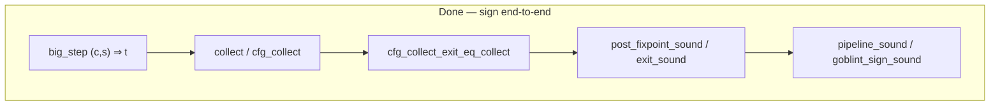
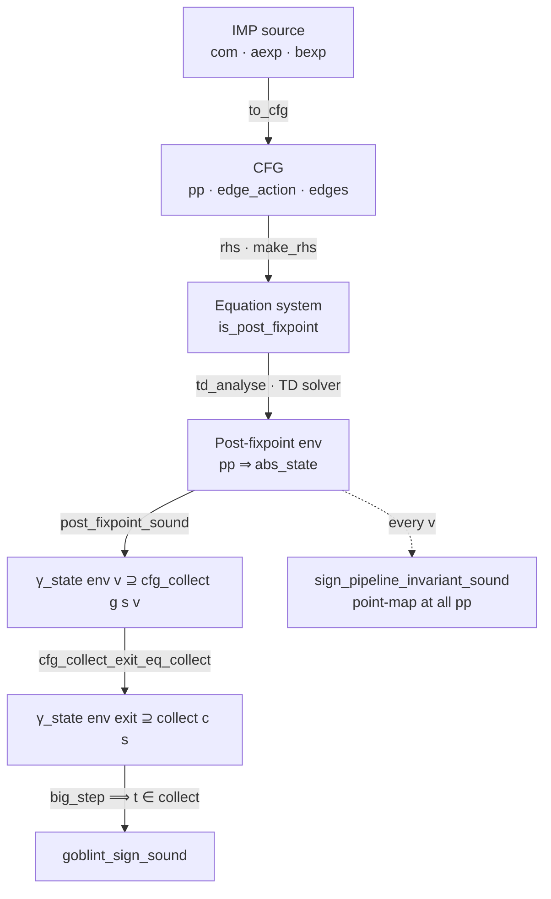
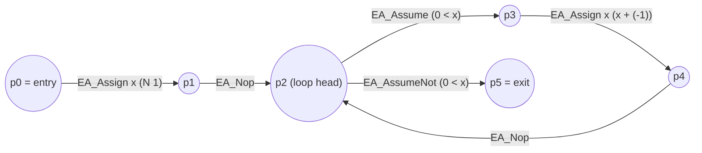
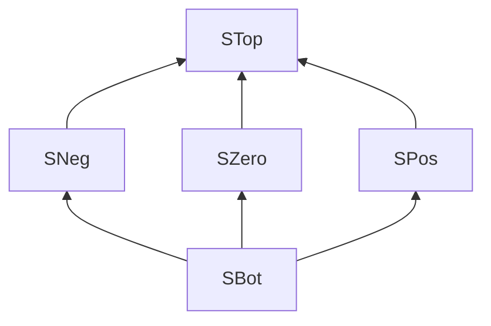
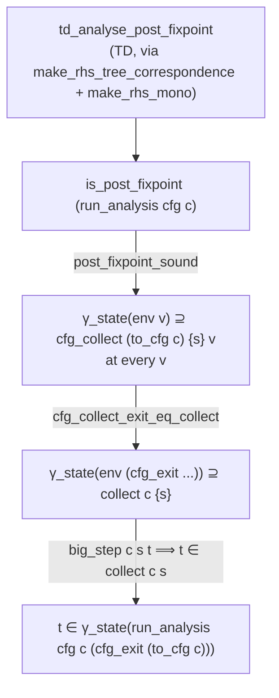
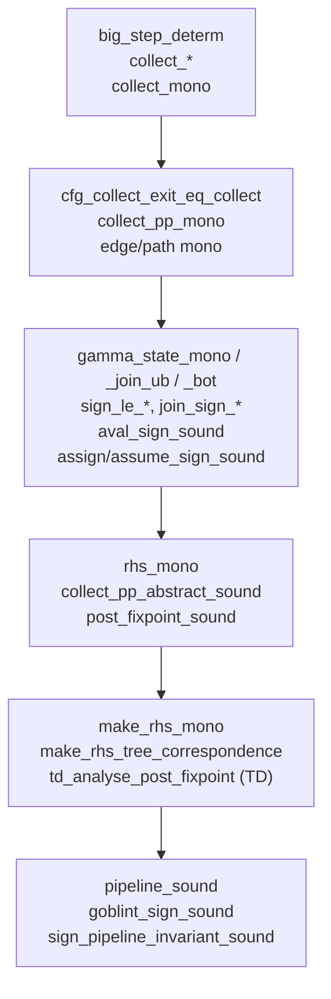

# Pipeline Walkthrough — IMP to Sound Sign Analysis

This document follows one example program from IMP source, through CFG
compilation, the equation system, the Top-Down solver, and back to a sound
abstract result. Each stage names the functions involved and highlights the
core lemmas that make the whole chain correct.

---

## Stage 0 — Running Example

```text
Program c:                              Initial concrete store s:
  x ::= N 1;;                             s = (λ_. 0)
  WHILE Less (N 0) (V x) DO
    x ::= Plus (V x) (N (-1))
```

The concrete big-step semantics terminates with `t x = 0`.

**Target.** Prove

```isabelle
t : sign_domain.gamma_state
       (run_analysis (sign_analysis_config s) c (cfg_exit (to_cfg c)))
```

i.e. the abstract value computed for `x` at the program exit is in
`{SZero, STop}` (i.e. `γ_sign` contains `0`).

---

## Top-Level Flow

### Proof status (done vs. open)

**Sign pipeline:** closed (`goblint_sign_sound`). **Interval / optional paths:** open
sorries — see `docs/PROOF_PHASES.md`. Overview: `docs/PROOF_OVERVIEW.md`.



### Artifact flow (stages)



---

## Stage 1 — Syntax and Concrete Semantics (`src/IMP2/`)

| File / definition                                        | Role                                                       |
| -------------------------------------------------------- | ---------------------------------------------------------- |
| `IMP2_Syntax.thy` :: `datatype com / aexp / bexp`        | Abstract syntax of the language.                           |
| `IMP2_Semantics.thy` :: `fun aval`, `fun bval`           | Expression evaluation.                                     |
| `IMP2_Semantics.thy` :: `inductive big_step ((c,s) ⇒ t)` | Concrete big-step semantics.                               |
| `IMP2_Collecting.thy` :: `definition collect`            | Collecting semantics: `com ⇒ store set ⇒ store set`.       |

### Core lemmas

- `big_step_determ` — concrete semantics is deterministic.
- `collect_SKIP`, `collect_Assign`, `collect_Seq`, `collect_If` — compositional shape of `collect` (while handled via `big_step` in the CFG bridge).
- `collect_mono`, `while_collect_mono` — `collect` is monotone in its input set.

### Example

`collect c {s}` is the singleton containing the unique terminating store `t`
with `t x = 0`. Anything that over-approximates `collect c {s}` must contain
this `t`.

---

## Stage 2 — IMP to CFG (`src/CFG/`)

### 2a. CFG model (`CFG_Def.thy`)

```isabelle
datatype edge_action = EA_Nop | EA_Assign vname aexp | EA_Assume bexp | EA_AssumeNot bexp
record cfg = cfg_entry :: pp, cfg_exit :: pp, cfg_edges :: (pp × edge_action × pp) set
definition predecessors, successors, cfg_wf
```

**Lemma.** `finite_predecessors` — needed so that joins over predecessor sets
are well-defined `Finite_Set.fold`s.

### 2b. Compilation (`IMP2_to_CFG.thy`)

```isabelle
fun compile  :: "com ⇒ nat ⇒ nat × pp × pp × (pp × edge_action × pp) set"
definition to_cfg :: "com ⇒ cfg"
```

#### Core lemmas
- `compile_fresh` — emitted node ids stay above the fresh counter.
- `compile_ge` — fresh counter only grows.
- `compile_entry_ne_exit` — entry and exit nodes are distinct.
- `compile_finite` ⇒ `to_cfg_finite` — the edge set is finite (used everywhere downstream for folds).
- `to_cfg_wf` — compiled CFGs satisfy `cfg_wf`.

### 2c. CFG paths and collecting semantics

```isabelle
inductive cfg_path :: "cfg ⇒ pp ⇒ (edge_action × pp) list ⇒ pp ⇒ bool"
fun edge_collect, path_collect
definition cfg_collect :: "cfg ⇒ store set ⇒ (pp ⇒ store set)"
```

#### Core lemmas
- `edge_collect_mono`, `path_collect_mono`, `path_collect_mono_strong`.
- `collect_pp_mono` — CFG collecting is monotone in the input set.
- `cfg_collect_exit_le_collect` and `collect_le_cfg_collect_exit` combine into
  the bridge theorem:

```isabelle
theorem cfg_collect_exit_eq_collect:
  "cfg_collect (to_cfg c) S (cfg_exit (to_cfg c)) = collect c S"
```

This is the IMP ↔ CFG correctness link: reasoning about `collect c S` on the
source equals reasoning about the CFG collecting semantics at the exit.

**Status:** proved in `CFG_Collecting.thy` (no `sorry` in `src/IMP2/` or `src/CFG/`).
See `docs/html/IMP_CFG_WALKTHROUGH.html`.

### Example CFG for our program



Concrete: `cfg_collect (to_cfg c) {s} p5 = collect c {s} = { (λv. if v=x then 0 else 0) }`.

---

## Stage 3 — Abstract Domain (Sign) (`src/Domains/`)

### 3a. Generic interface (`Abstract_Domain.thy`)

```isabelle
locale sound_domain =
  fixes gamma, join_op, bot_abs, ...
  assumes gamma_join_ub1, gamma_join_ub2, ...

type_synonym 'a abs_state = "vname ⇒ 'a"
definition gamma_state, bot_state, join_state
```

#### Core lemmas (locale-level)
- `gamma_join_ub1`, `gamma_join_ub2` — join is a sound upper bound concretely.
- `join_comp_fun_commute`, `join_state_comp_fun_commute` — needed so `Finite_Set.fold` is order-independent.
- `gamma_state_mono`, `gamma_state_join_ub1/ub2`, `gamma_state_bot` — pointwise lifting.
- `gamma_abs_join_set_ub`, `join_fold_ge` — soundness of the predecessor join.

### 3b. Sign instance (`Sign_Domain.thy`)

```isabelle
datatype sign = SBot | SNeg | SZero | SPos | STop

fun gamma_sign, sign_le, join_sign
fun sign_plus, sign_minus, sign_times
fun aval_sign :: "aexp ⇒ (vname ⇒ sign) ⇒ sign"
```

#### Core lemmas
- Lattice: `sign_le_refl / antisym / trans`, `join_sign_ub1/ub2/least/comm/assoc`.
- Galois: `gamma_sign_mono`.
- Arithmetic: `sign_plus_sound`, `sign_minus_sound`, `sign_times_sound` combine into `aval_sign_sound`.
- Transfer: `assign_sign_sound`, `assume_sign_sound`, `assume_not_sign_sound`.

#### Sign lattice



### Example carry-through

- After `x ::= N 1`: abstract state `σ₁ = (λv. if v=x then SPos else STop)`.
- Loop body once: `sign_plus SPos SNeg = STop`.
- Join at loop head: `SPos ⊔ STop = STop`.
- After `EA_AssumeNot (0 < x)` from the loop head, the exit abstract state has
  `x ↦ STop`. Since `0 ∈ γ_sign STop = UNIV`, the exit invariant is sound
  (loose, but sound — that is the price of the Sign domain).

---

## Stage 4 — Equation System (`src/Equations/`)

### `Constraint_System.thy`

```isabelle
record 'a domain_transfer =
  tf_assign     :: "vname ⇒ aexp ⇒ 'a abs_state ⇒ 'a abs_state"
  tf_assume     :: "bexp  ⇒ 'a abs_state ⇒ 'a abs_state"
  tf_assume_not :: "bexp  ⇒ 'a abs_state ⇒ 'a abs_state"

fun apply_tf       :: "'a domain_transfer ⇒ edge_action ⇒ 'a abs_state ⇒ 'a abs_state"
definition abs_join_set
definition rhs    -- join over predecessors of apply_tf(action)(env u), plus s0 at entry

definition is_post_fixpoint g tf join bot s0 env  ≡  ∀v. rhs ... env v ≤ env v
```

#### Core lemmas
- `abs_join_set_empty`, `mem_image_le_fold` — fold infrastructure.
- `rhs_no_predecessors_not_entry`, `rhs_entry_no_predecessors` — boundary cases.
- `fold_join_image_mono` — fold is monotone in its image.
- `rhs_mono` — `rhs` is monotone in `env` (key prerequisite for the TD solver).

### `Constraint_System_Sound.thy`

- `collect_pp_abstract_sound` — pointwise: post-fixpoint envs over-approximate `cfg_collect` at every node.
- `post_fixpoint_sound` — central soundness theorem:

```isabelle
theorem post_fixpoint_sound:
  is_post_fixpoint g tf join_state bot_state s0 env
  ⟹  s ∈ gamma_state s0
  ⟹  cfg_collect g {s} v ⊆ gamma_state (env v)
```

### Example

An env mapping `p1 ↦ x:SPos`, `p2 ↦ x:STop`, `p3 ↦ x:STop`, `p4 ↦ x:SNeg`,
`p5 ↦ x:STop` is a post-fixpoint of `rhs`. By `post_fixpoint_sound`,
`γ_state (env p5) ⊇ collect c {s} ⊇ {t}`. So `t x = 0 ∈ γ_sign STop`. ✓

---

## Stage 5 — Top-Down Solver Bridge (`src/Solver/`)

### `TD_Interface.thy`

```isabelle
definition make_rhs g tf join bot s0 v env = rhs g tf join bot s0 env v
fun rhs_tree_fold        -- monadic rhs in the TD Answer/Query monad
definition make_rhs_tree
definition env_map, lookup_bot
```

#### Core lemmas
- `make_rhs_mono` — packaged monotonicity (uses `rhs_mono`).
- `make_rhs_tree_correspondence`, `make_rhs_tree_correspondence_not_entry_no_predecessors`
  — the monadic rhs (tree form expected by the TD solver) equals `make_rhs`
  after traversing the env. This lets us hand `make_rhs_tree` to the
  vendored `TD` session and read back `make_rhs`.
- `rhs_eq_fold_join_sorted_predecessors`, `fold_join_apply_edges_eq_fold_join_over_map`
  — equate the set-fold formulation with the list-fold the solver uses.
- `part_solutionD` — extract that the solver returns a partial solution.

### `TD_Soundness.thy`

```isabelle
theorem td_solver_sound          -- generic: solver result ⇒ collecting overapprox
theorem sign_analysis_sound      -- instantiation for Sign
theorem interval_analysis_sound  -- instantiation for Interval
```

### `TD_Total.thy`

Termination/total-correctness obligations for the TD solver (optional stretch):

- `sign_widening_precise`, `sign_wf_widening_chains`, `sign_is_mono_eq` — sign chains are well-founded; widening is monotone.
- Interval analogues: `ivl_widening_precise`, `ivl_wf_widening_chains`,
  `ivl_narrowing_le`, `ivl_is_mono_eq`.

### TD imports

`td_analyse_post_fixpoint` — the vendored `TD_plain` solver returns a value
satisfying `is_post_fixpoint`.

---

## Stage 6 — End-to-End Pipeline (`src/Pipeline/`)

### `Pipeline.thy`

```isabelle
definition domain_transfer_sound gamma tf
record 'a analysis_config = ac_join, ac_bot, ac_gamma, ac_tf, ac_init

definition run_analysis cfg c =
  td_analyse c (ac_tf cfg) (ac_join cfg) (ac_bot cfg) (ac_init cfg)

theorem pipeline_sound:
  assumes domain_transfer_sound (ac_gamma cfg) (ac_tf cfg)
      and s ∈ γ_state (ac_init cfg)
      and big_step (c,s) t
  shows   t ∈ γ_state (run_analysis cfg c (cfg_exit (to_cfg c)))
```

### Proof chain



### Sign instantiation

```isabelle
definition sign_analysis_config s

theorem goblint_sign_sound:           -- Goblint_Formalization.thy (top-level)
  big_step (c,s) t ⟹
  t ∈ sign_domain.gamma_state
        (run_analysis (sign_analysis_config s) c (cfg_exit (to_cfg c)))

lemma sign_pipeline_sound_scaffold:   -- Pipeline.thy (exit, via sign_analysis_sound)

theorem sign_pipeline_invariant_sound:  -- Pipeline.thy (every program point)
  cfg_collect (to_cfg c) {s} v ⊆ γ_state (run_analysis … v)
```

`pipeline_invariant_sound` is the generic point-map theorem; exit soundness
(`pipeline_sound` / `goblint_sign_sound`) is the `v = cfg_exit` special case.

---

## Definitions Glossary

All the supporting definitions the soundness narrative relies on, grouped by
layer. Each definition is given in its mathematical form; file names in
parentheses point to the actual Isabelle source.

### Concrete world (`src/IMP2/`)

```text
-- expression evaluation
aval : aexp ⇒ store ⇒ int
bval : bexp ⇒ store ⇒ bool

-- big-step relation
inductive  (c, s) ⇒ t

-- collecting semantics: lift big-step to sets of stores
collect c S  ≡  { t | ∃ s ∈ S. (c, s) ⇒ t }
```

### CFG layer (`src/CFG/`)

```text
type_synonym pp = nat

datatype edge_action = EA_Nop
                     | EA_Assign vname aexp
                     | EA_Assume   bexp
                     | EA_AssumeNot bexp

record cfg = cfg_entry :: pp
             cfg_exit  :: pp
             cfg_edges :: (pp × edge_action × pp) set

cfg_nodes g       ≡  { cfg_entry g, cfg_exit g } ∪ { u | (u,_,_) ∈ edges }
                                                ∪ { v | (_,_,v) ∈ edges }
predecessors g v  ≡  { (u, a) | (u, a, v) ∈ cfg_edges g }
successors   g u  ≡  { (a, v) | (u, a, v) ∈ cfg_edges g }

-- well-formedness: the only structural assumption used downstream
cfg_wf g  ≡  cfg_entry g ≠ cfg_exit g
           ∧ finite (cfg_edges g)
           ∧ (∀(u, _, v) ∈ cfg_edges g. u ∈ cfg_nodes g ∧ v ∈ cfg_nodes g)
```

**Per-edge / per-path concrete transformers:**

```text
edge_collect EA_Nop          S  ≡  S
edge_collect (EA_Assign x a) S  ≡  { s(x := aval a s) | s ∈ S }
edge_collect (EA_Assume b)   S  ≡  { s ∈ S | bval b s     }
edge_collect (EA_AssumeNot b) S ≡  { s ∈ S | ¬ bval b s   }

path_collect []            S  ≡  S
path_collect ((a, _) # es) S  ≡  path_collect es (edge_collect a S)

inductive cfg_path g u es v where
    empty :  cfg_path g v [] v
  | step  :  (u, a, w) ∈ cfg_edges g  ∧  cfg_path g w es v
             ⟹  cfg_path g u ((a, w) # es) v

g ⊢ u →* v  ≡  ∃ es. cfg_path g u es v        -- reachability
```

**CFG collecting semantics (least fixpoint):**

```text
-- one-step "push" through every incoming edge
collect_pp g ρ v   ≡  ⋃ { edge_collect a (ρ u) | (u, a, v) ∈ cfg_edges g }

-- collecting semantics as a least fixpoint of single-step push,
-- with the initial set S injected at the entry node
cfg_collect g S    ≡  lfp ( λρ v.  if v = cfg_entry g
                                   then  S ∪ collect_pp g ρ v
                                   else        collect_pp g ρ v )
```

### Abstract domain (`src/Domains/`)

```text
type_synonym 'a abs_state = vname ⇒ 'a

-- The minimum a domain must satisfy for soundness to hold.
locale sound_domain :
  fixes γ       : 'a ⇒ int set
  fixes (⊔)     : 'a ⇒ 'a ⇒ 'a
  assumes  γ ⊥ = ∅                                         -- (D1) bot
       ∧   a ≤ b   ⟹   γ a ⊆ γ b                          -- (D2) γ monotone
       ∧   a ≤ a ⊔ b   ∧   b ≤ a ⊔ b                       -- (D3) join is upper bound
       ∧   a ⊔ b = b ⊔ a                                   -- (D4) commutative
       ∧   a ⊔ (b ⊔ c) = (a ⊔ b) ⊔ c                       -- (D5) associative

-- pointwise lifting to states
γ_state σ      ≡  { s | ∀ x. s x ∈ γ (σ x) }
bot_state      ≡  (λ_. ⊥)
(σ₁ ⊔ σ₂)      ≡  (λx. σ₁ x ⊔ σ₂ x)                       -- = join_state
```

Note: `comp_fun_commute (⊔)` follows from (D4)+(D5); that is what makes
`Finite_Set.fold (⊔) ⊥` order-independent on finite sets.

### Equation system (`src/Equations/`)

```text
record 'a domain_transfer =
  tf_assign     :: vname ⇒ aexp ⇒ 'a abs_state ⇒ 'a abs_state
  tf_assume     :: bexp  ⇒ 'a abs_state ⇒ 'a abs_state
  tf_assume_not :: bexp  ⇒ 'a abs_state ⇒ 'a abs_state

apply_tf tf EA_Nop           σ  ≡  σ
apply_tf tf (EA_Assign x a)  σ  ≡  tf_assign tf x a σ
apply_tf tf (EA_Assume b)    σ  ≡  tf_assume tf b σ
apply_tf tf (EA_AssumeNot b) σ  ≡  tf_assume_not tf b σ

-- finite fold of the abstract join over a set of abstract states
abs_join_set (⊔) ⊥ S  ≡  Finite_Set.fold (⊔) ⊥ S

-- right-hand side of the constraint system at node v
rhs g tf (⊔) ⊥ s₀ env v  ≡
   let preds = predecessors g v
       vals  = { apply_tf tf a (env u) | (u, a) ∈ preds }
       base  = if v = cfg_entry g  then  insert s₀ vals  else  vals
   in  abs_join_set (⊔) ⊥ base

is_post_fixpoint g tf (⊔) ⊥ s₀ env  ≡  ∀v. rhs g tf (⊔) ⊥ s₀ env v ≤ env v
```

### Solver bridge (`src/Solver/`)

```text
-- argument-reordered rhs, so the TD solver can curry it
make_rhs g tf (⊔) ⊥ s₀ v env  ≡  rhs g tf (⊔) ⊥ s₀ env v

-- the same function expressed in the TD solver's Answer/Query monad
make_rhs_tree g tf (⊔) ⊥ s₀ v  : Tree pp ('a abs_state)
env_map η                       : pp ⇀ 'a abs_state    -- env as a partial map
lookup_bot m x                  ≡  case m x of None ⇒ ⊥  | Some d ⇒ d

-- TD delivery: td_analyse returns an env satisfying is_post_fixpoint
td_analyse c tf (⊔) ⊥ s₀  : pp ⇒ 'a abs_state
```

### Pipeline (`src/Pipeline/`)

```text
record 'a analysis_config =
  ac_join  :: 'a abs_state ⇒ 'a abs_state ⇒ 'a abs_state
  ac_bot   :: 'a abs_state
  ac_gamma :: 'a ⇒ int set
  ac_tf    :: 'a domain_transfer
  ac_init  :: 'a abs_state

run_analysis cfg c  ≡  td_analyse c (ac_tf cfg) (ac_join cfg) (ac_bot cfg) (ac_init cfg)

-- The exact hypothesis we need on the transfer functions.
-- This is L11 packaged for the pipeline theorem.
domain_transfer_sound γ tf  ≡
   (∀ x a σ.  ∀ s ∈ γ_state σ.   s(x := aval a s)  ∈  γ_state (tf_assign tf x a σ))
 ∧ (∀ b   σ.  ∀ s ∈ γ_state σ.   bval b s          ⟹  s ∈ γ_state (tf_assume tf b σ))
 ∧ (∀ b   σ.  ∀ s ∈ γ_state σ.  ¬ bval b s          ⟹  s ∈ γ_state (tf_assume_not tf b σ))
```

---

## End-to-End Soundness — Step-by-Step Narrative

This section walks the soundness argument in order, stating each lemma
abstractly (as a mathematical statement, independent of its Isabelle name) and
showing how the next step consumes the previous one.

Notation used below:

- `c` — IMP program, `s` — initial concrete store, `t` — concrete final store.
- `g = to_cfg c` — compiled CFG; `pp` — program points.
- `D` — abstract domain (think `sign`); `γ` — concretization;
  `γ_state : (vname ⇒ D) ⇒ store set` — pointwise lift.
- `tf` — transfer functions (`tf_assign`, `tf_assume`, `tf_assume_not`);
  `apply_tf a` — the per-edge action `a`.
- `env : pp ⇒ (vname ⇒ D)` — abstract environment computed by the solver.
- `s0 : (vname ⇒ D)` — initial abstract state at the CFG entry.

### Step 1 — Concrete semantics is the ground truth

We use the standard big-step semantics, lifted to sets of stores.

> **(L1) Determinism of big-step.**
> ` (c, s) ⇒ t₁  ∧  (c, s) ⇒ t₂  ⟹  t₁ = t₂`.

> **(L2) Compositional shape of `collect`.**
> `collect SKIP S = S`,
> `collect (x ::= a) S = { s(x := aval a s) | s ∈ S }`,
> `collect (c₁;;c₂) S = collect c₂ (collect c₁ S)`,
> `collect (IF b THEN c₁ ELSE c₂) S = collect c₁ (S ∩ ⟦b⟧) ∪ collect c₂ (S ∩ ⟦¬b⟧)`,
> `collect (WHILE b DO c) S = lfp F` where `F X = (S ∪ collect c (X ∩ ⟦b⟧)) ∩ ⟦¬b⟧`.

> **(L3) Monotonicity of `collect`.**
> `S ⊆ S' ⟹ collect c S ⊆ collect c S'`.

**Consequence used downstream.** If `(c, s) ⇒ t` then `t ∈ collect c {s}`.
This is the only fact about the concrete world that the rest of the chain
needs.

### Step 2 — Replace AST reasoning with CFG reasoning

`to_cfg c` produces a finite CFG whose collecting semantics matches the AST
collecting semantics at the exit node.

> **(L4) Well-formed compilation.**
> `finite (cfg_edges g)`, `cfg_wf g`, `cfg_entry g ≠ cfg_exit g`.

> **(L5) Monotonicity of CFG collecting.**
> `S ⊆ S' ⟹ cfg_collect g S v ⊆ cfg_collect g S' v` for every `v`.

> **(L6) IMP ↔ CFG bridge — *the* link to the source.**
> `cfg_collect (to_cfg c) S (cfg_exit (to_cfg c)) = collect c S`.

**Consequence used downstream.** Soundness at the CFG exit transports
verbatim back to soundness on the AST: if `γ_state (env (cfg_exit g)) ⊇
cfg_collect g {s} (cfg_exit g)`, then `γ_state (env (cfg_exit g)) ⊇
collect c {s}`.

### Step 3 — Abstract domain over-approximates concrete operations

`γ` lifts pointwise to states; the join and the transfer functions must be
sound with respect to `γ`.

> **(L7) Galois monotonicity.**
> `a ≤ b ⟹ γ a ⊆ γ b`, and pointwise: `σ₁ ≤ σ₂ ⟹ γ_state σ₁ ⊆ γ_state σ₂`.

> **(L8) Join is a sound upper bound.**
> `γ a ⊆ γ (a ⊔ b)` and `γ b ⊆ γ (a ⊔ b)`; pointwise on states likewise.

> **(L9) Lattice laws on the abstract join (Sign instance).**
> `⊔` is commutative, associative, idempotent — i.e. `comp_fun_commute join`.
> This is what makes `Finite_Set.fold join bot` well-defined: order
> independent.

> **(L10) Soundness of arithmetic.**
> `aval a s ∈ γ (aval_abs a σ)` whenever `s ∈ γ_state σ`. For the sign
> instance this decomposes into `sign_plus`, `sign_minus`, `sign_times`
> soundness lemmas.

> **(L11) Soundness of edge transfer.** For each action `a`:
> `s ∈ γ_state σ  ⟹  edge_collect a {s} ⊆ γ_state (apply_tf tf a σ)`.
> Concretely: `assign_sign_sound`, `assume_sign_sound`,
> `assume_not_sign_sound`.

### Step 4 — Lift edge soundness to the constraint system

The equation system places, at each node, a join over predecessors of the
transferred abstract states.

> **(L12) Right-hand side definition.**
> `rhs g tf join bot s₀ env v = ⨆ {(u,a) | (u,a,v) ∈ edges} apply_tf tf a (env u)`,
> with the initial state `s₀` additionally joined in at `v = cfg_entry g`.

> **(L13) Monotonicity of `rhs`.**
> `env₁ ≤ env₂ ⟹ rhs … env₁ v ≤ rhs … env₂ v` for every `v`.
> (Requires `finite cfg_edges`, `comp_fun_commute join`, join upper-bound +
> least + monotonicity, and `apply_tf` monotone in its state argument.)

> **(L14) Pointwise soundness of post-fixpoints.**
> Define `is_post_fixpoint env  ≡  ∀v. rhs … env v ≤ env v`.
> If `env` is a post-fixpoint, the initial concrete store is captured by
> `s₀`, and `cfg_collect g {s} v` is the set of concrete stores reachable
> at `v`, then
> `cfg_collect g {s} v ⊆ γ_state (env v)`, for every `v`.

This last statement, **`post_fixpoint_sound`**, is the heart of soundness:
any solution that satisfies the equation system at every node is an
over-approximation everywhere, not just at the exit. The proof is by
induction along paths in the CFG, using (L5), (L8), (L11), (L13).

### Step 5 — Hand the equation system to the TD Top-Down Solver

The vendored `TD` solver (`TD_plain`) is parametric in a right-hand-side
function expressed in a monadic *Answer/Query* form. We must show our `rhs`
fits its interface, and we get a post-fixpoint guarantee in return.

> **(L15) Solver-compatible repackaging.**
> `make_rhs g tf join bot s₀ v env = rhs g tf join bot s₀ env v`
> (just argument reordering).

> **(L16) Monadic ↔ direct correspondence.**
> `traverse (make_rhs_tree g tf … v) (env_map η) = make_rhs g tf … v η`
> for every η. The monadic tree form is what the TD solver consumes; the
> direct form is what (L13)–(L14) reason about.

> **(L17) Monotonicity of the packaged rhs.**
> `monotone (≤) (≤) (make_rhs g tf join bot s₀ v)`. Direct consequence of
> (L13).

> **(L18) TD guarantee.**
> The vendored `TD_plain` `td_analyse` returns an environment satisfying
> `is_post_fixpoint`. Stated abstractly:
> `td_analyse c tf join bot s₀ = env  ⟹  ∀v. rhs … env v ≤ env v`.

### Step 6 — Compose into end-to-end soundness

> **(L19) Generic pipeline soundness.**
> Assume:
> 1. `domain_transfer_sound γ tf`  (i.e. (L11) packaged).
> 2. `s ∈ γ_state s₀`  (initial concrete store covered by initial abstract).
> 3. `(c, s) ⇒ t`  (program terminates).
>
> Then `t ∈ γ_state (run_analysis cfg c (cfg_exit (to_cfg c)))`.

The proof composes the previous steps in a single chain:

```text
                                   (L18) TD solver
                              run_analysis is a post-fixpoint
                                          ↓
                                  (L14) post_fixpoint_sound
            cfg_collect (to_cfg c) {s} v  ⊆  γ_state (env v)   for every v
                                          ↓  specialize  v := cfg_exit (to_cfg c)
                                  (L6)  bridge lemma
                       collect c {s}  ⊆  γ_state (env (cfg_exit ...))
                                          ↓  (c,s) ⇒ t  ⟹  t ∈ collect c {s}
                       t ∈ γ_state (run_analysis cfg c (cfg_exit (to_cfg c)))
```

> **(L20) Sign instantiation.**
> Instantiate (L19) with `D = sign`, `γ = gamma_sign`,
> `tf = (assign_sign, assume_sign, assume_not_sign)`,
> `s₀ = λx. sign_of_int (s x)`. The hypothesis (1) is discharged by the
> Sign transfer-function soundness lemmas (the sign half of L11); (2)
> reduces to `s x ∈ γ_sign (sign_of_int (s x))`, which is trivial.

> **(L21) Per-point invariant strengthening.**
> The same post-fixpoint argument holds at every `v`, yielding
> `sign_pipeline_invariant_sound` (point-map form). Exit soundness is the
> `v = cfg_exit` case.

### Summary in one paragraph

The vendored TD solver guarantees a post-fixpoint of our equation system (L15–L18).
A post-fixpoint over-approximates the CFG collecting semantics at every
node (L14), because at every node the right-hand side is monotone (L13)
and built from sound edge transfers (L11) joined by a sound abstract join
(L8) using a lattice that makes folds well-defined (L9). At the exit, CFG
collecting equals AST collecting (L6), and the AST collecting captures
every concrete terminating store (L2). Therefore the abstract value at the
exit concretizes to a superset of `{ t | (c, s) ⇒ t }`. Specializing the
domain to `sign` (L20) gives `goblint_sign_sound`; at every program point,
`sign_pipeline_invariant_sound`.

---

## Recap — Core Lemma Spine



| Level                  | Key fact                                           |
| ---------------------- | -------------------------------------------------- |
| IMP concrete           | `collect` compositional, monotone, deterministic   |
| CFG collecting         | matches `collect` at exit                          |
| Abstract domain (Sign) | sound Galois connection + transfer functions       |
| Equations              | `rhs` monotone; post-fixpoint ⇒ over-approximation |
| Solver bridge          | `make_rhs_tree` ↔ `make_rhs`; TD returns p.f.p.    |
| Pipeline               | exit + per-point soundness (sign closed)           |
