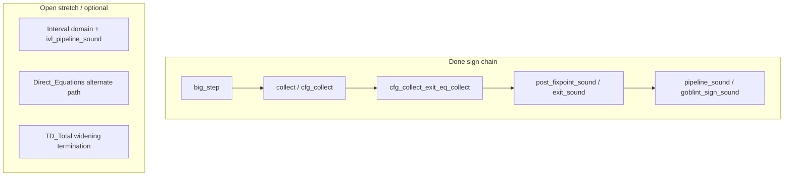

# Proof overview

High-level map of the thesis formalization: what is proved elsewhere, what this
repository contributes, and how the main lemmas connect.

**Status detail and sorry counts:** `docs/PROOF_PHASES.md`.
**Live roadmap and backlog:** `docs/ROADMAP.md` → [GitHub Project 8](https://github.com/users/ManuelLerchner/projects/8).

---

## External vs. repository

| Layer                                             | Source                                                       |
| ------------------------------------------------- | ------------------------------------------------------------ |
| IMP-style syntax / big-step patterns              | Isabelle `HOL-IMP`                                           |
| Top-down solver algorithm                         | Vendored `TD` session (`vendor/td-verification`, `TD_plain`) |
| IMP2 semantics, CFG, equations, domains, pipeline | This repository                                              |

---

## Main theorem chain

Sign analysis is **closed end-to-end** (`goblint_sign_sound` in
`Goblint_Formalization.thy`). Interval and optional paths still have `sorry`s
(see phases doc).

```
big_step (c, s) t
  ⊆ collect c {s}                          -- IMP2_Collecting
  = cfg_collect (to_cfg c) {s} exit        -- CFG_Collecting (bridge #1)
  ⊆ γ_state (env exit)                     -- Constraint_System_Sound (bridge #2)
env = td_analyse c tf join bot init        -- TD_Interface + AFP TD_plain
```

**Statement shape (exit):** terminating run implies final store in γ of the
abstract state at `cfg_exit (to_cfg c)`.

**Stronger shape (point-map, Option 2):** for every reachable program point `v`,
`cfg_reach (to_cfg c) {s} v ⊆ γ_state (env v)`. Proved as
`pipeline_invariant_sound` / `sign_pipeline_invariant_sound`; exit soundness is
`v = cfg_exit`.

See [Design decisions](#design-decisions) for why AST annotation (`acom`) was dropped.



---

## Key types

- `com` IMP2 commands; `cfg` with `cfg_entry`, `cfg_exit`, `cfg_edges`
- `pp = nat` program points
- `'a abs_state = vname => 'a`; `'a domain_transfer` assign / assume / assume-not
- `rhs`, `is_post_fixpoint` constraint system (`Constraint_System.thy`)
- `make_rhs_tree`, `td_analyse` solver bridge (`TD_Interface.thy`)

Domains use **semantic** γ-axioms in `abstract_domain` (soundness-oriented, not
full syntactic lattice laws in the generic locale).

---

## Lemma spine (by stage)

| Stage     | File(s)                                        | Main facts                                                                                          |
| --------- | ---------------------------------------------- | --------------------------------------------------------------------------------------------------- |
| IMP2      | `IMP2_Semantics`, `IMP2_Collecting`            | `big_step`, `collect`                                                                               |
| CFG       | `IMP2_to_CFG`, `CFG_Collecting`, `CFG_Path`    | `to_cfg`, `cfg_collect`, `cfg_collect_exit_eq_collect`                                              |
| Equations | `Constraint_System`, `Constraint_System_Sound` | `rhs_mono`, `post_fixpoint_sound`, `exit_sound`                                                     |
| Solver    | `TD_Interface`, `TD_Soundness`                 | `make_rhs_tree_correspondence`, `td_analyse_post_fixpoint`, `sign_analysis_sound` (interval: sorry) |
| Pipeline  | `Pipeline.thy`                                 | `pipeline_invariant_sound`, `pipeline_sound`, sign corollaries                                      |

---

## Adding a domain

The pipeline is **domain-agnostic in structure**: the same CFG, `rhs`, and
`td_analyse` hook apply once a domain fits the interfaces.

| Mechanism                | Role                                                         |
| ------------------------ | ------------------------------------------------------------ |
| `abstract_domain` locale | `gamma`, `bot`, `join`, `widening` + soundness-oriented laws |
| `domain_transfer`        | per-edge `tf_assign` / `tf_assume` / `tf_assume_not`         |
| `rhs` / `make_rhs_tree`  | constraint system over the compiled CFG                      |
| `analysis_config`        | bundles join, bot, gamma, tf, init for `run_analysis`        |

To add a domain (Sign was the template; Interval is the stretch goal):

1. Define `'a` with `{ord, bot}` (and instances), plus `gamma`, `join`, `widen`.
2. Prove `interpretation … abstract_domain` (γ/join laws used by soundness).
3. Prove `domain_transfer_sound` for your transfer functions.
4. Build an `analysis_config` (like `sign_analysis_config`) and instantiate
   `pipeline_sound` / `pipeline_invariant_sound`.

**Limits:** not every analyzer in the literature plugs in without change. A domain must:

- use **finite predecessor joins** (`finite (cfg_edges g)`, `comp_fun_commute join`);
- provide transformers for the fixed `edge_action` labels (assign / assume / assume-not);
- satisfy **`make_rhs_mono`** so the TD solver API applies.

Exotic edge kinds need extending `edge_action` and the compiler, not only a new lattice.

---

## TD hypotheses on `goblint_sign_sound`

The sign end-to-end theorem is proved, but still assumes the AFP solver succeeds on the
generated strategy tree:

- **`comp_fun_idem join_state`** join is commutative, associative, idempotent (finite fold).
- **`TD_plain.solve_dom … (cfg_entry …)`** the query point is in the solver domain.
- **`cfg_in_reach`** every reachable unknown in the tree is solved relative to entry.

These are the same obligations as in `td_solver_sound`: the **semantic soundness chain**
(collecting → post-fixpoint → γ) is closed; **operational** “the solver terminates and
covers the CFG” remains explicit. Discharging them is solver-instantiation work, not a
gap in `post_fixpoint_sound` or `exit_sound`.

---

## Design decisions

### Point-map vs exit-only

We use **point-map soundness** (`pipeline_invariant_sound`): at every reachable `v`,
concrete stores lie in `γ_state (env v)`. Exit soundness is `v = cfg_exit`. This matches
the supervisor’s “collect at every pp” formulation and needs no extra proof beyond the
post-fixpoint argument.

### Why not `annotation_sound` (dropped)

An earlier sketch (`Result_Mapping` / `acom`) stored the **exit** abstract state at leaf
commands and read it back as the “pre” condition. For `x := a`, that required the entry
store’s abstract state to be **closed under the assignment** false in general (e.g.
sign `x > 0` before assign does not imply `x > 0` after `x := -1`). Fixing it needs
entry+exit pairs on every node (Nipkow-style annotations). The main theorem uses
`exit_sound` and the point-map predicate directly; annotation on the AST is optional
narrative only and was removed from the codebase.

---

## Proof vs example

| Style                                                          | Meaning                                       |
| -------------------------------------------------------------- | --------------------------------------------- |
| **Generic** (`goblint_sign_sound`, `pipeline_sound`)           | All programs; TD hypotheses explicit          |
| **Concrete** (`example_swap_*` in `Goblint_Formalization.thy`) | One program; operational semantics only today |

A future `lemma swap_sign_sound` would instantiate the generic theorem for `example_swap`;
not required for the thesis result.

---

## Thesis target (one paragraph)

For any IMP2 program `c`, if execution terminates (`big_step (c,s) t`), then the
abstract state computed by the verified top-down solver on the CFG constraint
system soundly overapproximates the concrete result at exit: `t ∈ γ_state (σ
(cfg_exit (to_cfg c)))`, where `σ` is `td_analyse` with the chosen domain and
transfer functions.
