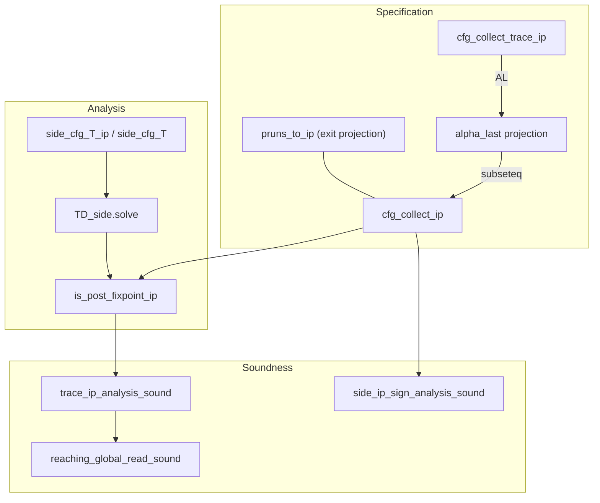

# Proof overview

High-level map of the thesis formalization: what is proved elsewhere, what this
repository contributes, and how the main lemmas connect.

**Status and sorry inventory:** `docs/PROOF_PHASES.md`.
**Live roadmap and backlog:** `docs/ROADMAP.md` → [GitHub Project 8](https://github.com/users/ManuelLerchner/projects/8).

---

## External vs. repository

| Layer | Source |
| --- | --- |
| IMP-style syntax patterns | Isabelle `HOL-IMP` (via wrapped `aexp` / `bexp`) |
| Top-down solver algorithm | Vendored `TD` session (`vendor/td-verification`, `TD_side`) |
| Reference concrete semantics (big-step, VCG) | AFP `IMP2` (Lammich & Wimmer) |
| IMP2 syntax, procedures, globals/locals, CFG, equations, domains, pipeline | This repository |

**Reference-semantics anchor.** Soundness is also expressible against AFP IMP2's
standard big-step semantics via a one-way bridge (`src/IMP2/IMP2_Bridge.thy`) and
`src/IMP2/IMP2_VCG_Example.thy`, which shows IMP2's own VCG and our analyzer
meeting on one program. Details: `docs/AFP_IMP2_REBASE_MIGRATION.md`.

### Scope honesty: pipeline axis, not framework axis

This repository is on the **pipeline / domain-instance axis**: IMP2 AST →
interprocedural CFG → equation system → AFP side-effecting TD solver → pointwise
sound abstract result, with the sign domain instance. It deliberately does **not**
model the *framework* Voblint actually uses — `GlobConstrSys` / `DemandGlobConstrSys`
in `src/constraint/constrSys.ml`. The directly adjacent verified-solver work is
**Tilscher, Graß, Schwarz, Seidl, *Verifying a Solver for Mixed Flow-Sensitive
Analyses* (NASA FM 2026)**.

---

## Language

The source language (`src/IMP2/`) is IMP2 with parameterless procedures and a
locals/globals split:

- `com` in `IMP2_Proc.thy` — SKIP, Assign, Seq, If, While, Scope, Call, Restore.
- `proc_table = pname ⇒ com option`; `pstep` — frame-stack small-step.
- `IMP2_Globals.thy` — `combine_states <s|t>`, `enter_state`, `is_global`.
- `compile_prog pi ps c :: cfg` (`IMP2_Proc_to_CFG.thy`) — whole-program CFG with
  enter edges and combine triples.

---

## Specification and soundness

**Collecting spec:** `cfg_collect_ip g S v` — least fixpoint of the interprocedural
one-step functional over the compiled CFG (`src/CFG/Collecting/CFG_Collect_IP.thy`).
Extends `cfg_collect` (intra) with `combine_states` triples for call/return.

**Trace spec:** `cfg_collect_trace_ip g S v` — trace-valued interprocedural
collecting (`CFG_Trace_Collect_IP.thy`). Projection: `alpha_last` collapses traces
to last stores; `alpha_last (cfg_collect_trace_ip …) ⊆ cfg_collect_ip …`.

**Operational link:** `pruns_to_ip pi ps c s t` — definitional exit projection of
`cfg_collect_ip` at `cfg_exit (compile_prog …)`; in `CFG_Collect_IP_Adeq.thy`.

**Canonical analyzer soundness:**

- `trace_ip_analysis_sound` — `alpha_last (cfg_collect_trace_ip g S v) ⊆ γ(env v)`.
- `reaching_global_read_sound` — for every reaching trace `tr`, `(last tr) x ∈ γ(env v x)`.
- `reaching_global_read_sound_d` — digest-indexed variant.
- `flat_env_is_digest_sound` — sign domain with flat (per-pp) abstract state.

**Domain instantiation:**

- `side_ip_sign_analysis_sound` (`Sign_Side_IP_Soundness.thy`) — sign analysis at exit, using `side_analyse_ip`.
- `proc_global_side_sign_analysis` (`Example_Side_Proc_Global.thy`) — concrete witness: global-increment call.



---

## Main theorem chain (sign, exit)

```
pruns_to_ip pi ps c s t             -- spec: t at exit of compile_prog pi ps c
  => t in cfg_collect_ip … exit
  => t in gamma_state (side_analyse_ip pi ps c sign_tf bot s0 exit)
     (side_ip_sign_analysis_sound / proc_global_side_sign_analysis)
```

Full chain: `side_ip_sign_analysis_sound` ← `sound_transfer.side_analyse_ip_collect_sound_exit_pruned` ← `TD_Side_IP_Soundness` ← `Analysis_Sound.unified_post_fixpoint_sound_ip` ← `CFG_Collect_IP`.

---

## Key types

- `com` — IMP2 commands incl. Scope/Call/Restore (`IMP2_Proc.thy`)
- `proc_table = pname ⇒ com option`; `frame = store`
- `cfg` — record with `cfg_entry`, `cfg_exit`, `edges`, `combines`
- `pp = nat` — program points
- `'a abs_state = vname ⇒ 'a`; `'a domain_transfer` — assign / assume / assume-not
- `rhs`, `rhs_ip`, `is_post_fixpoint_ip` — IP constraint system (`Constraint_System.thy`)
- `side_cfg_T_ip` — side-effecting strategy tree (`TD_Side_IP_CFG.thy`)
- `side_analyse_ip` — solver output function (`TD_Side_IP_Interface.thy`)

Domains use semantic γ-axioms in `sound_domain` / `abstract_domain` locales.

---

## Lemma spine (by stage)

| Stage | File(s) | Main facts |
| --- | --- | --- |
| IMP2 | `IMP2_Syntax`, `IMP2_Expr`, `IMP2_Globals`, `IMP2_Proc` | `aval`, `bval`, `pstep`, `combine_states`, `enter_state` |
| CFG | `IMP2_Proc_to_CFG` | `compile_prog`, `compile`, call/combine layout |
| Collecting | `CFG_Collect_IP`, `CFG_Collect_IP_Adeq`, `CFG_Trace_Collect_IP` | `cfg_collect_ip`, `pruns_to_ip`, `alpha_last`, trace-ip projection |
| Unified | `CFG_Collect_Unified`, `Analysis_Sound` | locale `collecting`, `unified_post_fixpoint_sound_ip` |
| Equations | `Constraint_System`, `Constraint_System_IP_Sound` | `rhs_ip`, `is_post_fixpoint_ip`, `post_fixpoint_sound_at` |
| Solver | `TD_Side_IP_CFG`, `TD_Side_IP_Interface`, `TD_Side_IP_Soundness` | `side_cfg_T_ip`, `side_analyse_ip`, `side_analyse_ip_collect_sound_exit_pruned` |
| Pipeline | `Trace_IP_Analysis_Sound` | `trace_ip_analysis_sound`, `reaching_global_read_sound`, `digest_read_sound` |
| Domain | `Sign_Side_IP_Soundness` | `side_ip_sign_analysis_sound` |
| Examples | `Example_Side_Proc_Global` | `proc_global_side_sign_analysis` |

---

## Adding a domain

Same CFG, `rhs_ip`, and `side_analyse_ip` once the domain fits the interfaces:

1. Define `'a` with `{ord, bot}` and `gamma`, `join`.
2. Prove `interpretation … abstract_domain` or use `sound_domain`.
3. Prove `domain_transfer_sound` for your transfer functions.
4. Instantiate `sound_transfer` and use `trace_ip_analysis_sound` / `reaching_global_read_sound`.

**Limits:** finite predecessor joins, monotone transfer functions, side solver termination.

---

## TD hypothesis on sign soundness

The sign end-to-end theorem (`side_ip_sign_analysis_sound`) assumes:

- **`side_cfg_ip_solve_dom g sign_tf bot s0 v`** — per-pp solve termination.
  This is `TD_side.solve_dom … v`, gated on monotonicity of `side_cfg_T_ip` (proved).

This is an operational obligation on the vendored solver, not a gap in `unified_post_fixpoint_sound_ip`.

---

## Design decisions

### Point-map vs exit-only

**Point-map** (`trace_ip_analysis_sound`): sound at every reachable `v`.
**Exit-only** (`side_ip_sign_analysis_sound`): special case `v = cfg_exit`.

### Why not AST annotations

Exit-only AST annotations cannot express assignment soundness in general.
The CFG + post-fixpoint story is the main theorem.

### Intra-procedural spine

The classical (intra-procedural) spine — plain `TD_Soundness`, intra `Sign`/`Interval`
analysis, `Pipeline`, `voblint_sign_sound` — was extracted to the sibling repo
`voblint-formalization-classical` and removed here.
See `docs/CLASSICAL_SPINE_RETIREMENT.md`.

---

## Thesis target (one paragraph)

For any IMP2 program with procedures `(pi, ps, c)`, if `tr` is a reaching
interprocedural trace at program point `v` from initial store `s` (equivalently
`pruns_to_ip pi ps c s (last tr)` at exit), and the TD side solver yields a stable
assignment `env` on `compile_prog pi ps c`, then `(last tr) x ∈ γ(env v x)` for
every variable `x` and every reachable `v`, for a domain with proved transfer
soundness. The projection `alpha_last` is a soundness-preserving morphism: the
trace-level spec soundly refines to the state-level spec, which the analyzer
over-approximates.
