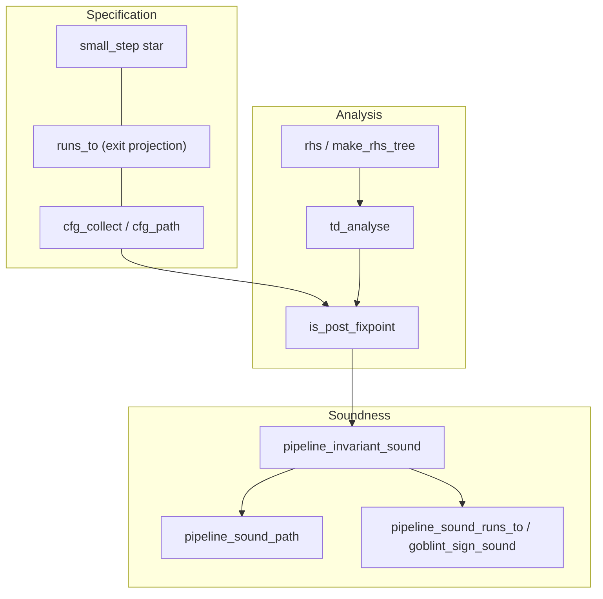

# Proof overview

High-level map of the thesis formalization: what is proved elsewhere, what this
repository contributes, and how the main lemmas connect.

**Status and sorry inventory:** `docs/PROOF_PHASES.md`.
**Live roadmap and backlog:** `docs/ROADMAP.md` → [GitHub Project 8](https://github.com/users/ManuelLerchner/projects/8).

---

## External vs. repository

| Layer | Source |
| --- | --- |
| IMP-style syntax patterns | Isabelle `HOL-IMP` (via wrapped `aexp` / `bexp`) |
| Top-down solver algorithm | Vendored `TD` session (`vendor/td-verification`, `TD_plain`) |
| IMP2 syntax, small-step, CFG, equations, domains, pipeline | This repository |

---

## Specification and soundness

**Collecting spec:** `cfg_collect (to_cfg c) S v` — least fixpoint of one-step
collecting over the compiled CFG (`src/CFG/Collecting/`; import
`CFG_Runs_To_Bridge` for the full chain: `CFG_Edges_Collect`,
`CFG_Collecting_Core`, `CFG_Compound_Paths`, `CFG_Path_Bridge`,
`CFG_Runs_To_Bridge`).

**Path form:** `cfg_path` + `edges_collect` (`cfg_edges_collect`); linked to the
lfp by `cfg_collect_eq_cfg_edges_collect`.

**Exit sugar:** `runs_to c s t` abbreviates membership in `cfg_collect` at
`cfg_exit (to_cfg c)` (`runs_to_def`). Not a second operational semantics.

**Operational link:** `runs_to_iff_small_step` — terminating small-step star to
`SKIP` iff `runs_to` (`IMP2_SmallStep.thy` + reverse bridge in `CFG_Runs_To_Bridge.thy`).

**Canonical analyzer soundness** (no termination premise):

- `pipeline_invariant_sound` — every program point `v`: `cfg_collect … v ⊆ γ(env v)`.
- `pipeline_sound_path` — along any `cfg_path` from entry, stores in `edges_collect` are covered.

**Exit corollaries** (terminating runs only):

- `pipeline_sound_runs_to` — from `runs_to` at exit.
- `sign_pipeline_sound` / `goblint_sign_sound` — sign domain instantiation.
- `ivl_pipeline_sound` — interval domain (same shape; assign TF lemmas closed;
  assume transformers are forward identity stubs — sound but imprecise).



---

## Main theorem chain (sign, exit)

```
t ∈ cfg_collect (to_cfg c) {s} (cfg_exit (to_cfg c))     -- spec (or runs_to c s t)
  ⊆ γ_state (env (cfg_exit (to_cfg c)))                  -- post_fixpoint_sound / exit_sound
env = td_analyse c tf join bot init                      -- TD_Interface + TD_plain
```

End-to-end: `goblint_sign_sound` (`Goblint_Formalization.thy`) from `sign_pipeline_sound`.

---

## Key types

- `com` — IMP2 commands (`IMP2_Syntax.thy`)
- `cfg` — record extending AFP `Graph.graph` with `cfg_entry` / `cfg_exit`
- `pp = nat` — program points
- `'a abs_state = vname => 'a`; `'a domain_transfer` — assign / assume / assume-not
- `rhs`, `is_post_fixpoint` — constraint system (`Constraint_System.thy`)
- `make_rhs_tree`, `td_analyse` — solver bridge (`TD_Interface.thy`)

Domains use semantic γ-axioms in `sound_domain` / `abstract_domain` locales.

---

## Lemma spine (by stage)

| Stage | File(s) | Main facts |
| --- | --- | --- |
| IMP2 | `IMP2_Syntax`, `IMP2_SmallStep` | `aval`, `bval`, `small_step`, `runs_to_iff_small_step` |
| CFG | `IMP2_to_CFG`, `CFG_Path`, `CFG_Edges_Collect` … `CFG_Runs_To_Bridge` | `to_cfg`, `cfg_collect`, `runs_to_def`, `compile_path_small_step` |
| Equations | `Constraint_System`, `Constraint_System_Sound` | `rhs_mono`, `post_fixpoint_sound`, `exit_sound` |
| Solver | `TD_Interface`, `TD_Soundness` | `td_analyse_post_fixpoint`, `sign_analysis_sound`, `interval_analysis_sound` |
| Pipeline | `Pipeline.thy` | `pipeline_invariant_sound`, `pipeline_sound_path`, `pipeline_sound_runs_to`, sign/interval corollaries |

---

## Adding a domain

Same CFG, `rhs`, and `td_analyse` once the domain fits the interfaces:

1. Define `'a` with `{ord, bot}` and `gamma`, `join` (and `widen` if needed).
2. Prove `interpretation … abstract_domain` or use `sound_domain`.
3. Prove `domain_transfer_sound` for your transfer functions.
4. Build an `analysis_config` and use `pipeline_invariant_sound` / `pipeline_sound_path`.

**Limits:** finite predecessor joins, transformers for `edge_action` labels, `make_rhs_mono` for TD.

---

## TD hypotheses on `goblint_sign_sound`

The sign end-to-end theorem still assumes the AFP solver succeeds on the generated tree:

- **`comp_fun_idem join`** on the domain join.
- **`TD_plain.solve_dom … (cfg_entry …)`** — query in solver domain.
- **`td_cfg_in_reach`** — every reachable unknown in the strategy tree is solved from entry.

These are operational obligations (solver covers the CFG), not gaps in
`post_fixpoint_sound` or `exit_sound`.

---

## Design decisions

### Point-map vs exit-only

**Point-map** (`pipeline_invariant_sound`): sound at every reachable `v`. **Exit-only**
is the special case `v = cfg_exit` (`pipeline_sound_runs_to`). Non-terminating
programs can still satisfy point-map / path soundness (`Example_NonTerminating_Safe.thy`).

### Why not AST annotations

Earlier annotation-on-`com` sketches were dropped: exit-only AST annotations cannot
express assignment soundness in general. The CFG + post-fixpoint story is the main theorem.

---

## Proof vs example

| Style | Meaning |
| --- | --- |
| **Generic** (`goblint_sign_sound`, `pipeline_sound_path`) | All programs; TD hypotheses explicit |
| **Concrete** (`example_swap_*`, `Example_Sign_Analysis`) | Fixed program; may use `value` / manual checks |

---

## Thesis target (one paragraph)

For any IMP2 program `c`, if `t` is in the CFG collecting semantics at exit from
initial store `s` (equivalently `runs_to c s t`, or small-step termination to `SKIP`),
and the top-down solver yields post-fixpoint environment `σ` on `to_cfg c`, then
`t ∈ γ_state (σ (cfg_exit (to_cfg c)))` for a domain with proved transfer soundness.
At every reachable program point, `cfg_collect` is over-approximated by `γ ∘ σ`.
