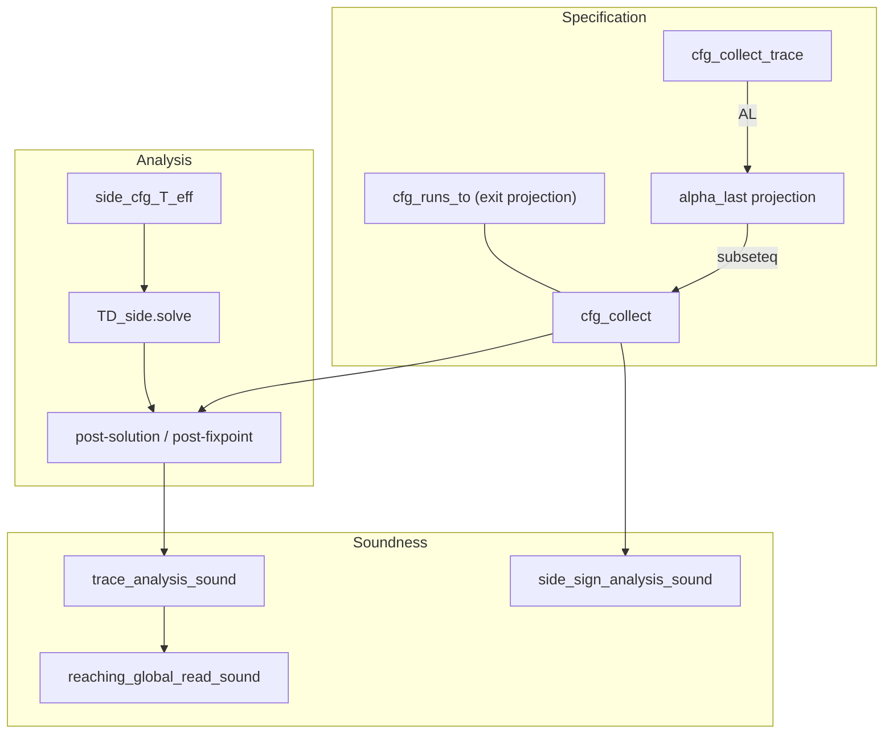

# Proof overview

High-level map of the thesis formalization: what is proved elsewhere, what this
repository contributes, and how the main lemmas connect.

**Status and sorry inventory:** `docs/PROOF_PHASES.md`.
**Live roadmap and backlog:** `docs/ROADMAP.md` → [GitHub Project 8](https://github.com/users/ManuelLerchner/projects/8).
**Keyed context branch:** `docs/KEYED_CONTEXT_CONSOLIDATION.md`.

---

## External vs. repository

| Layer | Source |
| --- | --- |
| IMP-style syntax patterns | Isabelle `HOL-IMP` (via wrapped `aexp` / `bexp`) |
| Top-down solver algorithm | Vendored `TD` session (`vendor/td-verification`, `TD_side`) |
| Reference concrete semantics (big-step, VCG) | AFP `IMP2` (Lammich & Wimmer) |
| IMP2 syntax, procedures, globals/locals, CFG, equations, domains, pipeline | This repository |

**Reference-semantics anchor.** Soundness is also expressible against AFP IMP2's
standard big-step semantics via a one-way bridge (`src/IMP2/IMP2_Bridge.thy`) and
`src/IMP2/IMP2_VCG_Example.thy`, which shows IMP2's own VCG and our analyzer
meeting on one program. Details: `docs/AFP_IMP2_REBASE_MIGRATION.md`.

### Scope honesty: pipeline axis, not framework axis

This repository is on the **pipeline / domain-instance axis**: IMP2 AST →
interprocedural CFG → equation system → AFP side-effecting TD solver → pointwise
sound abstract result, with sign and interval domain instances. It deliberately does **not**
model the *framework* Voblint actually uses — `GlobConstrSys` / `DemandGlobConstrSys`
in `src/constraint/constrSys.ml`. The directly adjacent verified-solver work is
**Tilscher, Graß, Schwarz, Seidl, *Verifying a Solver for Mixed Flow-Sensitive
Analyses* (NASA FM 2026)**.

---

## Language

The source language (`src/IMP2/`) is IMP2 with parameterless procedures and a
locals/globals split:

- `com` in `IMP2_Proc.thy` — SKIP, Assign, Seq, If, While, Scope, Call, Restore.
- `proc_table = pname ⇒ com option`; `pstep` — frame-stack small-step.
- `IMP2_Globals.thy` — `combine_states <s|t>`, `enter_state`, `is_global`.
- `compile_prog pi ps c :: cfg` (`IMP2_Proc_to_CFG.thy`) — whole-program CFG with
  enter edges and combine triples.

---

## Specification and soundness

**Collecting spec:** `cfg_collect g S v` — least fixpoint of the interprocedural
one-step functional over the compiled CFG (`src/CFG/Collecting/CFG_Collect.thy`).
It includes ordinary edges and `combine_states` triples for call/return.

**Trace spec:** `cfg_collect_trace g S v` — trace-valued interprocedural
collecting (`CFG_Collect_Trace.thy`). Projection: `alpha_last` collapses traces
to last stores; `alpha_last (cfg_collect_trace …) ⊆ cfg_collect …`.

**Operational link:** `cfg_runs_to pi ps c s t` — definitional exit projection of
`cfg_collect` at `cfg_exit (compile_prog …)`; in `CFG_Collect_Runs.thy`.

**Canonical analyzer soundness:**

- `trace_analysis_sound` — `alpha_last (cfg_collect_trace g S v) ⊆ γ(env v)`.
- `reaching_global_read_sound` — for every reaching trace `tr`, `(last tr) x ∈ γ(env v x)`.
- `reaching_global_read_sound_d` — digest-indexed variant.
- `mixed_flow_analysis_sound` — trace-level soundness for any effectful transfer post-solution.
- `mixed_flow_analysis_optimal` — TD_side soundness plus least partial post-solution under `threefold_mono`.

**Domain instantiation:**

- `side_sign_analysis_sound` / `side_ivl_analysis_sound` — sign / interval analysis at exit, using native `sign_etf` / `ivl_etf`.
- `sign_mixed_flow_sound_and_optimal` (`Example_Mixed_Flow_Sign.thy`) — concrete mixed-flow theorem application on `inc_pi`.



---

## Main theorem chain (sign, exit)

```
cfg_runs_to pi ps c s t             -- spec: t at exit of compile_prog pi ps c
  => t in cfg_collect … exit
  => t in gamma_state (side_analyse_eff pi ps c sign_etf bot s0 () exit)
     (side_sign_analysis_sound / proc_global_side_sign_analysis)
```

Full chain: `side_sign_analysis_sound` ←
`side_analyse_eff_collect_sound_exit_pruned` ←
`side_collect_sound_exit_pruned_eff_cone` ←
`post_fixpoint_sound_at_eff` ← `CFG_Collect`.

---

## Canonical spine and analysis branches

The context-sensitive analyses are **one layered tower**, not competing spines;
five theorems close end-to-end soundness. Architecture diagram: repository
`README.md` (§ Architecture).

**Canonical end-to-end chain** — each step reuses the soundness of the one below:

`cfg_collect_trace` → `Constraint_System_Sound` → `TD_Side_Eff_Soundness`
(`side_analyse_eff_collect_sound_exit_pruned`) → entry-context
(`TD_Side_Eff_Ctx_Sound.semantic_entry_store_ctx_analysis_sound`) → keyed/combine
(`TD_Side_Eff_Cmp_Sound.post_fixpoint_sound_at_ctx_semantic_cmp_final`) →
seeded-clean (`Clean_RRead_Sound.clean_ctx_collect_rread_head_bound`) →
activation collecting (`Seeded_Activation_Sound.seeded_activation_collecting_sound`)
→ `twf`/`twfr` witness (`Activation_Witness_From`) → recursive soundness
(`Example_Rdiv_Twfr_Sound.rdiv_witness_G_over_approximated`).

Steps two through five lie inside the dependency cone of the recursive flagship
`Example_Rdiv_Twfr_Sound`: required support, not alternatives. The mode/value
digest (`Trace_Analysis_Sound.context_collect_sound` →
`Example_Sign_Mode_Digest.mode_collect_sound_witness`) is a *separate* proved spine.

**Branch roles.** Every non-flagship theory is classified:

| Role | Meaning | Representative |
| --- | --- | --- |
| Canonical spine | proved end-to-end soundness | `side_sign_analysis_sound`, `rdiv_witness_G_over_approximated` |
| Required support | inside a flagship's dependency cone | context tower, return rehydration (`rdiv_rehyd_main_return_sound`) |
| Regression / counterexample | intentional negative fact | `clean_transfer_unsound` (`¬ sound_effectful_transfer sign_etf_clean`) |
| Precision comparison | `eval`-only sharper-than witness | bare `Exec_*_Ctx_Run`, `Exec_Sign_Cmp_Keyed_Solve` |
| Design evidence | motivates a design; proves no soundness | `Example_Interval_Recursion_Digest` |

**Retired.** The per-origin-widening experiment (`Origin_State`, `Origin_Lift`,
`Example_Interval_Recursion_Origin`) was removed: isolated, outside every proved
soundness endpoint, and its positive precision claim was never machine-checked
(the per-origin solve exceeds the batch budget and lived only in prose). Its
machine-checked negative regression `rec_warrowing_widens_to_top` survives
unchanged in `Example_Interval_Recursion_Digest`.

## Keyed context branch

The keyed-global context branch extends the side-effecting pipeline with
`glob_env_cmp` / `side_env_cmp`, the framed-enter contract
`sound_effectful_transfer_framed`, and the keyed generator
`side_cfg_T_eff_cmp`. Its central theorem is
`side_cfg_T_eff_cmp_collect_sound`: a post-fixpoint of the keyed generator
over-approximates `cfg_collect` when each context reads its compatible global
slot. The finite executable demonstration is
`Example_Finite_Sign_Context_Analysis.thy`.

Architecture graph, example review, and remaining debt:
`docs/KEYED_CONTEXT_CONSOLIDATION.md`.

---

## Key types

- `com` — IMP2 commands incl. Scope/Call/Restore (`IMP2_Proc.thy`)
- `proc_table = pname ⇒ com option`; `frame = store`
- `cfg` — record with `cfg_entry`, `cfg_exit`, `edges`, `combines`
- `pp = nat` — program points
- `'a abs_state = vname ⇒ 'a`; `'a domain_transfer` — assign / assume / assume-not
- `rhs`, `is_post_fixpoint` — interprocedural constraint system (`Constraint_System.thy`)
- `side_cfg_T_eff` — side-effecting strategy tree (`TD_Side_Tree.thy`)
- `side_analyse_eff` — solver output function (`TD_Side_Eff_Interface.thy`)

Domains use semantic γ-axioms in `sound_domain` / `abstract_domain` locales.

---

## Lemma spine (by stage)

| Stage | File(s) | Main facts |
| --- | --- | --- |
| IMP2 | `IMP2_Syntax`, `IMP2_Expr`, `IMP2_Globals`, `IMP2_Proc` | `aval`, `bval`, `pstep`, `combine_states`, `enter_state` |
| CFG | `IMP2_Proc_to_CFG` | `compile_prog`, `compile`, call/combine layout |
| Collecting | `CFG_Collect`, `CFG_Collect_Runs`, `CFG_Collect_Trace` | `cfg_collect`, `cfg_runs_to`, `alpha_last`, trace projection |
| Equations | `Constraint_System`, `Constraint_System_Sound`, `Analysis_Sound` | `rhs`, `is_post_fixpoint`, `post_fixpoint_sound_at`, `post_fixpoint_sound` |
| Solver | `TD_Side_Tree`, `TD_Side_Eff_{Sound,Bounds,Interface,Pipeline,Soundness}` | `side_cfg_T_eff`, `side_analyse_eff`, `side_analyse_eff_collect_sound_exit_pruned` |
| Pipeline | `Trace_Analysis_Sound`, `Mixed_Flow_Sound` | `trace_analysis_sound`, `reaching_global_read_sound`, `mixed_flow_analysis_sound`, `mixed_flow_analysis_optimal` |
| Domain | `Sign_Domain`, `Interval_Domain`, `Sign_Side_Soundness`, `Interval_Side_Soundness`, `Sign_Exec_Sound` | native `sign_etf` / `ivl_etf`, `side_sign_analysis_sound`, `side_ivl_analysis_sound`, `sign_exec_sound_collecting` |
| Examples | `Example_Inc_Proc`, `Example_Mixed_Flow_Sign`, `Example_Side_Proc_Global` | shared increment witness, mixed-flow sign application, procedural sign witness |

---

## Adding a domain

Same CFG, `rhs`, and `side_analyse_eff` once the domain fits the four-layer interface
(see `src/Analysis/Instances/README.md` for the detailed chain):

1. **Type class layer.** Instantiate `'a :: bounded_semilattice_sup_bot` — gives `⊥`, `⊔`, `≤` and lifts them pointwise to `'a abs_state` for free via HOL's `fun` instances.
2. **Locale layer.** `interpretation … : abstract_domain gamma widen` and `interpretation … : sound_transfer gamma tf`. All derived lemmas (monotonicity, entry coverage, `side_collect_sound_ip_exit_pruned`) become available prefixed by the interpretation name.
3. **Effectful transfer layer.** Define a native `X_etf :: (unit, X) effectful_domain_transfer`; prove `sound_effectful_transfer X_etf`, `cone_compatible_etf X_etf`, and `threefold_mono (side_cfg_T_eff g X_etf bot0 s0 ())`.
4. **Executable bridge.** Define an `'a st` mirror `tf_st` and prove `fun_of_st (tf_st a s) = apply_tf tf a (fun_of_st s)`. Define a domain-specific C seed `cinit_X_st` where globals default to the abstract zero and locals default to `⊤`.
5. **End-to-end.** Define `X_exec_eqs` using the executable mirror. The soundness proof follows the pattern in `Sign_Exec_Sound.thy` — wrap solver output → lift via commutation → cover entry from `cinit_stores` → apply the effectful soundness engine.

**`cinit_stores`** (`Constraint_System.thy`): the shared C-faithful initial store set
`{s. ∀x. is_global x → s x = 0}`. Every domain's soundness theorem is stated against
this set (not `UNIV`) when a domain-specific seed satisfying `cinit_stores ⊆ γ(seed)` exists.

**Limits:** finite predecessor joins, monotone transfer functions, side solver termination.

---

## TD hypothesis on sign soundness

The sign end-to-end theorem (`side_sign_analysis_sound`) assumes:

- **`side_cfg_solve_dom_eff g sign_etf bot s0 () v`** — per-pp solve termination.
  This is `TD_side.solve_dom … v`, gated on monotonicity of `side_cfg_T_eff` (proved).

This is an operational obligation on the vendored solver, not a gap in `post_fixpoint_sound`.

---

## Design decisions

### Point-map vs exit-only

**Point-map** (`trace_analysis_sound`): sound at every reachable `v`.
**Exit-only** (`side_sign_analysis_sound`): special case `v = cfg_exit`.

### Why not AST annotations

Exit-only AST annotations cannot express assignment soundness in general.
The CFG + post-fixpoint story is the main theorem.

### Intra-procedural spine

The classical (intra-procedural) spine — plain `TD_Soundness`, intra `Sign`/`Interval`
analysis, `Pipeline`, `voblint_sign_sound` — was extracted to the sibling repo
`voblint-formalization-classical` and removed here.
See `docs/CLASSICAL_SPINE_RETIREMENT.md`.

---

## Thesis target (one paragraph)

For any IMP2 program with procedures `(pi, ps, c)`, if `tr` is a reaching
interprocedural trace at program point `v` from initial store `s` (equivalently
`cfg_runs_to pi ps c s (last tr)` at exit), and the TD side solver yields a stable
assignment `env` on `compile_prog pi ps c`, then `(last tr) x ∈ γ(env v x)` for
every variable `x` and every reachable `v`, for a domain with proved transfer
soundness. The projection `alpha_last` is a soundness-preserving morphism: the
trace-level spec soundly refines to the state-level spec, which the analyzer
over-approximates.
