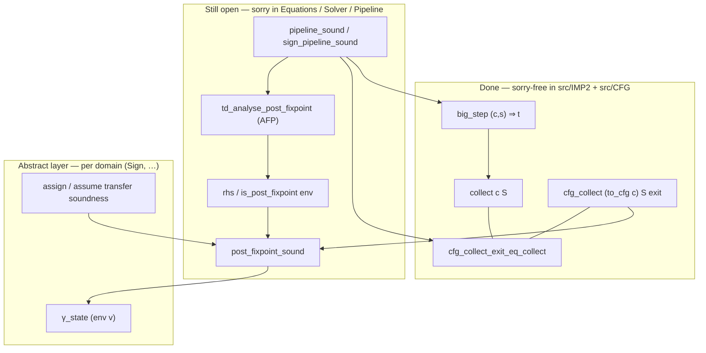

# Goblint Formalization Proof Overview

This document is the high-level map of what the thesis is proving, what is already proved elsewhere, and how the key lemmas connect.

It is written as a proof chain, not as implementation notes.

---

## 1) What is already proved vs. what we prove here

### Already proved in Isabelle/HOL / AFP

- `HOL-IMP` provides trusted baseline material for IMP-style syntax/semantics patterns (big-step style, abstract interpretation patterns, etc.).
- AFP `Top_Down_Solver` proves correctness properties of the top-down solver algorithm over strategy trees:
  - locale interface (`TD_plain`) over `'d::bot`
  - solver algorithm and partial-correctness theorem (`partial_correctness`)

### Proved in this repository (thesis contribution)

We prove the end-to-end bridge from program semantics to solver result soundness:

1. IMP2 concrete semantics and collecting semantics
2. translation `IMP2 -> CFG`
3. CFG constraint system (`rhs`) and its soundness connection to collecting semantics
4. domain instantiations (Sign first, Interval stretch)
5. AFP bridge: our `rhs` shape to AFP strategy trees
6. final pipeline theorem at program exit

---

## Result mapping: how to present the solver output

The solver returns `pp => 'a abs_state` — a map from CFG program points to abstract states.
There are four ways to state what this means for the program. Choose ONE before investing
in proof work; the choice is low-cost to make but expensive to change mid-proof.

### Option 1 — Exit-state soundness only (current `pipeline_sound`)

```isabelle
theorem pipeline_sound:
  big_step (c, s) t  →  t ∈ gamma_state (run_analysis cfg c (cfg_exit (to_cfg c)))
```

Minimum viable. Already stated in `Pipeline.thy`. No annotation layer needed.
The exit abstract state is a sound post-condition for the entire program.

### Option 2 — Point-map invariant predicate (RECOMMENDED)

```isabelle
theorem analysis_invariant_sound:
  big_step (c, s) t  →
    ∀ v. cfg_reach (to_cfg c) {s} v ⊆ gamma_state (run_analysis cfg c v)
```

Falls out for free from `post_fixpoint_sound` + `td_analyse_post_fixpoint` — zero extra
proof work beyond what the pipeline already requires.  Exit soundness (Option 1) is the
`v = cfg_exit` special case.  This is what the supervisor suggested in meeting 2 as the
"point-map soundness predicate: ∀ p. collect_sem_at c p ⊆ γ(mlup σ p)".

**This is the recommended default.**

### Option 3 — Fixed `acom` annotation (Nipkow style, needs supervisor sign-off)

Annotate every command with the abstract state at its entry AND exit program point:

```isabelle
datatype 'a acom =
    ASkip   "'a abs_state" "'a abs_state"
  | AAssign vname aexp "'a abs_state" "'a abs_state"
  | ASeq    "'a acom" "'a acom"
  | AIf     bexp "'a acom" "'a acom" "'a abs_state" "'a abs_state"
  | AWhile  bexp "'a abs_state" "'a acom" "'a abs_state"

theorem annotation_sound:
  s ∈ gamma_state (acom_pre ac)  →  big_step (c, s) t  →  t ∈ gamma_state (acom_post ac)
```

The current `Result_Mapping.thy` is broken: `acom_pre` returns the EXIT state for leaf nodes
(ASkip, AAssign), making `annotation_sound` unprovable for assignments (would require q to
be closed under x := a, which doesn't hold in general).  Fix: store both entry and exit
abstract states in leaf nodes so `acom_pre` has the correct value to return.

More work than Option 2, but gives the analysis result in the form of a valid Hoare
annotation that can be read off the program text.  Ask supervisors before implementing.

### Option 4 — Verification conditions (HOL-IMP `Abs_Int_ITP2012` style)

Define verification conditions (VCs) from the annotated program; prove the analysis satisfies
all VCs; derive soundness from VC satisfaction.  Decouples analysis correctness from
annotation soundness.  This is Nipkow's approach in AFP `Abs_Int_ITP2012`.

Adds a VC machinery layer.  Probably overkill given that Option 2 already provides the
invariant statement directly.

---

### Decision guide

| Want to say | Use |
|---|---|
| "final output state is sound" | Option 1 |
| "abstract state at every pp is a sound invariant" (supervisor request) | Option 2 |
| "analysis produces a valid Hoare annotation" | Option 3 |
| "analysis satisfies Nipkow-style VCs" | Option 4 |

**Current status**: `Result_Mapping.thy` implements a broken attempt at Option 3.
Recommended path: implement Option 2 first (free from existing lemmas), then discuss
Option 3 with supervisors.

---

## 2) Core theorem chain (big picture)

### Proof status (what is done vs. open)

Bridge **#1** (IMP collecting = CFG collecting at exit) is proved with no `sorry` in
`src/IMP2/` or `src/CFG/`. Bridge **#2** (abstract post-fixpoint over-approximates
`cfg_collect`) and the TD solver glue are still open.



**How to read it.** Concrete execution flows down the left (done). The equation system
mirrors `collect_pp` on the same `to_cfg c` graph: `rhs` + post-fixpoint gives
`cfg_reach ⊆ γ ∘ env` (open). The AFP top-down solver is meant to produce that
post-fixpoint (`td_analyse`). `exit_sound` closes the loop using
`cfg_collect_exit_eq_collect` so exit soundness talks about `collect` / `big_step`.

Target shape:

1. Concrete run:
   - `big_step (c, s) t`
2. CFG/equation soundness bridge:
   - if `env` is a post-fixpoint of `rhs`, then concrete reachable states are in `gamma_state (env p)`
3. Solver post-fixpoint:
   - `td_analyse ...` returns an `env` that is a post-fixpoint
4. Compose 2 + 3:
   - final state `t` is in `gamma_state` at CFG exit

In formula-style summary:

- `td_analyse_post_fixpoint`
- `post_fixpoint_sound` (plus exit corollary)
- `td_solver_sound`
- `pipeline_sound`

---

## 3) Key types (the interfaces that matter)

## Program and CFG side

- `com` (IMP2 commands)
- `cfg` with
  - `cfg_entry :: pp`
  - `cfg_exit :: pp`
  - `cfg_edges :: (pp * edge_action * pp) set`
- `pp = nat` (program points)

## Abstract interpretation side

- abstract value type `'a`
- abstract state: `'a abs_state = vname => 'a`
- transfer bundle:
  - `'a domain_transfer`
  - fields: `tf_assign`, `tf_assume`, `tf_assume_not`

### Domain locale design: semantic (gamma-based) axioms

`abstract_domain` uses **semantic axioms** (`gamma a ⊆ gamma (join_op a b)`, etc.) rather than
syntactic order axioms (`x ⊑ x ⊔ y`). This is intentional:

- For soundness (`t ∈ gamma_state(env exit)`), gamma upper-bound properties are what you need directly.
- No meet, top, or order axioms required in the generic locale.
- Narrowing not in the locale — only needed for precision, not soundness.
- Widening termination is domain-specific (sign: trivially terminates; interval: separate proof).

Graß 2024 (master's thesis) confirms at the solver level: join-semilattice + `narrowing_ge`
suffices for partial correctness of the warrowing TD. The semantic approach here is even simpler.

## Constraint system side

- `rhs :: cfg => 'a domain_transfer => ... => (pp => 'a abs_state) => pp => 'a abs_state`
- `is_post_fixpoint :: ... => (pp => 'a abs_state) => bool`

## Solver bridge side

- AFP expects strategy trees:
  - `T :: pp => (pp, 'a abs_state) strategy_tree`
- bridge constructor:
  - `make_rhs_tree :: cfg => ... => pp => (pp, 'a abs_state) strategy_tree`
- analysis entry point:
  - `td_analyse :: com => 'a::bot domain_transfer => ... => pp => 'a abs_state`

## Important sort constraints after AFP integration

- Domain locale is now parameterized over `'a::{ord,bot}`
- Pipeline-facing generic statements must carry `{ord,bot}` where they invoke solver-facing APIs
- Concrete domains need `bot` instances (`sign`, `ivl`)

---

## 4) Key lemmas by stage

## A. Equation-system construction and monotonicity

- `rhs_mono` (in `Constraint_System.thy`)
  - purpose: monotonicity of function-style RHS in environment
  - role: prerequisite for monotonic reasoning and fold/join soundness flow

- `make_rhs_mono` (in `TD_Interface.thy`)
  - purpose: wrapper lemma transporting `rhs_mono` to `make_rhs`

## B. AFP strategy-tree correspondence (new critical bridge)

- `rhs_tree_fold_traverse_env_map` (helper)
  - unfolds tree traversal into list-fold behavior

- `make_rhs_tree_preds_list` (helper)
  - obtains concrete predecessor list representation from predecessor set

- `make_rhs_tree_correspondence` (main bridge lemma)
  - states that traversing `make_rhs_tree` matches function-style `make_rhs`
  - this is the key missing semantic bridge

## C. Solver post-fixpoint and soundness composition

- `td_analyse_post_fixpoint`
  - solver output satisfies post-fixpoint predicate for generated CFG constraints

- `post_fixpoint_sound` / exit corollary (constraint-system soundness theory)
  - any post-fixpoint overapproximates collecting semantics

- `td_solver_sound`
  - combines solver post-fixpoint + post-fixpoint soundness + transfer-function soundness

- `pipeline_sound`
  - package-level end-to-end theorem (analysis config, run, and result at exit)

---

## 5) What exactly remains to prove (high-level)

Most remaining difficulty is concentrated in two bridges:

1. **Tree-vs-function RHS bridge** (`TD_Interface`)
   - proving `make_rhs_tree_correspondence` cleanly
2. **Post-fixpoint-to-collecting bridge** (`Constraint_System_Sound` / CFG collecting path machinery)
   - proving sound overapproximation at exit

Everything else is largely composition/instantiation once these two are stable.

---

## 6) Practical proof order (recommended)

1. finish `TD_Interface` helper lemmas (`rhs_tree_fold_*`, predecessor list, correspondence)
2. finish `td_analyse_post_fixpoint`
3. finish `post_fixpoint_sound` path/collecting bridge and exit corollary
4. close `td_solver_sound`
5. close `pipeline_sound` and domain-specific corollaries (`sign_pipeline_sound`, interval stretch)

---

## 7) One-paragraph thesis statement (final target)

For any IMP2 program `c`, if concrete execution terminates (`big_step (c,s) t`), then the abstract state computed by the AFP-based top-down solver on the generated constraint system safely overapproximates the concrete result at CFG exit; i.e., `t` belongs to the concretization (`gamma_state`) of the solver result at exit.
