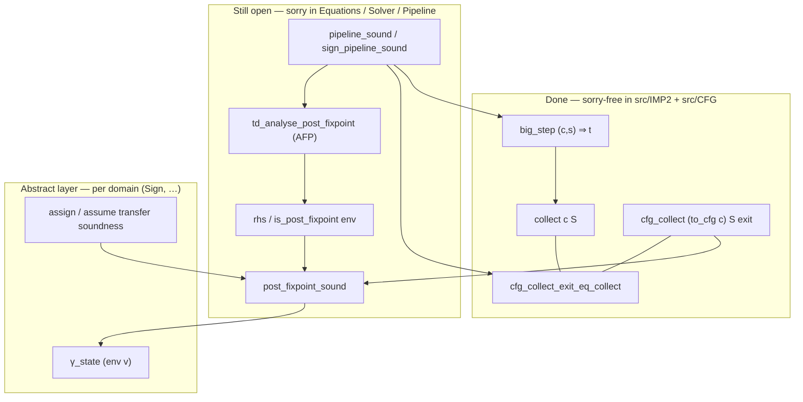

# Proof Phases

Concrete execution plan for closing the remaining `sorry`s. Companion to
`docs/PROOF_OVERVIEW.md` (big-picture chain) and `AGENTS.md` (workflow).

HTML walkthroughs: `docs/html/PIPELINE_WALKTHROUGH.html`,
`docs/html/IMP_CFG_WALKTHROUGH.html`.

---

## Thesis target (final theorem)

For any IMP program `c`, terminating run `(c, s) ⇒ t` implies
`t ∈ γ_state(σ_exit)`, where `σ` is the TD solver result and
`σ_exit = σ (cfg_exit (to_cfg c))`.

Strong form (Option 2, supervisor-preferred): for every program point `v`,
`cfg_reach (to_cfg c) {s} v ⊆ γ_state(σ v)`. Exit-soundness is the
`v = cfg_exit` special case.

---

## Pipeline chain

```
big_step (c, s) t                                       -- IMP2_Semantics
  ⊆ collect c {s}                                       -- IMP2_Collecting
  = cfg_collect (to_cfg c) {s} (cfg_exit ...)           -- CFG_Collecting   [bridge #1 DONE]
  ⊆ γ_state (env (cfg_exit ...))                        -- Constraint_System_Sound [bridge #2]
                                                        -- via post-fixpoint
  env = td_analyse c tf join bot init                   -- TD_Interface (AFP TD_plain)
```

Bridge #1 is closed (no `sorry` in `src/IMP2/` or `src/CFG/`). Bridge #2 and
pipeline composition remain open.



---

## Sorry inventory (live)

Run: `rg -n '^\s*sorry' src/` (source of truth).

| File                                    | n  | Status                          |
|-----------------------------------------|----|---------------------------------|
| `IMP2/IMP2_Collecting.thy`              | 0  | **done** (optional `collect_While` removed) |
| `CFG/CFG_Path.thy`                      | 0  | **done** (exit-reachability stubs removed) |
| `CFG/CFG_Collecting.thy`                | 0  | **done** — `cfg_collect_exit_eq_collect` |
| `Equations/Constraint_System_Sound.thy` | 0  | **done** — Phase 1.2 closed     |
| `Solver/TD_Soundness.thy`               | 1  | sign closed; interval blocked on Phase 3 |
| `Pipeline/Pipeline.thy`                 | 1  | sign closed; `ivl_pipeline_sound` blocked on Phase 3 |
| `Goblint_Formalization.thy`             | 0  | **done** — `goblint_sign_sound` |
| `Domains/Interval_Domain.thy`           | 5  | Phase 3 (stretch); `gamma_ivl_bot/top` closed |
| `Solver/TD_Total.thy`                   | 8  | optional (totality / widening)  |
| `Equations/Direct_Equations.thy`        | 7  | skip (alternate path)           |
| `Scratch_Explore.thy`                   | 1  | scratch only                    |

**Sign pipeline:** end-to-end closed. Batch build green (`isabelle build`
exit 0, `quick_and_dirty` tolerates Phase 3 / TD_Total / Direct_Equations
sorries which are outside the sign chain).

---

## Phase 1 — Hard bridges

### 1.1 CFG collecting ≡ IMP collecting at exit — **DONE**

File: `src/CFG/CFG_Collecting.thy`

Closed lemmas:

- `cfg_path_collect_exit_le_collect` / `cfg_collect_exit_le_collect`
- `collect_le_cfg_collect_exit`
- `cfg_collect_exit_eq_collect` (main theorem)
- `cfg_reach_entry`
- Supporting: `compile_path_big_step`, `big_step_cfg_path`, `path_sound_cfg_collect`, …

Exit criterion for 1.1: satisfied.

**Removed (not sorry’d):** `collect_While` in `IMP2_Collecting.thy` (explicit
`lfp` characterisation — bridge uses `big_step` induction instead);
`cfg_exit_reachable_from_entry` / `to_cfg_exit_reachable` in `CFG_Path.thy`
(not needed; false for arbitrary `cfg_wf` CFGs).

### 1.2 Post-fixpoint over-approximates collecting — **DONE**

File: `src/Equations/Constraint_System_Sound.thy` — 0 sorries.

Closed lemmas:

- `edge_collect_apply_tf_sound` — per-edge bridge, case split on `edge_action`.
- `join_state_ub1` / `join_state_ub2` — pointwise upper bounds on `join_state`.
- `apply_tf_le_rhs` — each predecessor's `apply_tf` is below the `rhs` fold
  (uses `mem_image_le_fold` over the predecessor set).
- `join_state_fold_ge` — element of a finite set ≤ the join-fold over it.
- `s0_le_rhs_entry` — initial state ≤ `rhs` at the CFG entry.
- `collect_pp_abstract_sound` — `collect_pp` step abstract soundness.
- `post_fixpoint_sound` — `lfp_lowerbound` argument; the function
  `λv. gamma_state (env v)` is a post-fixpoint of `cfg_collect_F`.
- `exit_sound` — corollary composing `post_fixpoint_sound`,
  `cfg_collect_exit_eq_collect`, and the `big_step → collect` bridge.

Exit criterion: `Constraint_System_Sound.exit_sound` has no `sorry`. ✓

---

## Phase 2 — Pipeline composition — **DONE (sign)**

Files: `src/Pipeline/Pipeline.thy`, `src/Solver/TD_Soundness.thy`,
`src/Goblint_Formalization.thy`.

Closed:

- `pipeline_invariant_sound` — generic point-map invariant. Takes
  `sound_domain (ac_gamma cfg) join_op` + glue (`ac_join cfg`, `ac_bot cfg`
  tied to `sound_domain.join_state` / `sound_domain.bot_state`) +
  `td_analyse_post_fixpoint` solver assumptions.
- `pipeline_sound` — exit specialisation of `pipeline_invariant_sound`
  + termination.
- `sign_pipeline_sound_scaffold` — sign-specialised wrapper using
  `sign_analysis_sound`.
- `sign_pipeline_invariant_sound` — point-map invariant for sign domain,
  discharging the `sign_domain.gamma_state ↔ sound_domain.gamma_state
  gamma_sign` coercion.
- `sign_analysis_sound` (TD_Soundness) — sign-specific.
- `goblint_sign_sound` (top-level) — wires `sign_pipeline_sound_scaffold`
  with the discharged init-stub.

The TD solver assumptions (`comp_fun_idem`, `solve_dom`, `cfg_in_reach`)
are explicit hypotheses (matching `td_solver_sound`'s pattern). Discharging
them is solver-side work — outside the soundness chain.

Exit criterion: `goblint_sign_sound` and `sign_pipeline_invariant_sound`
closed; batch build green. ✓

---

## Phase 3 — Interval stretch (optional)

File: `src/Domains/Interval_Domain.thy`.

- Interval lattice laws (`join_ivl` comm/assoc; `ivl_le` partial order).
- TF soundness: `assign_ivl_sound`, `assume_ivl_sound`,
  `assume_not_ivl_sound`.
- `ivl_pipeline_sound`, `interval_analysis_sound` via Phase 2 template.
- Skip widening termination (`TD_Total`) unless total correctness
  required by supervisors. Partial correctness suffices for soundness.

---

## Phase 4 — Examples + thesis polish

- `Examples/Example_Sign_Analysis.thy`: no `sorry` in current tree (verify on change).
- Decide on `Result_Mapping.thy`: drop (Option 2 already headline) or
  repair per `PROOF_OVERVIEW.md` §1 Option 3.
- Final batch build green:
  `isabelle build -d ~/afp/thys -d vendor/td-verification -D . Goblint_Formalization`
  with `quick_and_dirty` removed from `ROOT`.

---

## Working order

1. ~~`cfg_collect_exit_eq_collect` (Phase 1.1)~~ **done**
2. ~~`collect_pp_abstract_sound` (Phase 1.2)~~ **done**
3. ~~`post_fixpoint_sound` + `exit_sound` (Phase 1.2)~~ **done**
4. ~~`pipeline_sound` + `pipeline_invariant_sound` (Phase 2)~~ **done**
5. ~~Sign corollaries (Phase 2) — `goblint_sign_sound`~~ **done**
6. Interval (Phase 3, optional) — 5 sorries remaining
7. Examples + polish (Phase 4) — pending

Commit after each step closes — never mid-bridge.
